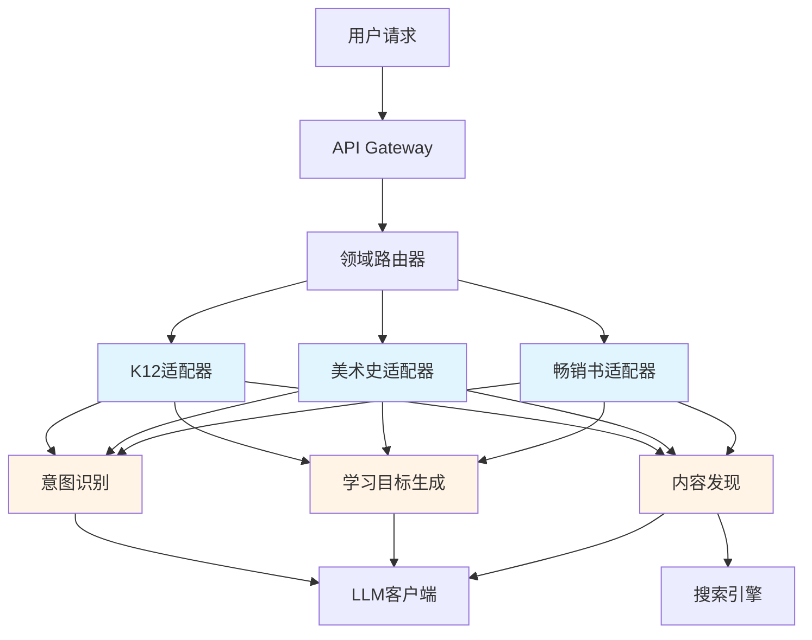

# 领域适配器 vs AI能力层 - 架构定位与关系

**版本**: 1.0  
**日期**: 2025-12-10  
**状态**: 架构说明文档

---

## 📋 目录

1. [核心概念对比](#核心概念对比)
2. [架构分层关系](#架构分层关系)
3. [职责边界](#职责边界)
4. [协作模式](#协作模式)
5. [实际案例](#实际案例)
6. [扩展指南](#扩展指南)

---

## 核心概念对比

### 一句话总结

| 组件 | 定位 | 比喻 |
|------|------|------|
| **AI能力层** | 通用的AI基础能力，与领域无关 | **🏭 工厂的生产线** - 标准化、可复用的制造流程 |
| **领域适配器** | 特定领域的专业知识和规则 | **👔 定制西装的裁缝** - 根据客户特征量身定制 |

### 详细对比

| 维度 | AI能力层 | 领域适配器 |
|------|---------|-----------|
| **抽象级别** | 底层通用能力 | 上层领域特化 |
| **复用性** | 跨所有领域复用 | 仅在特定领域有效 |
| **知识来源** | 通用AI模型 + 算法 | 领域专家经验 + 行业标准 |
| **开发方式** | 平台核心团队开发 | 领域专家 + 开发者插件化开发 |
| **变更频率** | 低（稳定的AI能力） | 中高（领域知识持续更新） |
| **依赖方向** | 被领域适配器调用 | 调用AI能力层 |

---

## 架构分层关系

### 完整架构图

```
┌────────────────────────────────────────────────────────────┐
│                       应用层 (API)                          │
│            用户请求 → 需求解析 → 结果返回                     │
└────────────────────────────────────────────────────────────┘
                            ↓
┌────────────────────────────────────────────────────────────┐
│              领域适配器层 (Domain Adapter Layer)             │
│  ┌──────────┐  ┌──────────┐  ┌──────────┐  ┌──────────┐   │
│  │ K12教育  │  │ 美术史   │  │ 畅销书   │  │ 企业培训 │   │
│  │ Adapter  │  │ Adapter  │  │ Adapter  │  │ Adapter  │   │
│  └──────────┘  └──────────┘  └──────────┘  └──────────┘   │
│       ↓              ↓              ↓              ↓        │
│  【调用AI能力】  【调用AI能力】  【调用AI能力】  【调用AI能力】│
└────────────────────────────────────────────────────────────┘
                            ↓
┌────────────────────────────────────────────────────────────┐
│               AI能力层 (AI Capability Layer)                │
│  ┌──────────────────┐  ┌──────────────────┐  ┌──────────┐ │
│  │ 意图识别         │  │ 学习目标生成      │  │ 内容发现 │ │
│  │ IntentRecognizer │  │ ObjectiveGen     │  │ContentSvc│ │
│  └──────────────────┘  └──────────────────┘  └──────────┘ │
│                                                             │
│  ┌──────────────────┐  ┌──────────────────┐  ┌──────────┐ │
│  │ 故事化叙述       │  │ 质量评估         │  │ 提示词管理│ │
│  │ NarrativeGen    │  │ QualityCheck     │  │PromptMgr │ │
│  └──────────────────┘  └──────────────────┘  └──────────┘ │
└────────────────────────────────────────────────────────────┘
                            ↓
┌────────────────────────────────────────────────────────────┐
│                  工作流引擎层 (Workflow Engine)              │
│         节点编排 → 执行调度 → 状态管理 → 结果聚合            │
└────────────────────────────────────────────────────────────┘
                            ↓
┌────────────────────────────────────────────────────────────┐
│                  数据访问层 (Data Layer)                     │
│     ORM Repository → Database → 向量库 → 外部API            │
└────────────────────────────────────────────────────────────┘
```

### 依赖关系



---

## 职责边界

### AI能力层职责 (通用能力)

#### 1. 意图识别 (Intent Recognition)

**职责**：从自然语言中提取结构化意图

**输入**：
```python
raw_input = "我想讲解印象派画家莫奈的《日出·印象》"
```

**输出**：
```python
{
    "intent_type": "content_generation",
    "entities": {
        "topic": "莫奈的《日出·印象》",
        "category": "艺术史",
        "task": "讲解"
    }
}
```

**特点**：
- ✅ 与领域无关的NLP能力
- ✅ 基于通用LLM模型
- ✅ 可用于任何领域（K12、美术、图书等）

---

#### 2. 学习目标生成 (Learning Objective Generation)

**职责**：根据主题和受众生成SMART学习目标

**输入**：
```python
context = {
    "topic": "莫奈的《日出·印象》",
    "audience": "成人艺术爱好者",
    "duration": 30,  # 分钟
    "domain": "art_history"
}
```

**输出**：
```python
[
    {
        "title": "理解印象派的艺术特点",
        "bloom_level": "understand",
        "estimated_time": 10
    },
    {
        "title": "分析莫奈的色彩运用技巧",
        "bloom_level": "analyze",
        "estimated_time": 15
    },
    {
        "title": "评价《日出·印象》的艺术价值",
        "bloom_level": "evaluate",
        "estimated_time": 5
    }
]
```

**特点**：
- ✅ 基于通用的教育学原理（布鲁姆分类法）
- ✅ 与具体领域内容无关
- ✅ 所有领域都需要学习目标

---

#### 3. 内容发现 (Content Discovery)

**职责**：从多个数据源检索和评估内容

**输入**：
```python
query = {
    "keywords": ["莫奈", "印象派", "日出·印象"],
    "sources": ["wikipedia", "youtube", "museum_api"],
    "filters": {"language": "zh", "quality": "high"}
}
```

**输出**：
```python
[
    {
        "source": "wikipedia",
        "title": "克劳德·莫奈",
        "url": "https://zh.wikipedia.org/wiki/...",
        "relevance_score": 0.95,
        "quality_score": 0.88
    },
    {
        "source": "youtube",
        "title": "解读印象派画家莫奈",
        "url": "https://youtube.com/watch?v=...",
        "relevance_score": 0.87,
        "quality_score": 0.76
    }
]
```

**特点**：
- ✅ 通用的检索和评估算法
- ✅ 多源整合能力
- ✅ 可配置的质量评估标准

---

#### 4. 故事化叙述 (Narrative Generation)

**职责**：将内容组织成引人入胜的故事结构

**输入**：
```python
materials = [
    {"type": "fact", "content": "莫奈在1872年创作了《日出·印象》"},
    {"type": "context", "content": "当时法国正处于工业革命时期"},
    {"type": "analysis", "content": "这幅画使用了全新的光影处理技法"}
]
```

**输出**：
```python
{
    "structure": "three_act",
    "narrative": {
        "opening": "1872年的一个清晨，莫奈站在勒阿弗尔港口...",
        "development": "当时的法国正经历着工业革命...",
        "climax": "莫奈大胆地运用了全新的光影技法..."
    }
}
```

**特点**：
- ✅ 基于通用的叙事理论（三幕式结构）
- ✅ 适用于各种内容类型
- ✅ 可调整叙述风格但不改变核心能力

---

### 领域适配器职责 (领域特化)

#### 1. 请求解析 (Request Parsing)

**职责**：将原始输入转换为领域特定的结构

**K12教育适配器**：
```python
# 输入
raw_input = "讲解初三化学燃烧条件，时长10分钟"

# K12适配器的parse_request()方法
async def parse_request(self, raw_input, preferences):
    # 提取学科（化学）
    subject = self._extract_subject(raw_input)
    
    # 提取年级（初三 → 9年级）
    grade = self._extract_grade(raw_input)  # 使用K12特定的年级映射
    
    # 提取课程标准（中国义务教育化学课程标准）
    curriculum_std = self._get_curriculum_standard(subject, grade)
    
    return UserRequest(
        domain=DomainType.K12_EDUCATION,
        subject=subject,
        grade=grade,
        curriculum_standard=curriculum_std,
        duration=10
    )
```

**美术史适配器**：
```python
# 输入
raw_input = "讲解印象派画家莫奈的《日出·印象》"

# 美术史适配器的parse_request()方法
async def parse_request(self, raw_input, preferences):
    # 提取艺术流派（印象派）
    art_movement = self._extract_movement(raw_input)
    
    # 提取艺术家（莫奈）
    artist = self._extract_artist(raw_input)
    
    # 提取作品（《日出·印象》）
    artwork = self._extract_artwork(raw_input)
    
    # 提取受众（成人艺术爱好者 vs 儿童启蒙）
    audience_type = self._infer_audience(raw_input, preferences)
    
    return UserRequest(
        domain=DomainType.ART_HISTORY,
        art_movement=art_movement,
        artist=artist,
        artwork=artwork,
        audience_type=audience_type
    )
```

**特点**：
- ✅ 包含领域特定的关键词和模式识别
- ✅ 使用领域专业术语和分类体系
- ✅ 不同领域的解析逻辑完全不同

---

#### 2. 上下文验证 (Context Validation)

**职责**：根据领域规则验证工作流上下文的合理性

**K12教育适配器**：
```python
async def validate_context(self, context: WorkflowContext) -> bool:
    # 检查年级和学科是否匹配课程标准
    if not self._check_curriculum_alignment(context.grade, context.subject):
        logger.warning(f"初一没有化学课，不符合课程标准")
        return False
    
    # 检查时长是否符合教学规范（K12通常45分钟一节课）
    if context.duration > 45:
        logger.warning(f"单节课时长不应超过45分钟")
        return False
    
    # 检查学习目标是否符合年级认知水平
    if not self._check_bloom_level_appropriate(context.grade, context.objectives):
        logger.warning(f"目标难度与年级不匹配")
        return False
    
    return True
```

**美术史适配器**：
```python
async def validate_context(self, context: WorkflowContext) -> bool:
    # 检查艺术家和作品是否匹配
    if not self._verify_artist_artwork_match(context.artist, context.artwork):
        logger.warning(f"《日出·印象》不是梵高的作品")
        return False
    
    # 检查艺术流派和年代是否一致
    if not self._verify_movement_period(context.art_movement, context.artist):
        logger.warning(f"时代不符")
        return False
    
    # 成人内容时长更灵活（可以30分钟-2小时）
    # 儿童内容时长限制（最多20分钟）
    if context.audience_type == "children" and context.duration > 20:
        logger.warning(f"儿童内容不应超过20分钟")
        return False
    
    return True
```

**特点**：
- ✅ 基于领域特定的规则和标准
- ✅ 反映领域专家的经验
- ✅ 不同领域的验证规则差异巨大

---

#### 3. 工作流定制 (Workflow Customization)

**职责**：根据领域特点调整工作流结构

**K12教育适配器**：
```python
async def customize_workflow(self, context, base_workflow):
    # K12教育强调教学环节的完整性
    customized = {
        "nodes": [
            {"type": "导入环节", "duration": 2},  # K12特有
            {"type": "知识讲解", "duration": 15},
            {"type": "实验演示", "duration": 10},  # K12理科特有
            {"type": "练习巩固", "duration": 8},   # K12特有
            {"type": "课堂小结", "duration": 2}    # K12特有
        ],
        "quality_checks": [
            "符合课程标准",
            "难度适合年级",
            "包含互动环节"
        ]
    }
    return customized
```

**美术史适配器**：
```python
async def customize_workflow(self, context, base_workflow):
    # 美术史强调鉴赏和分析
    customized = {
        "nodes": [
            {"type": "作品背景介绍", "duration": 5},
            {"type": "视觉元素分析", "duration": 10},  # 美术史特有
            {"type": "艺术技法解读", "duration": 8},   # 美术史特有
            {"type": "历史文化关联", "duration": 5},
            {"type": "个人感受引导", "duration": 2}    # 美术史特有
        ],
        "quality_checks": [
            "包含高清作品图片",
            "分析艺术手法",
            "提供历史背景"
        ]
    }
    return customized
```

**特点**：
- ✅ 反映领域的教学/呈现习惯
- ✅ 包含领域特定的环节和要求
- ✅ 质量标准由领域专家定义

---

#### 4. 内容源配置 (Content Source Configuration)

**职责**：指定领域优先的内容来源

**K12教育适配器**：
```python
async def get_content_sources(self, context):
    return [
        {
            "name": "人教版教材",
            "type": "textbook",
            "priority": 1,  # 最高优先级
            "api": "textbook_api"
        },
        {
            "name": "国家课程标准",
            "type": "curriculum_standard",
            "priority": 2
        },
        {
            "name": "教师教学案例库",
            "type": "case_study",
            "priority": 3
        },
        {
            "name": "实验视频库",
            "type": "video",
            "priority": 4,
            "filter": "suitable_for_students"
        }
    ]
```

**美术史适配器**：
```python
async def get_content_sources(self, context):
    return [
        {
            "name": "博物馆官方数据",
            "type": "museum_api",
            "priority": 1,  # 最权威
            "examples": ["Metropolitan Museum API", "Louvre API"]
        },
        {
            "name": "艺术史专著",
            "type": "academic_book",
            "priority": 2
        },
        {
            "name": "艺术批评文章",
            "type": "article",
            "priority": 3,
            "filter": "peer_reviewed"
        },
        {
            "name": "纪录片",
            "type": "documentary",
            "priority": 4
        }
    ]
```

**特点**：
- ✅ 反映领域的权威性标准
- ✅ 优先级体现领域价值观
- ✅ 不同领域的内容源完全不同

---

## 协作模式

### 典型调用流程

```python
# ========== 用户请求 ==========
user_input = "讲解初三化学燃烧条件，时长10分钟"

# ========== 1. 领域路由 ==========
domain = router.identify_domain(user_input)  # → "k12_education"
adapter = adapter_registry.get(domain)       # → K12Adapter实例

# ========== 2. 领域适配器：请求解析 ==========
user_request = await adapter.parse_request(
    raw_input=user_input,
    preferences={}
)
# 结果：
# UserRequest(
#     domain="k12_education",
#     subject="化学",
#     grade=9,
#     topic="燃烧条件",
#     duration=10
# )

# ========== 3. AI能力层：意图识别（通用） ==========
intent = await intent_recognizer.recognize(user_request.raw_input)
# 结果：
# {
#     "intent_type": "teaching_content_generation",
#     "task": "explain",
#     "entities": {"topic": "燃烧条件"}
# }

# ========== 4. AI能力层：学习目标生成（通用） ==========
context = WorkflowContext.from_user_request(user_request)
objectives = await objective_generator.generate_objectives(context)
# 结果（由AI生成，但不包含领域特定验证）：
# [
#     {"title": "理解燃烧的三要素", "bloom_level": "understand"},
#     {"title": "应用燃烧条件解决问题", "bloom_level": "apply"}
# ]

# ========== 5. 领域适配器：验证目标合理性 ==========
context.learning_objectives = objectives
is_valid = await adapter.validate_context(context)
# K12适配器检查：
# - 初三学生能理解这个难度吗？✅
# - 符合课程标准吗？✅
# - 10分钟能完成这些目标吗？✅

if not is_valid:
    # 领域适配器调整目标
    objectives = await adapter.adjust_objectives(objectives, context)

# ========== 6. 领域适配器：定制工作流 ==========
base_workflow = workflow_template_manager.get("basic_lesson")
customized_workflow = await adapter.customize_workflow(context, base_workflow)
# K12适配器添加：
# - 导入环节（引发兴趣）
# - 实验演示（观察燃烧现象）
# - 练习巩固（检验理解）

# ========== 7. AI能力层：内容发现（通用） ==========
content_sources = await adapter.get_content_sources(context)  # K12特定源
discovered_content = await content_discovery.search(
    query="燃烧条件 初三化学",
    sources=content_sources,  # 使用K12适配器指定的源
    filters={"grade": 9, "subject": "chemistry"}
)
# 通用的搜索和评估算法，但使用K12特定的内容源

# ========== 8. 工作流引擎：执行编排 ==========
workflow_instance = await workflow_engine.execute(customized_workflow, context)

# ========== 9. 返回结果 ==========
return {
    "workflow_id": workflow_instance.id,
    "domain": "k12_education",
    "status": "completed",
    "outputs": workflow_instance.outputs
}
```

### 关键协作点

| 协作点 | 领域适配器的作用 | AI能力层的作用 |
|--------|----------------|---------------|
| **请求解析** | 提取领域特定字段（学科、年级） | 提供通用NLP能力 |
| **学习目标生成** | 验证目标符合领域标准 | 基于布鲁姆分类法生成目标 |
| **内容发现** | 指定领域权威内容源 | 执行多源检索和质量评估 |
| **工作流定制** | 添加领域特定环节 | 提供基础工作流模板 |
| **质量控制** | 应用领域质量标准 | 提供通用质量评估指标 |

---

## 实际案例

### 案例1：K12化学教案生成

```python
# ========== 用户输入 ==========
"讲解初三化学燃烧条件，时长10分钟"

# ========== K12适配器处理 ==========
class K12Adapter(DomainAdapter):
    async def parse_request(self, raw_input, preferences):
        return UserRequest(
            domain=DomainType.K12_EDUCATION,
            subject="化学",              # 领域特定：学科
            grade=9,                     # 领域特定：年级
            topic="燃烧条件",
            curriculum_standard="人教版九年级化学上册第七单元",  # 领域特定
            duration=10
        )
    
    async def get_content_sources(self, context):
        return [
            "人教版化学教材",             # 领域特定源
            "化学实验视频库",            # 领域特定源
            "中考化学试题库"             # 领域特定源
        ]
    
    async def customize_workflow(self, context, base_workflow):
        return {
            "nodes": [
                {"type": "导入", "content": "播放蜡烛燃烧视频"},  # K12特有
                {"type": "讲解", "content": "燃烧三要素"},
                {"type": "实验", "content": "演示燃烧条件"},      # K12特有
                {"type": "练习", "content": "灭火方法判断题"}     # K12特有
            ]
        }

# ========== AI能力层处理（通用） ==========
# 1. 意图识别
intent = await intent_recognizer.recognize(raw_input)
# → "教学内容生成"

# 2. 学习目标生成
objectives = await objective_generator.generate_objectives(context)
# → ["理解燃烧的三要素", "应用燃烧条件解决实际问题"]

# 3. 内容发现
content = await content_discovery.search(
    query="燃烧条件",
    sources=["人教版化学教材", "实验视频库"],  # 使用K12指定的源
    filters={"grade": 9}
)

# 4. 故事化叙述
narrative = await narrative_generator.generate(
    content=content,
    style="教学讲解"  # 适配器可指定叙述风格
)
```

### 案例2：美术史内容生成

```python
# ========== 用户输入 ==========
"讲解印象派画家莫奈的《日出·印象》"

# ========== 美术史适配器处理 ==========
class ArtHistoryAdapter(DomainAdapter):
    async def parse_request(self, raw_input, preferences):
        return UserRequest(
            domain=DomainType.ART_HISTORY,
            art_movement="印象派",        # 领域特定：艺术流派
            artist="克劳德·莫奈",        # 领域特定：艺术家
            artwork="日出·印象",          # 领域特定：作品
            audience_type="成人艺术爱好者",  # 领域特定
            duration=30
        )
    
    async def get_content_sources(self, context):
        return [
            "Musée Marmottan Monet API",  # 莫奈专题博物馆  # 领域特定源
            "艺术史学术期刊",               # 领域特定源
            "印象派纪录片库"                # 领域特定源
        ]
    
    async def customize_workflow(self, context, base_workflow):
        return {
            "nodes": [
                {"type": "背景", "content": "19世纪法国艺术环境"},  # 美术史特有
                {"type": "视觉分析", "content": "色彩和笔触分析"},    # 美术史特有
                {"type": "技法解读", "content": "印象派光影处理"},    # 美术史特有
                {"type": "影响", "content": "对后世艺术的影响"}      # 美术史特有
            ]
        }

# ========== AI能力层处理（通用） ==========
# 1. 意图识别
intent = await intent_recognizer.recognize(raw_input)
# → "艺术作品讲解"

# 2. 学习目标生成
objectives = await objective_generator.generate_objectives(context)
# → ["理解印象派的艺术特点", "分析莫奈的色彩运用", "评价作品的艺术价值"]

# 3. 内容发现
content = await content_discovery.search(
    query="莫奈 日出印象",
    sources=["Musée Marmottan Monet API", "艺术史期刊"],  # 使用美术史指定的源
    filters={"language": "zh", "quality": "high"}
)

# 4. 故事化叙述
narrative = await narrative_generator.generate(
    content=content,
    style="鉴赏性讲解"  # 适配器可指定叙述风格
)
```

### 对比总结

| 维度 | K12化学案例 | 美术史案例 |
|------|-----------|-----------|
| **领域适配器** | 提取学科、年级、课程标准 | 提取艺术流派、艺术家、作品 |
| **内容源** | 教材、实验视频、试题库 | 博物馆API、学术期刊、纪录片 |
| **工作流环节** | 导入、讲解、实验、练习 | 背景、视觉分析、技法、影响 |
| **质量标准** | 符合课程标准、适合年级 | 权威性、学术性、审美价值 |
| **AI能力层** | 相同的通用能力 | 相同的通用能力 |

---

## 扩展指南

### 何时开发新的AI能力？

**典型场景**：
1. 发现多个领域都需要某种能力
2. 该能力可以抽象为通用算法
3. 不依赖特定领域知识

**示例**：
```python
# ✅ 应该在AI能力层开发
class MultimodalContentGenerator:
    """多模态内容生成器（文本+图片+视频）"""
    # 理由：所有领域都需要，通用的多模态融合算法

# ❌ 不应该在AI能力层开发
class ChemistryEquationBalancer:
    """化学方程式配平器"""
    # 理由：只有化学领域需要，应该在K12适配器中实现
```

### 何时开发新的领域适配器？

**典型场景**：
1. 新增一个完整的业务领域
2. 该领域有独特的内容结构和质量标准
3. 需要特定的内容源和工作流

**开发步骤**：

```python
# 1. 继承DomainAdapter基类
class CorporateTrainingAdapter(DomainAdapter):
    """企业培训领域适配器"""
    
    def _get_domain_type(self) -> DomainType:
        return DomainType.CORPORATE_TRAINING
    
    # 2. 实现领域特定的请求解析
    async def parse_request(self, raw_input, preferences):
        # 提取企业培训特有字段
        return UserRequest(
            domain=DomainType.CORPORATE_TRAINING,
            training_type=self._extract_training_type(raw_input),  # 如：领导力、技术培训
            target_role=self._extract_role(raw_input),             # 如：中层管理者
            company_industry=preferences.get("industry"),          # 如：金融、制造
            duration=self._extract_duration(raw_input)
        )
    
    # 3. 定义领域特定的验证规则
    async def validate_context(self, context):
        # 企业培训特定验证
        if context.duration > 120:  # 企业培训通常不超过2小时
            return False
        if not self._check_role_training_match(context.target_role, context.training_type):
            return False
        return True
    
    # 4. 配置领域内容源
    async def get_content_sources(self, context):
        return [
            {"name": "哈佛商业评论", "type": "case_study"},
            {"name": "LinkedIn Learning", "type": "video_course"},
            {"name": "企业内部知识库", "type": "internal_docs"}
        ]
    
    # 5. 定制工作流结构
    async def customize_workflow(self, context, base_workflow):
        return {
            "nodes": [
                {"type": "破冰活动", "duration": 5},      # 企业培训特有
                {"type": "案例分析", "duration": 30},     # 企业培训特有
                {"type": "小组讨论", "duration": 20},     # 企业培训特有
                {"type": "行动计划", "duration": 10}      # 企业培训特有
            ]
        }

# 6. 注册到适配器中心
adapter_registry.register("corporate_training", CorporateTrainingAdapter)
```

### 何时在适配器中调用AI能力？

**调用时机**：

| 时机 | 领域适配器操作 | 调用的AI能力 |
|------|--------------|-------------|
| **请求解析后** | 需要补充信息 | `intent_recognizer.recognize()` |
| **生成学习目标后** | 需要验证目标 | `objective_generator.generate()` → 验证 |
| **定制工作流后** | 需要查找内容 | `content_discovery.search()` |
| **内容收集后** | 需要组织叙述 | `narrative_generator.generate()` |

**示例**：
```python
class K12Adapter(DomainAdapter):
    async def parse_request(self, raw_input, preferences):
        # 1. 先做领域特定解析
        subject = self._extract_subject(raw_input)
        grade = self._extract_grade(raw_input)
        
        # 2. 如果无法确定主题，调用AI能力层
        if not self._has_clear_topic(raw_input):
            intent = await self.intent_recognizer.recognize(raw_input)
            topic = intent.get("topic")
        
        return UserRequest(subject=subject, grade=grade, topic=topic)
```

---

## 总结

### 核心原则

1. **AI能力层** = 通用工具箱
   - 提供可复用的AI能力
   - 与领域无关
   - 平台核心团队维护

2. **领域适配器** = 专业裁缝
   - 应用领域特定规则
   - 调用AI能力层
   - 可由领域专家扩展

### 设计检查清单

开发新功能时，问自己：

```
□ 这个功能是所有领域都需要的吗？
   ✅ 是 → AI能力层
   ❌ 否 → 领域适配器

□ 这个功能依赖领域专业知识吗？
   ✅ 是 → 领域适配器
   ❌ 否 → AI能力层

□ 这个功能可以抽象为通用算法吗？
   ✅ 是 → AI能力层
   ❌ 否 → 领域适配器

□ 不同领域需要完全不同的实现吗？
   ✅ 是 → 领域适配器
   ❌ 否 → AI能力层
```

### 架构优势

| 优势 | 说明 |
|------|------|
| **高复用性** | AI能力层一次开发，所有领域复用 |
| **易扩展性** | 新增领域只需开发适配器插件 |
| **低耦合性** | 领域变化不影响AI能力层 |
| **专业性** | 领域适配器由领域专家开发 |
| **可测试性** | 两层可独立测试 |

---

**文档版本**: 1.0  
**最后更新**: 2025-12-10  
**维护者**: MetaWorkflow Team
