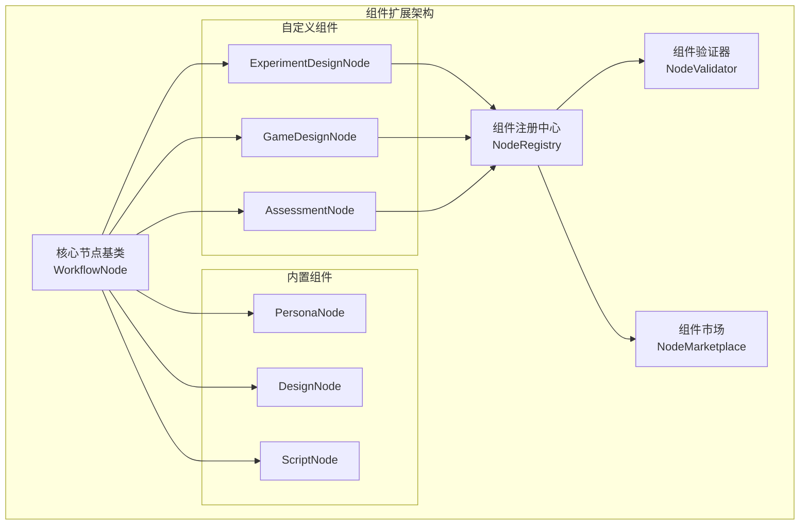
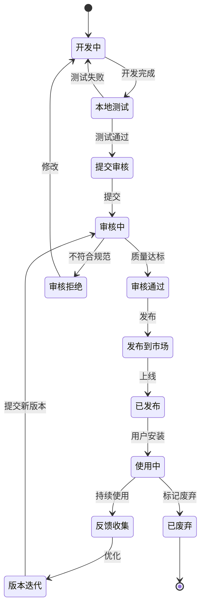
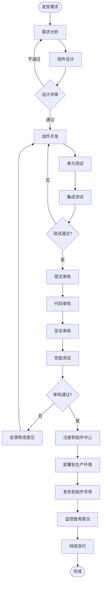
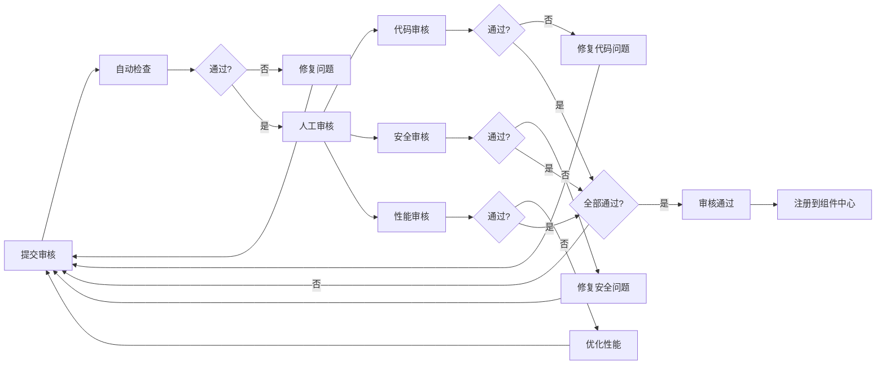
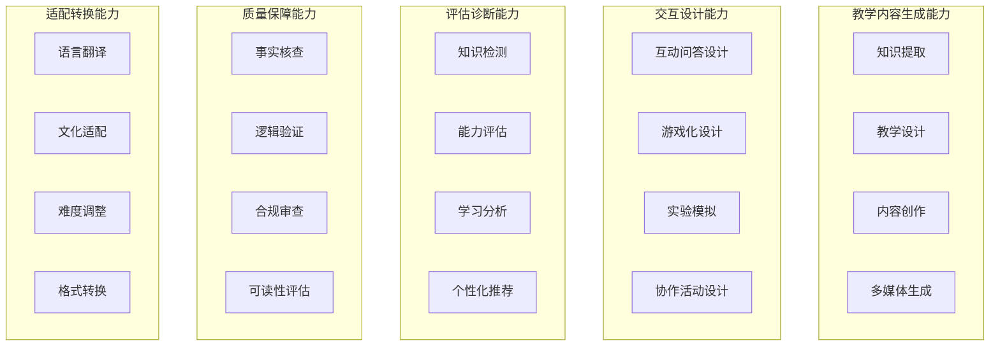
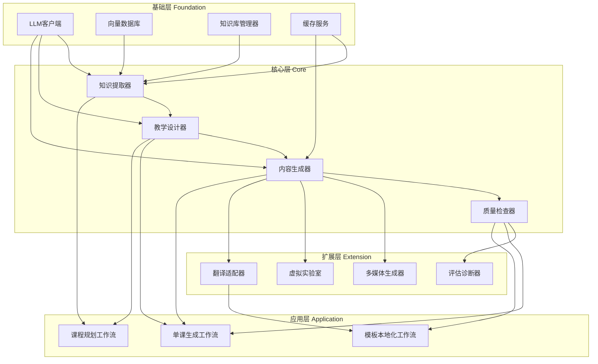
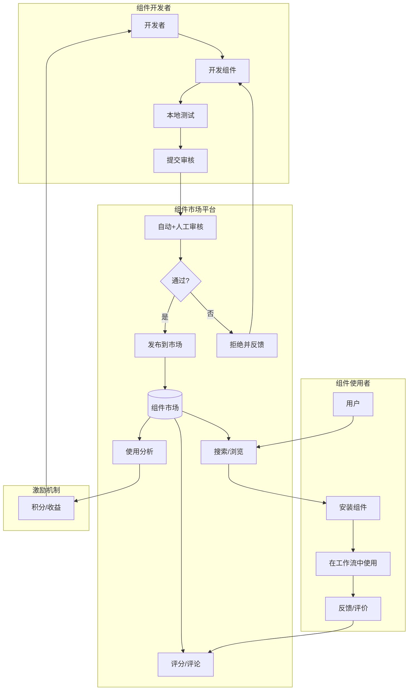
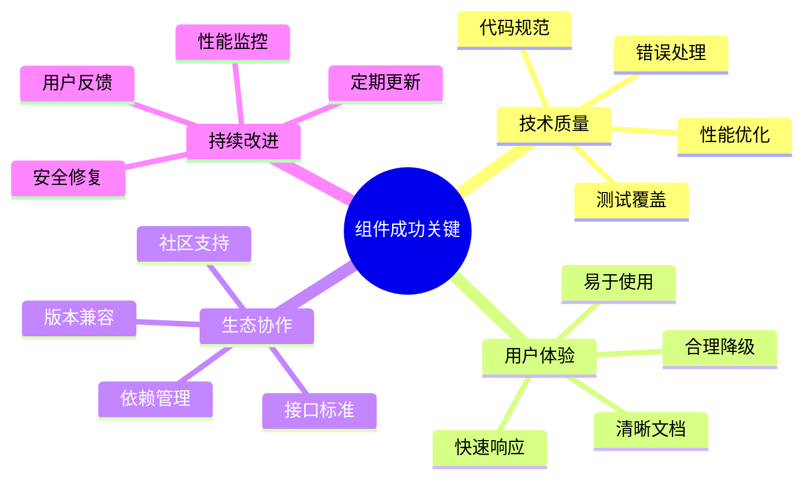

# 组件服务层扩展指南

**文档版本**: V1.0  
**日期**: 2025-12-09  
**状态**: 设计阶段

---

## 目录

1. [组件扩展机制](#1-组件扩展机制)
2. [组件开发流程](#2-组件开发流程)
3. [核心组件能力矩阵](#3-核心组件能力矩阵)
4. [组件分类与规划](#4-组件分类与规划)
5. [组件开发规范](#5-组件开发规范)

---

## 1. 组件扩展机制

### 1.1 设计原则



**核心原则**：

| 原则 | 说明 | 实现方式 |
|------|------|---------|
| **插件化** | 新节点无需修改核心代码 | 基于接口的插件架构 |
| **热加载** | 运行时动态加载新组件 | Python动态导入 + 组件注册 |
| **版本隔离** | 同一组件支持多版本共存 | 版本化命名空间 |
| **依赖管理** | 自动解析组件依赖 | 声明式依赖配置 |
| **沙箱执行** | 防止恶意代码影响系统 | 资源限制 + 超时控制 |

### 1.2 组件生命周期



---

## 2. 组件开发流程

### 2.1 新增组件完整流程



### 2.2 详细步骤说明

#### Step 1: 需求分析

**触发场景**：
1. 教师反馈现有节点无法满足特定教学场景
2. 新学科上线需要专属节点
3. 产品规划新功能

**输出物**：
- 需求文档（Need Document）
- 用例说明（Use Case）
- 验收标准（Acceptance Criteria）

**示例**：
```yaml
# need_example.yaml
need:
  id: "NEED-2025-001"
  title: "实验课需要虚拟实验室交互节点"
  
  background: |
    化学、物理、生物等实验课需要设计虚拟实验环节，
    让学生在安全环境中模拟操作，但现有节点无此能力。
  
  user_story: |
    作为化学教师，
    我希望在教案中嵌入虚拟实验室交互，
    以便学生可以在课前预习实验步骤。
  
  acceptance_criteria:
    - "支持定义实验器材和操作步骤"
    - "生成3D交互式实验演示"
    - "可嵌入到教案中（iframe/视频）"
    - "支持错误操作的安全提示"
  
  priority: "high"
  target_version: "V2.1"
```

---

#### Step 2: 组件设计

**设计要素**：

1. **节点基本信息**
```python
@dataclass
class NodeMetadata:
    """节点元数据"""
    
    node_id: str  # 唯一标识，如 "virtual_lab_v1"
    node_name: str  # 显示名称，如 "虚拟实验室设计器"
    version: str  # 版本号，如 "1.0.0"
    
    category: str  # 分类：content_generation / quality_check / interaction_design
    
    description: str  # 描述
    author: str  # 作者
    license: str  # 许可证
    
    # 依赖
    dependencies: List[str]  # 依赖的其他节点或库
    llm_required: bool  # 是否需要LLM
    external_api: List[str]  # 外部API依赖
    
    # 资源需求
    estimated_duration: int  # 预计执行时间（秒）
    memory_limit: int  # 内存限制（MB）
    cpu_limit: float  # CPU限制（核）
    
    # 适用场景
    applicable_subjects: List[str]  # 适用学科
    applicable_grades: List[str]  # 适用年级
    applicable_lesson_types: List[str]  # 适用课型
```

2. **输入输出契约**
```python
class VirtualLabNode(WorkflowNode):
    """虚拟实验室节点"""
    
    # 输入参数定义
    INPUT_SCHEMA = {
        "experiment_name": {"type": "string", "required": True},
        "experiment_type": {"type": "enum", "values": ["化学", "物理", "生物"]},
        "apparatus_list": {"type": "array", "items": {"type": "string"}},
        "steps": {"type": "array", "items": {"type": "object"}},
        "safety_warnings": {"type": "array", "items": {"type": "string"}},
        "duration_minutes": {"type": "integer", "default": 15}
    }
    
    # 输出参数定义
    OUTPUT_SCHEMA = {
        "virtual_lab_url": {"type": "string", "description": "虚拟实验室访问URL"},
        "embed_code": {"type": "string", "description": "嵌入代码"},
        "video_url": {"type": "string", "description": "演示视频URL"},
        "interactive_elements": {"type": "array", "description": "交互元素列表"}
    }
```

3. **设计文档模板**
```markdown
# 虚拟实验室节点设计文档

## 1. 功能概述
生成虚拟实验室交互式内容，支持化学/物理/生物实验模拟。

## 2. 技术方案
- 使用Unity WebGL渲染3D场景
- 调用实验数据库获取器材模型
- 使用LLM生成实验指导语音

## 3. 执行流程
1. 解析实验步骤
2. 加载3D模型库
3. 构建交互场景
4. 生成嵌入代码
5. 返回结果

## 4. 异常处理
- 器材模型不存在：降级为2D示意图
- 渲染超时：返回静态视频
- LLM调用失败：使用预设文案

## 5. 性能指标
- 执行时间：<30秒
- 内存占用：<512MB
- 成功率：>95%
```

**输出物**：
- 设计文档（Design Doc）
- 接口定义（Interface Spec）
- 技术方案（Technical Proposal）

---

#### Step 3: 组件开发

**开发规范**：

```python
# nodes/virtual_lab_node.py

from workflow.node_base import WorkflowNode, NodeOutput
from workflow.context import WorkflowContext
from typing import Dict, Any
import logging

logger = logging.getLogger(__name__)


class VirtualLabNode(WorkflowNode):
    """
    虚拟实验室节点
    
    功能：生成虚拟实验室交互内容
    版本：1.0.0
    作者：教学设计团队
    """
    
    # 元数据
    METADATA = {
        "node_id": "virtual_lab_v1",
        "node_name": "虚拟实验室设计器",
        "version": "1.0.0",
        "category": "interaction_design",
        "description": "生成虚拟实验室交互式内容",
        "author": "teaching_design_team",
        "license": "MIT",
        "dependencies": ["unity_renderer", "3d_model_lib"],
        "llm_required": True,
        "external_api": ["unity_cloud_build"],
        "estimated_duration": 25,
        "memory_limit": 512,
        "cpu_limit": 2.0,
        "applicable_subjects": ["化学", "物理", "生物"],
        "applicable_grades": ["7-12"],
        "applicable_lesson_types": ["实验课", "演示课"]
    }
    
    def __init__(self, config: Dict[str, Any]):
        """初始化节点"""
        super().__init__(config)
        self.unity_renderer = UnityRenderer(config.get('unity_config'))
        self.model_library = ModelLibrary(config.get('model_db_path'))
        self.llm_client = LLMClient(config.get('llm_config'))
    
    def validate_input(self, context: WorkflowContext) -> bool:
        """验证输入参数"""
        
        # 必需参数检查
        required_fields = ['experiment_name', 'experiment_type', 'apparatus_list', 'steps']
        for field in required_fields:
            if field not in context.inputs:
                logger.error(f"Missing required field: {field}")
                return False
        
        # 参数值验证
        if context.inputs['experiment_type'] not in ['化学', '物理', '生物']:
            logger.error(f"Invalid experiment_type: {context.inputs['experiment_type']}")
            return False
        
        # 步骤数量检查
        if len(context.inputs['steps']) > 20:
            logger.warning("Too many steps (>20), may cause performance issue")
        
        return True
    
    def execute(self, context: WorkflowContext) -> NodeOutput:
        """执行节点逻辑"""
        
        try:
            logger.info(f"Starting VirtualLabNode execution: {context.inputs['experiment_name']}")
            
            # 1. 准备实验数据
            experiment_data = self._prepare_experiment_data(context.inputs)
            
            # 2. 加载3D模型
            models = self._load_3d_models(experiment_data['apparatus_list'])
            
            # 3. 生成实验指导语音
            narration = self._generate_narration(experiment_data['steps'])
            
            # 4. 构建Unity场景
            scene_config = self._build_scene_config(models, experiment_data['steps'])
            
            # 5. 渲染虚拟实验室
            render_result = self.unity_renderer.render(scene_config)
            
            # 6. 生成嵌入代码
            embed_code = self._generate_embed_code(render_result['webgl_url'])
            
            # 返回结果
            output = NodeOutput(
                data={
                    "virtual_lab_url": render_result['webgl_url'],
                    "embed_code": embed_code,
                    "video_url": render_result.get('fallback_video_url'),
                    "interactive_elements": render_result['elements'],
                    "narration_audio": narration['audio_url']
                },
                metadata={
                    "execution_time": render_result['render_time'],
                    "models_loaded": len(models),
                    "scene_complexity": render_result['polygon_count']
                }
            )
            
            logger.info(f"VirtualLabNode execution completed successfully")
            return output
            
        except Exception as e:
            logger.error(f"VirtualLabNode execution failed: {str(e)}", exc_info=True)
            return self.handle_error(e, context)
    
    def _prepare_experiment_data(self, inputs: Dict) -> Dict:
        """准备实验数据"""
        return {
            "name": inputs['experiment_name'],
            "type": inputs['experiment_type'],
            "apparatus_list": inputs['apparatus_list'],
            "steps": inputs['steps'],
            "safety_warnings": inputs.get('safety_warnings', []),
            "duration": inputs.get('duration_minutes', 15)
        }
    
    def _load_3d_models(self, apparatus_list: List[str]) -> List[Dict]:
        """加载3D模型"""
        models = []
        for apparatus in apparatus_list:
            try:
                model = self.model_library.get_model(apparatus)
                models.append(model)
            except ModelNotFoundError:
                # 降级：使用占位符模型
                logger.warning(f"Model not found for {apparatus}, using placeholder")
                models.append(self.model_library.get_placeholder_model())
        
        return models
    
    def _generate_narration(self, steps: List[Dict]) -> Dict:
        """生成实验指导语音"""
        
        # 构建提示词
        prompt = f"""
        为以下实验步骤生成清晰、简洁的语音指导文案：
        
        {json.dumps(steps, ensure_ascii=False, indent=2)}
        
        要求：
        1. 每个步骤用1-2句话描述
        2. 突出安全注意事项
        3. 语言亲切、易懂
        4. 总时长控制在2-3分钟
        """
        
        # 调用LLM
        narration_text = self.llm_client.generate(prompt)
        
        # 文本转语音（TTS）
        audio_url = self.tts_service.synthesize(narration_text)
        
        return {
            "text": narration_text,
            "audio_url": audio_url
        }
    
    def _build_scene_config(self, models: List[Dict], steps: List[Dict]) -> Dict:
        """构建Unity场景配置"""
        return {
            "scene_name": f"experiment_{uuid.uuid4().hex[:8]}",
            "models": models,
            "interactions": self._design_interactions(steps),
            "camera_positions": self._calculate_camera_angles(models),
            "lighting": "laboratory_standard"
        }
    
    def _design_interactions(self, steps: List[Dict]) -> List[Dict]:
        """设计交互逻辑"""
        interactions = []
        for i, step in enumerate(steps):
            interactions.append({
                "step_id": i + 1,
                "trigger": step.get('trigger', 'click'),
                "action": step.get('action'),
                "feedback": step.get('feedback'),
                "next_step": i + 2 if i < len(steps) - 1 else None
            })
        return interactions
    
    def _generate_embed_code(self, webgl_url: str) -> str:
        """生成嵌入代码"""
        return f'''
<iframe 
    src="{webgl_url}" 
    width="800" 
    height="600" 
    frameborder="0"
    allowfullscreen
    style="border-radius: 8px; box-shadow: 0 4px 6px rgba(0,0,0,0.1);"
></iframe>
        '''.strip()
    
    def handle_error(self, error: Exception, context: WorkflowContext) -> NodeOutput:
        """错误处理"""
        
        # 根据错误类型选择降级策略
        if isinstance(error, UnityRenderTimeout):
            # 降级1：返回静态视频
            logger.warning("Unity render timeout, falling back to static video")
            return NodeOutput(
                data={
                    "virtual_lab_url": None,
                    "video_url": self._get_fallback_video(context.inputs),
                    "fallback_reason": "Render timeout"
                },
                metadata={"fallback": True}
            )
        
        elif isinstance(error, ModelNotFoundError):
            # 降级2：使用2D示意图
            logger.warning("3D models not available, using 2D diagrams")
            return NodeOutput(
                data={
                    "diagram_images": self._generate_2d_diagrams(context.inputs),
                    "fallback_reason": "3D models unavailable"
                },
                metadata={"fallback": True}
            )
        
        else:
            # 无法降级，抛出异常
            raise error
    
    def on_error(self, error: Exception) -> ErrorHandlingStrategy:
        """定义错误处理策略"""
        
        if isinstance(error, (UnityRenderTimeout, ModelNotFoundError)):
            return ErrorHandlingStrategy.FALLBACK  # 降级
        elif isinstance(error, TemporaryNetworkError):
            return ErrorHandlingStrategy.RETRY  # 重试
        else:
            return ErrorHandlingStrategy.FAIL  # 失败


# 注册节点到组件中心
def register_node():
    """注册节点（由系统自动调用）"""
    from workflow.registry import NodeRegistry
    
    NodeRegistry.register(
        node_class=VirtualLabNode,
        metadata=VirtualLabNode.METADATA
    )
```

**开发要点**：

✅ **必须实现的方法**：
- `validate_input()`: 输入验证
- `execute()`: 核心逻辑
- `on_error()`: 错误策略

✅ **推荐实现的方法**：
- `handle_error()`: 错误处理（降级策略）
- `get_metadata()`: 返回元数据
- `get_input_schema()`: 输入schema
- `get_output_schema()`: 输出schema

✅ **日志规范**：
- 使用标准logging模块
- 记录关键步骤和耗时
- 错误时记录完整堆栈

✅ **性能要求**：
- 避免阻塞操作
- 大任务使用异步
- 合理使用缓存

---

#### Step 4: 单元测试

```python
# tests/test_virtual_lab_node.py

import pytest
from nodes.virtual_lab_node import VirtualLabNode
from workflow.context import WorkflowContext


class TestVirtualLabNode:
    """虚拟实验室节点测试"""
    
    @pytest.fixture
    def node(self):
        """创建节点实例"""
        config = {
            'unity_config': {...},
            'model_db_path': 'test_models',
            'llm_config': {...}
        }
        return VirtualLabNode(config)
    
    @pytest.fixture
    def valid_context(self):
        """有效的输入上下文"""
        return WorkflowContext(
            inputs={
                "experiment_name": "氧气的制取",
                "experiment_type": "化学",
                "apparatus_list": ["试管", "酒精灯", "集气瓶"],
                "steps": [
                    {"action": "加热高锰酸钾", "duration": 30},
                    {"action": "收集氧气", "duration": 60}
                ],
                "safety_warnings": ["注意防烫伤"],
                "duration_minutes": 10
            }
        )
    
    def test_validate_input_success(self, node, valid_context):
        """测试：输入验证成功"""
        assert node.validate_input(valid_context) == True
    
    def test_validate_input_missing_field(self, node):
        """测试：缺少必需字段"""
        context = WorkflowContext(inputs={"experiment_name": "测试"})
        assert node.validate_input(context) == False
    
    def test_validate_input_invalid_type(self, node):
        """测试：实验类型无效"""
        context = WorkflowContext(
            inputs={
                "experiment_name": "测试",
                "experiment_type": "无效类型",  # 错误
                "apparatus_list": [],
                "steps": []
            }
        )
        assert node.validate_input(context) == False
    
    def test_execute_success(self, node, valid_context):
        """测试：执行成功"""
        result = node.execute(valid_context)
        
        assert result.data['virtual_lab_url'] is not None
        assert result.data['embed_code'] is not None
        assert 'iframe' in result.data['embed_code']
        assert len(result.data['interactive_elements']) > 0
    
    def test_execute_model_not_found_fallback(self, node):
        """测试：模型不存在时降级"""
        context = WorkflowContext(
            inputs={
                "experiment_name": "测试",
                "experiment_type": "化学",
                "apparatus_list": ["不存在的器材"],  # 故意触发错误
                "steps": [{"action": "测试"}]
            }
        )
        
        # 应该降级到2D示意图
        result = node.execute(context)
        assert result.metadata.get('fallback') == True
        assert 'diagram_images' in result.data
    
    def test_execute_timeout_fallback(self, node, valid_context, monkeypatch):
        """测试：渲染超时时降级"""
        
        # Mock渲染器使其超时
        def mock_render_timeout(*args, **kwargs):
            raise UnityRenderTimeout("Render timeout")
        
        monkeypatch.setattr(node.unity_renderer, 'render', mock_render_timeout)
        
        result = node.execute(valid_context)
        assert result.metadata.get('fallback') == True
        assert result.data['video_url'] is not None
    
    def test_performance_constraint(self, node, valid_context):
        """测试：性能约束"""
        import time
        start_time = time.time()
        
        result = node.execute(valid_context)
        
        execution_time = time.time() - start_time
        
        # 应该在30秒内完成
        assert execution_time < 30, f"Execution time {execution_time}s exceeds limit"
    
    def test_memory_usage(self, node, valid_context):
        """测试：内存使用"""
        import psutil
        import os
        
        process = psutil.Process(os.getpid())
        mem_before = process.memory_info().rss / 1024 / 1024  # MB
        
        result = node.execute(valid_context)
        
        mem_after = process.memory_info().rss / 1024 / 1024  # MB
        mem_used = mem_after - mem_before
        
        # 应该在512MB限制内
        assert mem_used < 512, f"Memory usage {mem_used}MB exceeds limit"
```

**测试覆盖率要求**：
- 行覆盖率：>80%
- 分支覆盖率：>70%
- 关键路径：100%

---

#### Step 5: 集成测试

```python
# tests/integration/test_virtual_lab_workflow.py

import pytest
from workflow.engine import WorkflowEngine
from workflow.builder import WorkflowBuilder


class TestVirtualLabIntegration:
    """虚拟实验室节点集成测试"""
    
    def test_full_workflow_with_virtual_lab(self):
        """测试：完整工作流包含虚拟实验室节点"""
        
        # 构建工作流
        builder = WorkflowBuilder()
        workflow = (builder
            .add_node("persona", "PersonaNode")
            .add_node("design", "DesignNode")
            .add_node("virtual_lab", "VirtualLabNode")  # 新节点
            .add_node("script", "ScriptNode")
            .add_edge("persona", "design")
            .add_edge("design", "virtual_lab")
            .add_edge("virtual_lab", "script")
            .build()
        )
        
        # 执行工作流
        engine = WorkflowEngine()
        result = engine.execute(
            workflow=workflow,
            inputs={
                "subject": "化学",
                "grade": "9",
                "topic": "氧气的制取",
                "lesson_type": "实验课"
            }
        )
        
        # 验证结果
        assert result.success == True
        assert 'virtual_lab' in result.node_outputs
        assert result.node_outputs['virtual_lab']['virtual_lab_url'] is not None
        
        # 验证后续节点能正确使用虚拟实验室输出
        script_output = result.node_outputs['script']
        assert 'virtual_lab_url' in script_output['references']
    
    def test_workflow_fallback_chain(self):
        """测试：降级链条"""
        
        # 模拟Unity服务不可用
        with mock_service_unavailable('unity_renderer'):
            builder = WorkflowBuilder()
            workflow = (builder
                .add_node("virtual_lab", "VirtualLabNode")
                .build()
            )
            
            result = engine.execute(workflow, inputs={...})
            
            # 应该降级到视频
            assert result.node_outputs['virtual_lab']['video_url'] is not None
            assert result.metadata['fallback_activated'] == True
```

---

#### Step 6: 提交审核

**审核清单**：

```yaml
# review_checklist.yaml

code_review:
  - title: "代码规范"
    checks:
      - "遵循PEP 8编码规范"
      - "函数名、变量名语义清晰"
      - "类和函数有完整的docstring"
      - "复杂逻辑有注释说明"
    
  - title: "错误处理"
    checks:
      - "所有异常都有捕获和处理"
      - "定义了降级策略"
      - "日志记录完整"
    
  - title: "性能优化"
    checks:
      - "无明显性能瓶颈"
      - "合理使用缓存"
      - "资源及时释放"

security_review:
  - title: "输入验证"
    checks:
      - "所有用户输入都经过验证"
      - "防止注入攻击"
      - "防止路径遍历"
    
  - title: "资源限制"
    checks:
      - "设置了内存限制"
      - "设置了CPU限制"
      - "设置了超时时间"
    
  - title: "隐私保护"
    checks:
      - "不记录敏感信息到日志"
      - "遵循数据最小化原则"

performance_review:
  - title: "性能指标"
    checks:
      - "执行时间 < 30秒"
      - "内存占用 < 512MB"
      - "成功率 > 95%"
    
  - title: "压力测试"
    checks:
      - "并发10次无异常"
      - "连续100次成功率达标"

documentation_review:
  - title: "文档完整性"
    checks:
      - "有设计文档"
      - "有API文档"
      - "有使用示例"
      - "有故障排查指南"
```

**审核流程**：



---

#### Step 7: 注册到组件中心

```python
# 组件注册脚本
# scripts/register_node.py

from workflow.registry import NodeRegistry
from workflow.validator import NodeValidator
from nodes.virtual_lab_node import VirtualLabNode
import yaml


def register_virtual_lab_node():
    """注册虚拟实验室节点"""
    
    # 1. 验证节点
    validator = NodeValidator()
    validation_result = validator.validate(
        node_class=VirtualLabNode,
        metadata=VirtualLabNode.METADATA
    )
    
    if not validation_result.is_valid:
        print(f"❌ 验证失败：{validation_result.errors}")
        return False
    
    # 2. 注册节点
    NodeRegistry.register(
        node_class=VirtualLabNode,
        metadata=VirtualLabNode.METADATA,
        tags=["实验", "虚拟", "交互", "3D"],
        examples=[
            {
                "name": "化学实验：氧气制取",
                "input": {
                    "experiment_name": "氧气的制取",
                    "experiment_type": "化学",
                    "apparatus_list": ["试管", "酒精灯"],
                    "steps": [...]
                },
                "output": {
                    "virtual_lab_url": "https://..."
                }
            }
        ]
    )
    
    print(f"✅ 节点注册成功：{VirtualLabNode.METADATA['node_id']}")
    
    # 3. 生成文档
    generate_node_documentation(VirtualLabNode)
    
    # 4. 发布到组件市场
    publish_to_marketplace(VirtualLabNode)
    
    return True


def generate_node_documentation(node_class):
    """生成节点文档"""
    
    doc = f"""
# {node_class.METADATA['node_name']}

**版本**: {node_class.METADATA['version']}  
**作者**: {node_class.METADATA['author']}  
**分类**: {node_class.METADATA['category']}

## 功能说明

{node_class.METADATA['description']}

## 适用场景

- **学科**: {', '.join(node_class.METADATA['applicable_subjects'])}
- **年级**: {node_class.METADATA['applicable_grades']}
- **课型**: {', '.join(node_class.METADATA['applicable_lesson_types'])}

## 输入参数

```yaml
{yaml.dump(node_class.INPUT_SCHEMA, allow_unicode=True)}
```

## 输出参数

```yaml
{yaml.dump(node_class.OUTPUT_SCHEMA, allow_unicode=True)}
```

## 使用示例

```python
from nodes.virtual_lab_node import VirtualLabNode

node = VirtualLabNode(config)
result = node.execute(context)

print(result.data['virtual_lab_url'])
```

## 性能指标

- 执行时间：{node_class.METADATA['estimated_duration']}秒
- 内存限制：{node_class.METADATA['memory_limit']}MB
- CPU限制：{node_class.METADATA['cpu_limit']}核

## 依赖项

{', '.join(node_class.METADATA['dependencies'])}

## 常见问题

### Q: 渲染超时怎么办？
A: 节点会自动降级到静态视频模式。

### Q: 模型不存在怎么办？
A: 节点会使用占位符模型或降级到2D示意图。

## 更新日志

- v1.0.0 (2025-12-09): 初始版本
    """
    
    # 保存文档
    with open(f"docs/nodes/{node_class.METADATA['node_id']}.md", 'w') as f:
        f.write(doc)


def publish_to_marketplace(node_class):
    """发布到组件市场"""
    
    from workflow.marketplace import MarketplaceClient
    
    client = MarketplaceClient()
    client.publish(
        node_id=node_class.METADATA['node_id'],
        version=node_class.METADATA['version'],
        package_path=f"nodes/{node_class.__name__.lower()}.py",
        metadata=node_class.METADATA,
        readme=f"docs/nodes/{node_class.METADATA['node_id']}.md"
    )
    
    print(f"✅ 已发布到组件市场")


if __name__ == "__main__":
    register_virtual_lab_node()
```

---

#### Step 8: 部署到生产环境

```yaml
# deployment/virtual_lab_node_deployment.yaml

apiVersion: v1
kind: ConfigMap
metadata:
  name: virtual-lab-node-config
data:
  unity_config.yaml: |
    unity_cloud_url: "https://unity-cloud.example.com"
    api_key: "${UNITY_API_KEY}"
    timeout: 25
  
  model_db_config.yaml: |
    database_url: "postgresql://models_db"
    cache_enabled: true
    cache_ttl: 3600

---
apiVersion: apps/v1
kind: Deployment
metadata:
  name: workflow-engine-with-virtual-lab
spec:
  replicas: 3
  template:
    spec:
      containers:
      - name: workflow-engine
        image: workflow-engine:latest
        env:
        - name: ENABLE_VIRTUAL_LAB_NODE
          value: "true"
        - name: UNITY_API_KEY
          valueFrom:
            secretKeyRef:
              name: unity-credentials
              key: api-key
        
        resources:
          limits:
            memory: "1Gi"  # 为虚拟实验室节点预留更多内存
            cpu: "2"
          requests:
            memory: "512Mi"
            cpu: "1"
        
        volumeMounts:
        - name: node-config
          mountPath: /etc/nodes/virtual_lab
      
      volumes:
      - name: node-config
        configMap:
          name: virtual-lab-node-config
```

---

#### Step 9: 监控使用情况

```python
# monitoring/node_metrics.py

from prometheus_client import Counter, Histogram, Gauge
import logging

# 指标定义
node_execution_total = Counter(
    'node_execution_total',
    'Total node executions',
    ['node_id', 'status']  # status: success/failure/fallback
)

node_execution_duration = Histogram(
    'node_execution_duration_seconds',
    'Node execution duration',
    ['node_id'],
    buckets=[1, 5, 10, 20, 30, 60]
)

node_memory_usage = Gauge(
    'node_memory_usage_mb',
    'Node memory usage',
    ['node_id']
)

node_fallback_total = Counter(
    'node_fallback_total',
    'Total fallback activations',
    ['node_id', 'fallback_reason']
)


class NodeMonitor:
    """节点监控"""
    
    @staticmethod
    def record_execution(node_id: str, status: str, duration: float, memory_mb: float):
        """记录执行指标"""
        
        node_execution_total.labels(node_id=node_id, status=status).inc()
        node_execution_duration.labels(node_id=node_id).observe(duration)
        node_memory_usage.labels(node_id=node_id).set(memory_mb)
    
    @staticmethod
    def record_fallback(node_id: str, reason: str):
        """记录降级"""
        
        node_fallback_total.labels(node_id=node_id, fallback_reason=reason).inc()
        logging.warning(f"Node {node_id} fallback: {reason}")
    
    @staticmethod
    def get_node_health_score(node_id: str) -> float:
        """计算节点健康分数"""
        
        # 获取最近1小时的数据
        total_executions = get_metric_value(node_execution_total, node_id, '1h')
        failed_executions = get_metric_value(node_execution_total, node_id, '1h', status='failure')
        fallback_executions = get_metric_value(node_execution_total, node_id, '1h', status='fallback')
        
        if total_executions == 0:
            return 1.0
        
        # 健康分数 = (成功率 * 0.7) + (非降级率 * 0.3)
        success_rate = 1 - (failed_executions / total_executions)
        no_fallback_rate = 1 - (fallback_executions / total_executions)
        
        health_score = (success_rate * 0.7) + (no_fallback_rate * 0.3)
        
        return health_score
```

**监控看板示例**：

```
┌─────────────────────────────────────────────────────────┐
│ 虚拟实验室节点 - 运行状况                                │
├─────────────────────────────────────────────────────────┤
│ 健康分数: 0.92 ⭐                                        │
│ 最近1小时执行: 145次                                     │
│ 成功率: 96.6%                                            │
│ 降级率: 3.4%                                             │
│ 平均耗时: 18.2秒                                         │
│ 峰值内存: 487MB                                          │
├─────────────────────────────────────────────────────────┤
│ 降级原因分布:                                            │
│   - Unity渲染超时: 3次                                   │
│   - 模型加载失败: 2次                                    │
├─────────────────────────────────────────────────────────┤
│ 告警:                                                    │
│   ⚠️  峰值内存接近限制（487/512 MB）                     │
└─────────────────────────────────────────────────────────┘
```

---

#### Step 10: 持续迭代

**反馈收集**：

```python
# feedback/node_feedback.py

class NodeFeedbackCollector:
    """节点反馈收集器"""
    
    @staticmethod
    def collect_user_feedback(node_id: str, execution_id: str, feedback: Dict):
        """收集用户反馈"""
        
        FeedbackDB.insert({
            "node_id": node_id,
            "execution_id": execution_id,
            "timestamp": datetime.now(),
            "rating": feedback.get('rating', 0),  # 1-5星
            "comment": feedback.get('comment'),
            "issues": feedback.get('issues', []),
            "suggestions": feedback.get('suggestions', [])
        })
    
    @staticmethod
    def analyze_feedback(node_id: str, time_range: str = '30d') -> Dict:
        """分析反馈"""
        
        feedbacks = FeedbackDB.query(
            node_id=node_id,
            time_range=time_range
        )
        
        return {
            "avg_rating": np.mean([f['rating'] for f in feedbacks]),
            "total_feedbacks": len(feedbacks),
            "common_issues": extract_common_issues(feedbacks),
            "top_suggestions": extract_top_suggestions(feedbacks),
            "satisfaction_trend": calculate_trend(feedbacks)
        }
```

**迭代决策**：

```yaml
# 基于反馈的迭代计划

iteration_plan:
  trigger:
    - "平均评分 < 3.5"
    - "成功率 < 90%"
    - "相同问题反馈 > 5次"
  
  actions:
    - type: "bug_fix"
      priority: "high"
      description: "修复用户反馈的高频问题"
    
    - type: "performance_optimization"
      priority: "medium"
      description: "优化执行时间和内存使用"
    
    - type: "feature_enhancement"
      priority: "low"
      description: "根据用户建议增加新功能"
  
  release_cycle: "bi-weekly"  # 双周发布
```

---

## 3. 核心组件能力矩阵 ⭐

基于教学场景分析，系统需要以下**核心组件能力**：

### 3.1 能力分类框架



### 3.2 详细能力清单

#### 类别A：教学内容生成能力（Content Generation）

| 组件ID | 组件名称 | 功能描述 | 优先级 | 依赖 |
|--------|---------|---------|--------|------|
| **CG-01** | **知识提取器** | 从教材/文档中提取知识点 | P0 | NLP, OCR |
| **CG-02** | **教学目标生成器** | 基于布鲁姆分类法生成三维目标 | P0 | LLM |
| **CG-03** | **教学环节设计器** | 设计导入/探究/总结等环节 | P0 | LLM |
| **CG-04** | **教学脚本生成器** | 生成详细的教学脚本 | P0 | LLM, RAG |
| **CG-05** | **故事化包装器** | 将知识点包装成故事 | P1 | LLM |
| **CG-06** | **例题生成器** | 生成例题和变式练习 | P1 | LLM |
| **CG-07** | **板书设计器** | 设计板书布局和内容 | P2 | LLM |
| **CG-08** | **作业设计器** | 生成课后作业和拓展任务 | P1 | LLM |

#### 类别B：多媒体生成能力（Multimedia Generation）

| 组件ID | 组件名称 | 功能描述 | 优先级 | 依赖 |
|--------|---------|---------|--------|------|
| **MG-01** | **图片生成器** | 生成配图、示意图、插画 | P1 | DALL-E, Midjourney |
| **MG-02** | **图表生成器** | 生成统计图、思维导图 | P1 | Matplotlib, D3.js |
| **MG-03** | **视频生成器** | 生成动画、演示视频 | P2 | FFmpeg, D-ID |
| **MG-04** | **音频生成器** | 文本转语音、背景音乐 | P2 | TTS API |
| **MG-05** | **PPT生成器** | 生成演示文稿 | P1 | python-pptx |
| **MG-06** | **3D模型生成器** | 生成3D教学模型 | P3 | Three.js, Unity |

#### 类别C：交互设计能力（Interaction Design）

| 组件ID | 组件名称 | 功能描述 | 优先级 | 依赖 |
|--------|---------|---------|--------|------|
| **ID-01** | **提问设计器** | 设计启发性问题 | P0 | LLM |
| **ID-02** | **互动活动设计器** | 设计小组讨论、辩论等 | P1 | LLM |
| **ID-03** | **游戏化设计器** | 设计教学游戏 | P2 | Game Engine |
| **ID-04** | **虚拟实验室** | 设计虚拟实验（已详述） | P2 | Unity, WebGL |
| **ID-05** | **角色扮演设计器** | 设计角色扮演活动 | P2 | LLM |
| **ID-06** | **AR/VR内容生成器** | 生成增强/虚拟现实内容 | P3 | ARKit, ARCore |

#### 类别D：评估诊断能力（Assessment & Diagnosis）

| 组件ID | 组件名称 | 功能描述 | 优先级 | 依赖 |
|--------|---------|---------|--------|------|
| **AD-01** | **测验生成器** | 生成选择题、填空题等 | P1 | LLM |
| **AD-02** | **主观题评分器** | 自动评阅主观题 | P2 | LLM |
| **AD-03** | **知识诊断器** | 诊断学生知识薄弱点 | P2 | ML模型 |
| **AD-04** | **学习路径推荐器** | 推荐个性化学习路径 | P2 | 推荐算法 |
| **AD-05** | **难度评估器** | 评估内容难度等级 | P1 | NLP, ML |
| **AD-06** | **学习分析仪表盘** | 可视化学习数据 | P2 | BI工具 |

#### 类别E：质量保障能力（Quality Assurance）

| 组件ID | 组件名称 | 功能描述 | 优先级 | 依赖 |
|--------|---------|---------|--------|------|
| **QA-01** | **事实核查器** | 验证事实准确性 | P0 | RAG, Knowledge Base |
| **QA-02** | **逻辑一致性检查器** | 检查内容逻辑 | P1 | LLM |
| **QA-03** | **语法检查器** | 检查语法错误 | P1 | LanguageTool |
| **QA-04** | **合规审查器** | 检查敏感词、合规性 | P0 | 规则引擎 |
| **QA-05** | **可读性评估器** | 评估文本可读性 | P1 | Flesch-Kincaid |
| **QA-06** | **抄袭检测器** | 检测内容原创性 | P2 | 文本相似度 |
| **QA-07** | **无障碍检查器** | 检查无障碍标准 | P2 | ADA/WCAG |

#### 类别F：适配转换能力（Adaptation & Transformation）

| 组件ID | 组件名称 | 功能描述 | 优先级 | 依赖 |
|--------|---------|---------|--------|------|
| **AT-01** | **语言翻译器** | 多语言翻译（已详述） | P1 | LLM |
| **AT-02** | **文化适配器** | 文化元素本地化（已详述） | P1 | LLM, 规则库 |
| **AT-03** | **难度调节器** | 调整内容难度 | P1 | LLM |
| **AT-04** | **长度控制器** | 压缩或扩展内容 | P2 | LLM |
| **AT-05** | **风格转换器** | 转换语言风格 | P2 | LLM |
| **AT-06** | **格式转换器** | Word/PDF/HTML互转 | P1 | Pandoc |
| **AT-07** | **课标对齐器** | 对齐不同课程标准（已详述） | P1 | LLM, 向量检索 |

#### 类别G：课程规划能力（Curriculum Planning）⭐新增

| 组件ID | 组件名称 | 功能描述 | 优先级 | 依赖 |
|--------|---------|---------|--------|------|
| **CP-01** | **教材分析器** | 分析教材结构和知识体系 | P0 | NLP, OCR |
| **CP-02** | **主题聚类器** | 划分单元和主题 | P0 | ML聚类算法 |
| **CP-03** | **知识图谱构建器** | 构建知识依赖图谱 | P1 | Neo4j, 图算法 |
| **CP-04** | **课时分配优化器** | 优化课时分配 | P1 | 优化算法 |
| **CP-05** | **课型序列生成器** | 生成课型序列 | P0 | 规则引擎 |
| **CP-06** | **故事宇宙设计器** | 设计故事主线和世界观 | P2 | LLM |
| **CP-07** | **进度追踪器** | 追踪教学进度 | P2 | 状态机 |

---

### 3.3 学科特定能力矩阵

不同学科需要专门的组件能力：

#### 数学学科（Mathematics）

| 组件ID | 组件名称 | 功能描述 | 优先级 |
|--------|---------|---------|--------|
| **MATH-01** | **LaTeX渲染器** | 渲染数学公式 | P0 |
| **MATH-02** | **几何图形生成器** | 生成几何图形（GeoGebra） | P1 |
| **MATH-03** | **步骤推导器** | 生成详细解题步骤 | P1 |
| **MATH-04** | **变式题生成器** | 基于原题生成变式 | P1 |
| **MATH-05** | **函数图像绘制器** | 绘制函数图像 | P1 |
| **MATH-06** | **数学证明生成器** | 生成数学证明过程 | P2 |
| **MATH-07** | **计算验证器** | 验证计算结果 | P0 |

#### 语文学科（Chinese Language）

| 组件ID | 组件名称 | 功能描述 | 优先级 |
|--------|---------|---------|--------|
| **LANG-01** | **古文翻译器** | 文言文翻译和注释 | P1 |
| **LANG-02** | **诗词鉴赏生成器** | 生成诗词鉴赏内容 | P1 |
| **LANG-03** | **作文批改器** | 自动批改作文 | P2 |
| **LANG-04** | **修辞手法识别器** | 识别修辞手法 | P2 |
| **LANG-05** | **朗读音频生成器** | 生成课文朗读音频 | P1 |
| **LANG-06** | **字词卡片生成器** | 生成生字词卡片 | P1 |
| **LANG-07** | **阅读理解生成器** | 生成阅读理解题 | P1 |

#### 英语学科（English）

| 组件ID | 组件名称 | 功能描述 | 优先级 |
|--------|---------|---------|--------|
| **ENG-01** | **语音合成器** | 生成标准发音 | P0 |
| **ENG-02** | **语法检查器** | 检查语法错误 | P1 |
| **ENG-03** | **词汇扩展器** | 提供同义词、例句 | P1 |
| **ENG-04** | **对话生成器** | 生成对话场景 | P1 |
| **ENG-05** | **口语评测器** | 评测口语水平 | P2 |
| **ENG-06** | **翻译对比器** | 对比中英翻译 | P1 |
| **ENG-07** | **听力材料生成器** | 生成听力练习 | P1 |

#### 物理学科（Physics）

| 组件ID | 组件名称 | 功能描述 | 优先级 |
|--------|---------|---------|--------|
| **PHY-01** | **物理仿真器** | 模拟物理现象 | P1 |
| **PHY-02** | **电路图生成器** | 生成电路图 | P1 |
| **PHY-03** | **力学分析器** | 分析受力情况 | P1 |
| **PHY-04** | **实验视频生成器** | 生成实验演示视频 | P2 |
| **PHY-05** | **单位转换器** | 物理单位转换 | P1 |
| **PHY-06** | **公式推导器** | 物理公式推导 | P2 |

#### 化学学科（Chemistry）

| 组件ID | 组件名称 | 功能描述 | 优先级 |
|--------|---------|---------|--------|
| **CHEM-01** | **分子结构绘制器** | 绘制分子结构式 | P1 |
| **CHEM-02** | **化学方程式配平器** | 自动配平方程式 | P1 |
| **CHEM-03** | **虚拟实验室** | 化学实验模拟（已详述） | P2 |
| **CHEM-04** | **反应动画生成器** | 生成反应过程动画 | P2 |
| **CHEM-05** | **元素周期表查询器** | 查询元素信息 | P1 |
| **CHEM-06** | **化学计算器** | 摩尔计算、浓度计算 | P1 |

#### 生物学科（Biology）

| 组件ID | 组件名称 | 功能描述 | 优先级 |
|--------|---------|---------|--------|
| **BIO-01** | **3D模型展示器** | 展示生物体3D模型 | P1 |
| **BIO-02** | **生物过程动画器** | 动画展示生物过程 | P2 |
| **BIO-03** | **显微镜模拟器** | 模拟显微观察 | P2 |
| **BIO-04** | **遗传图谱生成器** | 生成遗传图谱 | P2 |
| **BIO-05** | **解剖图生成器** | 生成解剖示意图 | P1 |

#### 历史学科（History）

| 组件ID | 组件名称 | 功能描述 | 优先级 |
|--------|---------|---------|--------|
| **HIST-01** | **时间轴生成器** | 生成历史时间轴 | P1 |
| **HIST-02** | **历史地图生成器** | 生成历史地图 | P1 |
| **HIST-03** | **史料引用器** | 自动引用史料 | P2 |
| **HIST-04** | **历史人物介绍器** | 生成人物介绍卡片 | P1 |
| **HIST-05** | **事件关联分析器** | 分析历史事件关联 | P2 |

#### 地理学科（Geography）

| 组件ID | 组件名称 | 功能描述 | 优先级 |
|--------|---------|---------|--------|
| **GEO-01** | **地图标注器** | 在地图上标注信息 | P1 |
| **GEO-02** | **地形3D可视化器** | 3D展示地形 | P2 |
| **GEO-03** | **气候数据可视化器** | 可视化气候数据 | P1 |
| **GEO-04** | **经纬度计算器** | 地理坐标计算 | P1 |
| **GEO-05** | **卫星影像调用器** | 调用卫星地图API | P2 |

---

### 3.4 组件能力优先级决策矩阵

基于**使用频率**、**技术复杂度**、**业务价值**三个维度，制定开发优先级：

```python
# 优先级评分模型

class ComponentPriorityScorer:
    """组件优先级评分器"""
    
    @staticmethod
    def calculate_priority_score(
        usage_frequency: float,  # 使用频率 (0-1)
        tech_complexity: float,  # 技术复杂度 (0-1, 越高越复杂)
        business_value: float    # 业务价值 (0-1)
    ) -> float:
        """
        计算综合优先级分数
        
        公式：score = (频率 * 0.3) + ((1-复杂度) * 0.2) + (价值 * 0.5)
        
        解释：
        - 业务价值权重最高（50%）
        - 使用频率次之（30%）
        - 技术复杂度取反（20%），越简单越优先
        """
        
        score = (
            usage_frequency * 0.3 +
            (1 - tech_complexity) * 0.2 +
            business_value * 0.5
        )
        
        return round(score, 2)
    
    @staticmethod
    def categorize_priority(score: float) -> str:
        """分类优先级"""
        
        if score >= 0.8:
            return "P0 - 立即开发"
        elif score >= 0.6:
            return "P1 - 第一批次"
        elif score >= 0.4:
            return "P2 - 第二批次"
        else:
            return "P3 - 未来考虑"


# 示例：评估各组件优先级

components_evaluation = [
    {
        "id": "CG-01",
        "name": "知识提取器",
        "usage_freq": 0.95,  # 几乎每个课程都需要
        "tech_complexity": 0.6,  # 中等复杂
        "business_value": 0.9   # 核心功能
    },
    {
        "id": "MG-06",
        "name": "3D模型生成器",
        "usage_freq": 0.2,   # 仅特定学科需要
        "tech_complexity": 0.9,  # 非常复杂
        "business_value": 0.5   # 锦上添花
    },
    {
        "id": "ID-04",
        "name": "虚拟实验室",
        "usage_freq": 0.4,   # 理科课程需要
        "tech_complexity": 0.85, # 很复杂
        "business_value": 0.75  # 高价值（差异化）
    },
    {
        "id": "QA-01",
        "name": "事实核查器",
        "usage_freq": 0.9,   # 所有内容都需要
        "tech_complexity": 0.5,  # 中等
        "business_value": 0.95  # 极高价值（质量保证）
    }
]

scorer = ComponentPriorityScorer()

for comp in components_evaluation:
    score = scorer.calculate_priority_score(
        comp['usage_freq'],
        comp['tech_complexity'],
        comp['business_value']
    )
    priority = scorer.categorize_priority(score)
    
    print(f"{comp['id']} - {comp['name']}")
    print(f"  评分: {score} -> {priority}")
    print()
```

**输出示例**：

```
CG-01 - 知识提取器
  评分: 0.82 -> P0 - 立即开发

MG-06 - 3D模型生成器
  评分: 0.29 -> P3 - 未来考虑

ID-04 - 虚拟实验室
  评分: 0.52 -> P2 - 第二批次

QA-01 - 事实核查器
  评分: 0.85 -> P0 - 立即开发
```

---

### 3.5 组件依赖关系图



**依赖规则**：

1. **基础层** → 提供底层能力，所有组件都可能依赖
2. **核心层** → 必须优先开发，是系统骨干
3. **扩展层** → 依赖核心层，提供增强功能
4. **应用层** → 编排组件，实现业务流程

---

## 4. 组件市场机制设计 🏪

### 4.1 组件市场架构



---

### 4.2 组件包规范

```yaml
# component_package.yaml

package:
  id: "virtual_lab_node_v1"
  name: "虚拟实验室节点"
  version: "1.2.0"
  author: "张三"
  organization: "某某科技"
  license: "MIT"
  
  description: |
    提供化学、物理实验的虚拟仿真能力，支持Unity WebGL渲染，
    包含100+常见实验模板。
  
  tags:
    - "实验"
    - "化学"
    - "物理"
    - "3D"
    - "交互"
  
  category: "交互设计"
  
  applicable:
    subjects: ["化学", "物理"]
    grades: ["7-12"]
    lesson_types: ["实验课", "探究课"]
  
  dependencies:
    - "llm_client >= 2.0.0"
    - "unity_renderer >= 3.5.0"
    - "model_library >= 1.0.0"
  
  performance:
    avg_duration: 18.2  # 秒
    memory_limit: 512   # MB
    cpu_limit: 2        # 核
    success_rate: 0.966 # 96.6%
  
  pricing:
    model: "freemium"  # free | freemium | paid
    free_quota: 100    # 每月免费调用次数
    price_per_call: 0.05  # 超出后每次调用价格（元）
  
  files:
    main: "nodes/virtual_lab_node.py"
    tests: "tests/test_virtual_lab_node.py"
    docs: "docs/virtual_lab_node.md"
    examples: "examples/virtual_lab_examples.yaml"
  
  metadata:
    created_at: "2025-11-01T10:00:00Z"
    updated_at: "2025-12-09T15:30:00Z"
    downloads: 1523
    rating: 4.7
    reviews: 89
```

---

### 4.3 组件安装流程

```python
# marketplace/installer.py

from typing import Optional
import subprocess
import yaml


class ComponentInstaller:
    """组件安装器"""
    
    def __init__(self, marketplace_url: str = "https://marketplace.metaworkflow.ai"):
        self.marketplace_url = marketplace_url
        self.registry = NodeRegistry()
    
    def search_components(
        self,
        keyword: Optional[str] = None,
        category: Optional[str] = None,
        subject: Optional[str] = None,
        min_rating: float = 0.0
    ) -> List[Dict]:
        """搜索组件"""
        
        params = {
            "keyword": keyword,
            "category": category,
            "subject": subject,
            "min_rating": min_rating
        }
        
        response = requests.get(
            f"{self.marketplace_url}/api/components/search",
            params=params
        )
        
        return response.json()['results']
    
    def get_component_details(self, component_id: str) -> Dict:
        """获取组件详情"""
        
        response = requests.get(
            f"{self.marketplace_url}/api/components/{component_id}"
        )
        
        return response.json()
    
    def install_component(
        self,
        component_id: str,
        version: Optional[str] = None
    ) -> bool:
        """安装组件"""
        
        # 1. 下载组件包
        print(f"📦 正在下载 {component_id}...")
        
        package_url = f"{self.marketplace_url}/api/components/{component_id}/download"
        if version:
            package_url += f"?version={version}"
        
        response = requests.get(package_url, stream=True)
        package_path = f"/tmp/{component_id}.zip"
        
        with open(package_path, 'wb') as f:
            for chunk in response.iter_content(chunk_size=8192):
                f.write(chunk)
        
        # 2. 解压
        print(f"📂 正在解压...")
        import zipfile
        with zipfile.ZipFile(package_path, 'r') as zip_ref:
            zip_ref.extractall(f"components/{component_id}")
        
        # 3. 读取配置
        with open(f"components/{component_id}/component_package.yaml", 'r') as f:
            config = yaml.safe_load(f)
        
        # 4. 安装依赖
        print(f"📚 正在安装依赖...")
        for dep in config['package']['dependencies']:
            subprocess.run(["pip", "install", dep], check=True)
        
        # 5. 运行安装脚本
        if os.path.exists(f"components/{component_id}/install.py"):
            print(f"⚙️  正在运行安装脚本...")
            subprocess.run(
                ["python", f"components/{component_id}/install.py"],
                check=True
            )
        
        # 6. 注册到系统
        print(f"📝 正在注册组件...")
        node_module = importlib.import_module(
            f"components.{component_id}.{config['package']['files']['main'].replace('.py', '').replace('/', '.')}"
        )
        node_class = getattr(node_module, config['package']['name'].replace(' ', ''))
        
        self.registry.register(
            node_class=node_class,
            metadata=node_class.METADATA
        )
        
        print(f"✅ 组件 {component_id} 安装成功！")
        
        return True
    
    def uninstall_component(self, component_id: str) -> bool:
        """卸载组件"""
        
        # 1. 从注册表移除
        self.registry.unregister(component_id)
        
        # 2. 删除文件
        import shutil
        shutil.rmtree(f"components/{component_id}")
        
        print(f"✅ 组件 {component_id} 已卸载")
        
        return True
    
    def update_component(
        self,
        component_id: str,
        target_version: Optional[str] = None
    ) -> bool:
        """更新组件"""
        
        # 1. 检查是否有新版本
        current_version = self.registry.get_version(component_id)
        
        if not target_version:
            # 获取最新版本
            details = self.get_component_details(component_id)
            target_version = details['latest_version']
        
        if current_version == target_version:
            print(f"ℹ️  组件 {component_id} 已是最新版本")
            return True
        
        print(f"⬆️  更新 {component_id}: {current_version} -> {target_version}")
        
        # 2. 卸载旧版本
        self.uninstall_component(component_id)
        
        # 3. 安装新版本
        self.install_component(component_id, version=target_version)
        
        print(f"✅ 组件 {component_id} 更新完成")
        
        return True


# CLI 使用示例
if __name__ == "__main__":
    installer = ComponentInstaller()
    
    # 搜索组件
    results = installer.search_components(
        keyword="实验",
        category="交互设计",
        min_rating=4.0
    )
    
    print(f"找到 {len(results)} 个组件：")
    for r in results:
        print(f"  - {r['name']} (v{r['version']}) ⭐{r['rating']}")
    
    # 安装组件
    installer.install_component("virtual_lab_node_v1")
    
    # 更新组件
    installer.update_component("virtual_lab_node_v1")
```

---

### 4.4 组件质量认证体系

```yaml
# 认证级别

certification_levels:
  - level: "Bronze 🥉"
    name: "铜牌认证"
    requirements:
      - "通过基础安全审核"
      - "测试覆盖率 >= 60%"
      - "平均评分 >= 3.5"
      - "文档完整"
    
  - level: "Silver 🥈"
    name: "银牌认证"
    requirements:
      - "达到铜牌认证标准"
      - "测试覆盖率 >= 80%"
      - "平均评分 >= 4.0"
      - "下载量 >= 100"
      - "成功率 >= 90%"
      - "有使用案例"
    
  - level: "Gold 🥇"
    name: "金牌认证"
    requirements:
      - "达到银牌认证标准"
      - "测试覆盖率 >= 90%"
      - "平均评分 >= 4.5"
      - "下载量 >= 500"
      - "成功率 >= 95%"
      - "有详细文档和视频教程"
      - "提供技术支持"
    
  - level: "Platinum 💎"
    name: "白金认证（官方推荐）"
    requirements:
      - "达到金牌认证标准"
      - "平均评分 >= 4.8"
      - "下载量 >= 1000"
      - "成功率 >= 98%"
      - "经过官方深度审核"
      - "持续维护和更新"
      - "优秀的社区支持"

# 认证标识显示
badges:
  bronze: "🥉 铜牌认证"
  silver: "🥈 银牌认证"
  gold: "🥇 金牌认证"
  platinum: "💎 官方推荐"
  verified: "✓ 已验证"
  trusted: "🛡️ 可信赖"
```

---

### 4.5 组件收益分配机制

```python
# marketplace/revenue_model.py

class ComponentRevenueModel:
    """组件收益模型"""
    
    @staticmethod
    def calculate_developer_revenue(
        total_calls: int,
        price_per_call: float,
        certification_level: str,
        platform_fee_rate: float = 0.20  # 平台抽成20%
    ) -> Dict:
        """计算开发者收益"""
        
        # 1. 基础收益
        gross_revenue = total_calls * price_per_call
        
        # 2. 认证级别加成
        certification_bonus = {
            "bronze": 1.0,
            "silver": 1.05,  # +5%
            "gold": 1.10,    # +10%
            "platinum": 1.15 # +15%
        }.get(certification_level, 1.0)
        
        adjusted_revenue = gross_revenue * certification_bonus
        
        # 3. 平台费用
        platform_fee = adjusted_revenue * platform_fee_rate
        
        # 4. 开发者净收益
        net_revenue = adjusted_revenue - platform_fee
        
        return {
            "total_calls": total_calls,
            "gross_revenue": round(gross_revenue, 2),
            "certification_bonus": round((certification_bonus - 1) * 100, 1),
            "adjusted_revenue": round(adjusted_revenue, 2),
            "platform_fee": round(platform_fee, 2),
            "net_revenue": round(net_revenue, 2),
            "effective_rate": round(net_revenue / gross_revenue, 3)
        }


# 示例
model = ComponentRevenueModel()

# 金牌认证组件，10000次调用，每次0.05元
revenue = model.calculate_developer_revenue(
    total_calls=10000,
    price_per_call=0.05,
    certification_level="gold"
)

print(f"""
💰 收益报告
━━━━━━━━━━━━━━━━━━━━━━
总调用次数: {revenue['total_calls']:,}
基础收益: ¥{revenue['gross_revenue']:,.2f}
认证加成: +{revenue['certification_bonus']}%
调整后收益: ¥{revenue['adjusted_revenue']:,.2f}
平台费用: -¥{revenue['platform_fee']:,.2f}
━━━━━━━━━━━━━━━━━━━━━━
净收益: ¥{revenue['net_revenue']:,.2f}
实际收益率: {revenue['effective_rate']*100:.1f}%
""")
```

**输出示例**：

```
💰 收益报告
━━━━━━━━━━━━━━━━━━━━━━
总调用次数: 10,000
基础收益: ¥500.00
认证加成: +10.0%
调整后收益: ¥550.00
平台费用: -¥110.00
━━━━━━━━━━━━━━━━━━━━━━
净收益: ¥440.00
实际收益率: 88.0%
```

---

## 5. 组件开发最佳实践 ⭐

### 5.1 设计原则

#### 原则1：单一职责（Single Responsibility）

```python
# ❌ 不好的设计：一个节点做太多事情
class SuperNode(WorkflowNode):
    """超级节点（不推荐）"""
    
    def execute(self, context):
        # 既生成内容
        content = self.generate_content(context)
        
        # 又检查质量
        quality = self.check_quality(content)
        
        # 还翻译成多语言
        translations = self.translate(content)
        
        # 甚至生成图片
        images = self.generate_images(content)
        
        return {...}  # 输出过于复杂


# ✅ 好的设计：拆分成多个职责明确的节点
class ContentGeneratorNode(WorkflowNode):
    """内容生成节点"""
    def execute(self, context):
        return self.generate_content(context)

class QualityCheckerNode(WorkflowNode):
    """质量检查节点"""
    def execute(self, context):
        return self.check_quality(context['content'])

class TranslatorNode(WorkflowNode):
    """翻译节点"""
    def execute(self, context):
        return self.translate(context['content'])

class ImageGeneratorNode(WorkflowNode):
    """图片生成节点"""
    def execute(self, context):
        return self.generate_images(context['content'])
```

---

#### 原则2：接口隔离（Interface Segregation）

```python
# 定义清晰的输入输出契约

class WellDesignedNode(WorkflowNode):
    """设计良好的节点"""
    
    INPUT_SCHEMA = {
        "required": ["topic", "grade"],  # 只要求必需的输入
        "optional": ["style", "length"]   # 可选输入单独标注
    }
    
    OUTPUT_SCHEMA = {
        "guaranteed": ["content", "metadata"],  # 保证输出
        "conditional": {                        # 条件输出
            "images": "仅当enable_images=true时"
        }
    }
```

---

#### 原则3：依赖注入（Dependency Injection）

```python
# ✅ 好的设计：依赖注入，易于测试和替换

class VirtualLabNode(WorkflowNode):
    """虚拟实验室节点"""
    
    def __init__(
        self,
        config: Dict,
        unity_renderer: Optional[UnityRenderer] = None,  # 可注入
        model_db: Optional[ModelDatabase] = None,        # 可注入
        llm_client: Optional[LLMClient] = None          # 可注入
    ):
        super().__init__(config)
        
        # 使用注入的依赖，或创建默认实例
        self.unity_renderer = unity_renderer or UnityRenderer(config.get('unity'))
        self.model_db = model_db or ModelDatabase(config.get('model_db'))
        self.llm_client = llm_client or LLMClient(config.get('llm'))


# 测试时可以注入Mock对象
def test_virtual_lab_with_mock():
    mock_unity = MockUnityRenderer()
    mock_db = MockModelDatabase()
    
    node = VirtualLabNode(
        config={},
        unity_renderer=mock_unity,
        model_db=mock_db
    )
    
    result = node.execute(context)
    assert result.success == True
```

---

#### 原则4：优雅降级（Graceful Degradation）

```python
class RobustNode(WorkflowNode):
    """健壮的节点设计"""
    
    def execute(self, context: Dict) -> NodeOutput:
        """执行逻辑，包含多层降级"""
        
        try:
            # 尝试最佳方案
            return self._execute_best_approach(context)
        
        except TimeoutError:
            logger.warning("超时，降级到快速方案")
            try:
                return self._execute_fast_approach(context)
            except Exception as e:
                logger.error(f"快速方案失败: {e}")
                return self._execute_fallback_approach(context)
        
        except ServiceUnavailableError:
            logger.warning("服务不可用，降级到离线方案")
            return self._execute_offline_approach(context)
        
        except Exception as e:
            logger.error(f"未预期的错误: {e}")
            # 最后的兜底：返回最小可用结果
            return self._execute_minimal_approach(context)
    
    def _execute_minimal_approach(self, context: Dict) -> NodeOutput:
        """最小可用方案：保证不抛异常"""
        return NodeOutput(
            success=False,
            data={"error": "所有方案均失败，返回占位符"},
            metadata={"fallback_level": "minimal"}
        )
```

---

### 5.2 性能优化技巧

#### 技巧1：缓存策略

```python
from functools import lru_cache
import hashlib


class CachedNode(WorkflowNode):
    """带缓存的节点"""
    
    def __init__(self, config: Dict):
        super().__init__(config)
        self.cache = RedisCache(config.get('redis_url'))
        self.cache_ttl = config.get('cache_ttl', 3600)  # 默认1小时
    
    def execute(self, context: Dict) -> NodeOutput:
        """执行（带缓存）"""
        
        # 1. 生成缓存键
        cache_key = self._generate_cache_key(context)
        
        # 2. 尝试从缓存读取
        cached_result = self.cache.get(cache_key)
        if cached_result:
            logger.info(f"缓存命中: {cache_key}")
            return NodeOutput.from_dict(cached_result)
        
        # 3. 执行实际逻辑
        result = self._execute_logic(context)
        
        # 4. 写入缓存
        self.cache.set(
            cache_key,
            result.to_dict(),
            ttl=self.cache_ttl
        )
        
        return result
    
    def _generate_cache_key(self, context: Dict) -> str:
        """生成缓存键"""
        
        # 只使用影响输出的关键字段
        key_fields = {
            'topic': context.get('topic'),
            'grade': context.get('grade'),
            'lesson_type': context.get('lesson_type')
        }
        
        # 生成哈希
        content = json.dumps(key_fields, sort_keys=True)
        hash_value = hashlib.md5(content.encode()).hexdigest()
        
        return f"{self.METADATA['node_id']}:{hash_value}"
```

---

#### 技巧2：批处理优化

```python
class BatchOptimizedNode(WorkflowNode):
    """批处理优化节点"""
    
    def execute_batch(self, contexts: List[Dict]) -> List[NodeOutput]:
        """批量执行（比逐个执行快10倍）"""
        
        # 1. 收集所有需要的LLM调用
        llm_prompts = [
            self._build_prompt(ctx) for ctx in contexts
        ]
        
        # 2. 批量调用LLM（一次网络请求）
        llm_responses = self.llm_client.batch_complete(
            prompts=llm_prompts,
            max_workers=10  # 并发
        )
        
        # 3. 解析结果
        outputs = []
        for ctx, response in zip(contexts, llm_responses):
            output = self._parse_response(ctx, response)
            outputs.append(output)
        
        return outputs
```

---

#### 技巧3：惰性加载

```python
class LazyLoadNode(WorkflowNode):
    """惰性加载节点"""
    
    def __init__(self, config: Dict):
        super().__init__(config)
        self._heavy_model = None  # 不立即加载
    
    @property
    def heavy_model(self):
        """惰性加载大模型"""
        if self._heavy_model is None:
            logger.info("首次使用，正在加载模型...")
            self._heavy_model = load_heavy_model()
        return self._heavy_model
    
    def execute(self, context: Dict) -> NodeOutput:
        # 只有执行时才加载模型
        result = self.heavy_model.predict(context)
        return NodeOutput(success=True, data=result)
```

---

### 5.3 测试策略

#### 策略1：测试金字塔

```python
"""
测试金字塔（从下到上）:

    /\
   /E2E\      端到端测试（10%）- 慢但全面
  /------\
 /  集成  \    集成测试（20%）- 测试组件协作
/----------\
/  单元测试  \  单元测试（70%）- 快速且大量
"""

# 单元测试（占70%）
class TestVirtualLabNodeUnit:
    """单元测试：测试单个方法"""
    
    def test_validate_input_success(self):
        node = VirtualLabNode(config={})
        result = node.validate_input({
            "experiment_name": "氧气制取",
            "experiment_type": "化学",
            "steps": [...]
        })
        assert result.is_valid == True
    
    def test_build_unity_config(self):
        node = VirtualLabNode(config={})
        unity_config = node._build_unity_config({...})
        assert 'scene_id' in unity_config
        assert unity_config['render_quality'] == 'high'


# 集成测试（占20%）
class TestVirtualLabNodeIntegration:
    """集成测试：测试与其他组件的协作"""
    
    def test_with_real_unity_service(self):
        # 使用真实的Unity服务（可能需要docker环境）
        node = VirtualLabNode(config={
            'unity': {'url': 'http://localhost:8080'}
        })
        
        result = node.execute({...})
        assert result.success == True
        assert result.data['virtual_lab_url'].startswith('http')


# 端到端测试（占10%）
class TestVirtualLabNodeE2E:
    """端到端测试：测试完整工作流"""
    
    def test_full_lesson_generation_with_virtual_lab(self):
        # 构建包含虚拟实验室的完整工作流
        workflow = WorkflowBuilder().add_node(...).build()
        engine = WorkflowEngine()
        
        result = engine.execute(workflow, inputs={...})
        
        # 验证最终输出
        assert result.success == True
        assert '虚拟实验室链接' in result.final_output
```

---

#### 策略2：Property-Based Testing（基于属性的测试）

```python
from hypothesis import given, strategies as st


class TestVirtualLabNodeProperties:
    """基于属性的测试：验证不变性"""
    
    @given(
        experiment_name=st.text(min_size=1, max_size=50),
        steps=st.lists(st.dictionaries(
            keys=st.sampled_from(['description', 'duration']),
            values=st.text()
        ), min_size=1, max_size=10)
    )
    def test_output_always_has_url_or_fallback(self, experiment_name, steps):
        """属性：输出总是包含URL或降级内容"""
        
        node = VirtualLabNode(config={})
        result = node.execute({
            "experiment_name": experiment_name,
            "steps": steps,
            "experiment_type": "化学"
        })
        
        # 不变性：必定有URL或降级内容
        assert (
            'virtual_lab_url' in result.data or
            'fallback_video_url' in result.data or
            'fallback_images' in result.data
        )
```

---

### 5.4 文档编写规范

```python
class WellDocumentedNode(WorkflowNode):
    """
    优秀的节点示例
    
    这个节点演示了完整的文档规范。
    
    **功能**：
    - 从教材中提取知识点
    - 识别知识点之间的依赖关系
    - 输出结构化的知识图谱
    
    **适用场景**：
    - 学科：所有学科
    - 年级：1-12年级
    - 课型：所有课型
    
    **输入示例**：
    ```python
    {
        "textbook_content": "第一章 有理数\\n1.1 正数和负数...",
        "subject": "数学",
        "grade": "7"
    }
    ```
    
    **输出示例**：
    ```python
    {
        "knowledge_points": [
            {
                "id": "kp_001",
                "name": "正数和负数的概念",
                "level": 1,
                "dependencies": []
            },
            {
                "id": "kp_002",
                "name": "有理数的加法",
                "level": 2,
                "dependencies": ["kp_001"]
            }
        ],
        "knowledge_graph": {
            "nodes": [...],
            "edges": [...]
        }
    }
    ```
    
    **性能指标**：
    - 执行时间：< 5秒
    - 内存占用：< 256MB
    - 成功率：> 98%
    
    **常见问题**：
    
    Q: 如果教材内容是扫描图片怎么办？
    A: 需要先使用OCR节点提取文本，再传给此节点。
    
    Q: 支持哪些文件格式？
    A: 支持纯文本、Markdown、Word（.docx）。
    
    **更新日志**：
    - v1.2.0 (2025-12-09): 支持Word格式
    - v1.1.0 (2025-11-15): 增加知识图谱可视化
    - v1.0.0 (2025-10-01): 初始版本
    
    **作者**：张三 <zhangsan@example.com>
    **许可**：MIT
    """
    
    METADATA = {
        "node_id": "knowledge_extractor_v1",
        "node_name": "知识提取器",
        "version": "1.2.0",
        # ... 其他元数据
    }
    
    def execute(self, context: Dict) -> NodeOutput:
        """
        执行知识提取
        
        Args:
            context: 执行上下文，必须包含：
                - textbook_content (str): 教材内容
                - subject (str): 学科名称
                - grade (str): 年级
        
        Returns:
            NodeOutput: 包含知识点和知识图谱
        
        Raises:
            ValidationError: 输入验证失败
            ExtractionError: 提取过程出错
        
        Example:
            >>> node = WellDocumentedNode(config={})
            >>> result = node.execute({
            ...     "textbook_content": "...",
            ...     "subject": "数学",
            ...     "grade": "7"
            ... })
            >>> print(len(result.data['knowledge_points']))
            15
        """
        
        # 实现逻辑...
        pass
```

---

## 6. 总结与行动计划 📋

### 6.1 组件开发路线图

```yaml
roadmap:
  phase_1:
    name: "MVP（最小可行产品）"
    timeline: "2025 Q4"
    components:
      - CG-01: 知识提取器
      - CG-02: 教学目标生成器
      - CG-03: 教学环节设计器
      - CG-04: 教学脚本生成器
      - QA-01: 事实核查器
      - QA-04: 合规审查器
    goal: "实现单课内容生成的完整闭环"
  
  phase_2:
    name: "功能扩展"
    timeline: "2026 Q1"
    components:
      - MG-01: 图片生成器
      - MG-02: 图表生成器
      - MG-05: PPT生成器
      - ID-01: 提问设计器
      - AD-01: 测验生成器
      - AT-03: 难度调节器
    goal: "丰富多媒体和交互能力"
  
  phase_3:
    name: "深度能力"
    timeline: "2026 Q2"
    components:
      - ID-04: 虚拟实验室
      - AD-03: 知识诊断器
      - CP-01至CP-07: 课程规划组件
      - AT-01至AT-07: 本地化组件
    goal: "支持课程级规划和跨区域适配"
  
  phase_4:
    name: "生态繁荣"
    timeline: "2026 Q3+"
    focus:
      - 组件市场上线
      - 社区驱动开发
      - 学科特定组件（MATH-*, CHEM-*, 等）
      - AR/VR组件
    goal: "建立开发者生态，实现自增长"
```

---

### 6.2 快速开始清单

如果你现在想**立即开发一个组件**，按以下步骤：

```markdown
## ✅ 组件开发清单

### 准备阶段
- [ ] 1. 明确组件要解决的具体问题
- [ ] 2. 填写需求分析YAML（参考Step 1）
- [ ] 3. 检查是否已有类似组件（避免重复造轮子）

### 设计阶段
- [ ] 4. 定义NodeMetadata
- [ ] 5. 设计INPUT_SCHEMA和OUTPUT_SCHEMA
- [ ] 6. 编写设计文档（参考Step 2模板）
- [ ] 7. 识别依赖项和降级策略

### 开发阶段
- [ ] 8. 创建节点类，继承WorkflowNode
- [ ] 9. 实现validate_input方法
- [ ] 10. 实现execute方法
- [ ] 11. 实现错误处理和降级逻辑
- [ ] 12. 添加日志记录

### 测试阶段
- [ ] 13. 编写单元测试（覆盖率>80%）
- [ ] 14. 编写集成测试
- [ ] 15. 性能测试（确保<30秒，<512MB）
- [ ] 16. 边界条件测试

### 发布阶段
- [ ] 17. 填写component_package.yaml
- [ ] 18. 编写README和使用文档
- [ ] 19. 提交到组件中心审核
- [ ] 20. 部署到生产环境
- [ ] 21. 监控运行状况
```

---

### 6.3 关键成功因素



---

### 6.4 常见陷阱与规避

| 陷阱 | 后果 | 规避方法 |
|------|------|---------|
| **过度设计** | 组件过于复杂，难以维护 | 遵循YAGNI原则（You Aren't Gonna Need It） |
| **缺少降级** | 依赖服务故障时系统崩溃 | 必须实现至少2层降级策略 |
| **硬编码配置** | 无法适配不同环境 | 所有配置通过config参数注入 |
| **忽视性能** | 执行时间过长影响用户体验 | 性能测试纳入CI/CD流程 |
| **文档缺失** | 用户不知如何使用 | 文档编写纳入Definition of Done |
| **测试不足** | 上线后频繁出bug | 测试覆盖率>80%作为发布门禁 |
| **版本不兼容** | 升级后现有工作流失败 | 遵循语义化版本，提供迁移指南 |

---

## 附录

### A. 完整代码模板

完整的节点代码模板可在以下位置获取：

```
templates/
├── basic_node_template.py          # 基础节点模板
├── llm_node_template.py            # LLM节点模板
├── multimedia_node_template.py     # 多媒体节点模板
├── test_template.py                # 测试模板
└── component_package_template.yaml # 组件包模板
```

### B. 相关文档索引

- [架构设计文档](./architecture.md) - 系统整体架构
- [数据模型文档](./data_models.md) - 数据结构定义
- [API设计文档](./api_design.md) - API接口规范
- [模板本地化指南](./TEMPLATE_LOCALIZATION_GUIDE.md) - 模板适配流程
- [课程规划设计](./CURRICULUM_PLANNING_DESIGN.md) - 课程级规划
- [用例分析](./USE_CASES.md) - 核心用例

### C. 参考资源

**开发工具**：
- [LangGraph官方文档](https://langchain-ai.github.io/langgraph/)
- [FastAPI文档](https://fastapi.tiangolo.com/)
- [Pydantic文档](https://docs.pydantic.dev/)

**学习资源**：
- [工作流引擎设计模式](https://example.com/workflow-patterns)
- [教育AI应用最佳实践](https://example.com/edu-ai-best-practices)

**社区**：
- [MetaWorkflow开发者论坛](https://forum.metaworkflow.ai)
- [组件市场](https://marketplace.metaworkflow.ai)
- [GitHub仓库](https://github.com/metaworkflow)

---

**📝 文档版本**：v1.0.0  
**最后更新**：2025-12-09  
**维护者**：MetaWorkflow团队

---

🎉 **恭喜！你现在已经掌握了组件扩展的完整知识！**

如有任何问题，欢迎：
- 📧 发邮件：dev@metaworkflow.ai
- 💬 加入讨论组：[Discord](https://discord.gg/metaworkflow)
- 🐛 提交Issue：[GitHub Issues](https://github.com/metaworkflow/issues)

