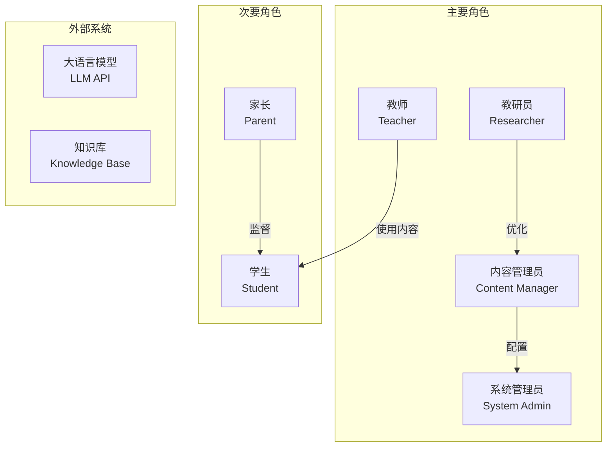
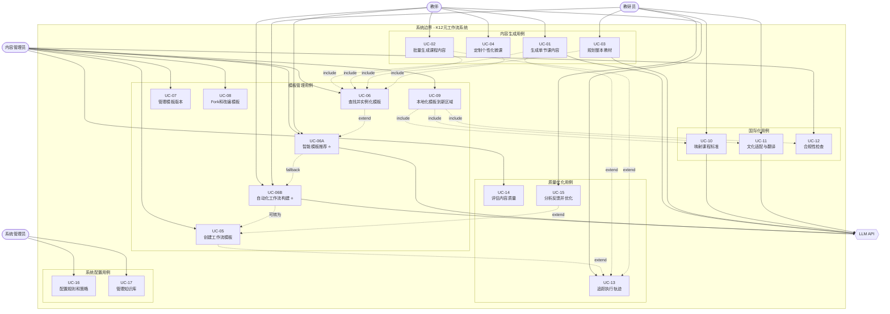
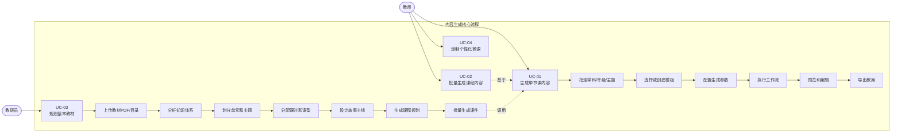
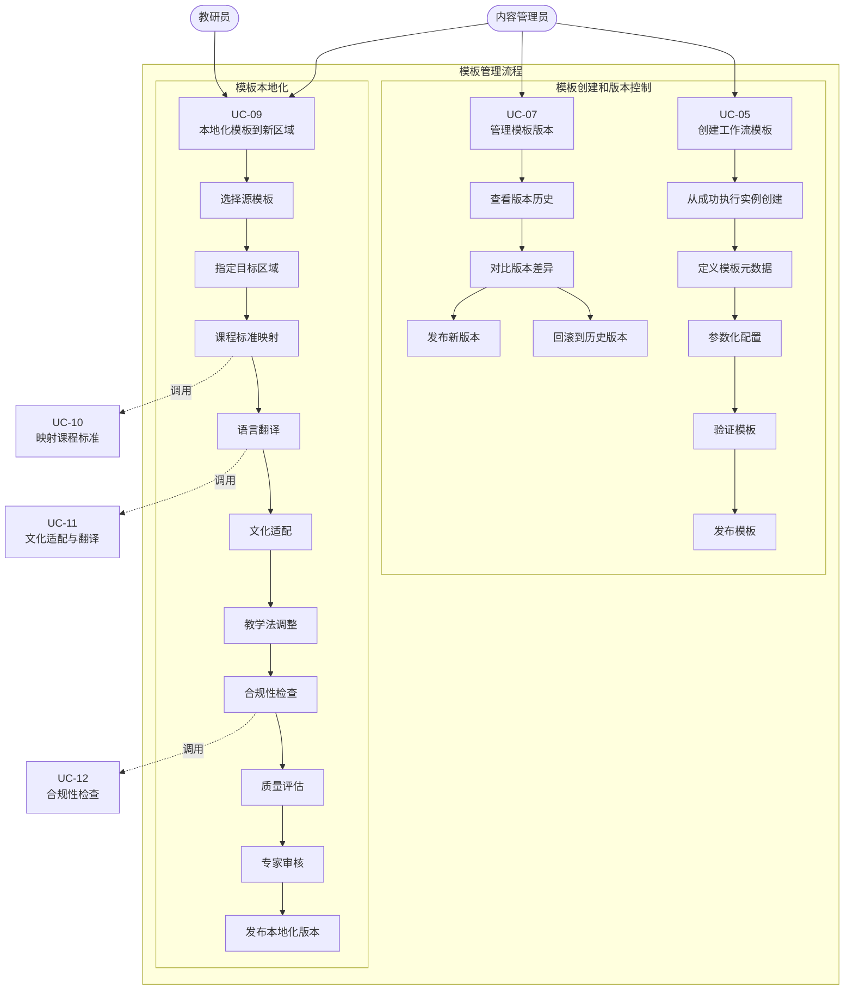
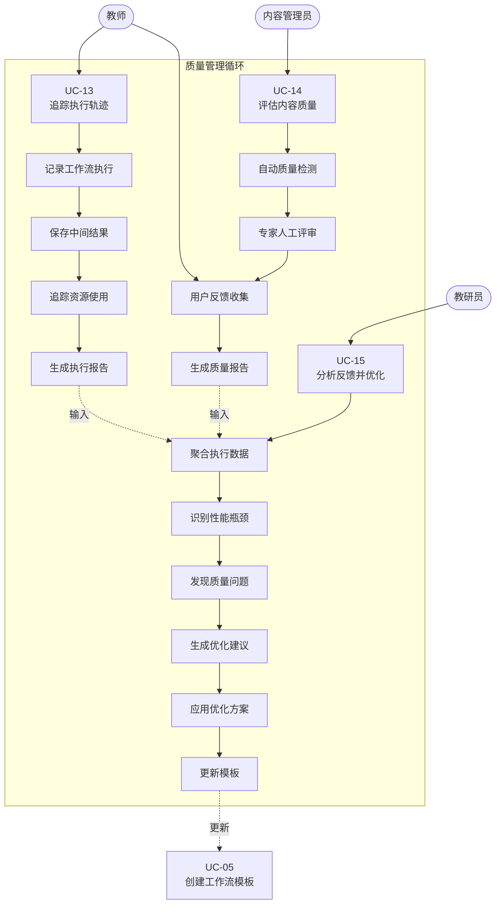
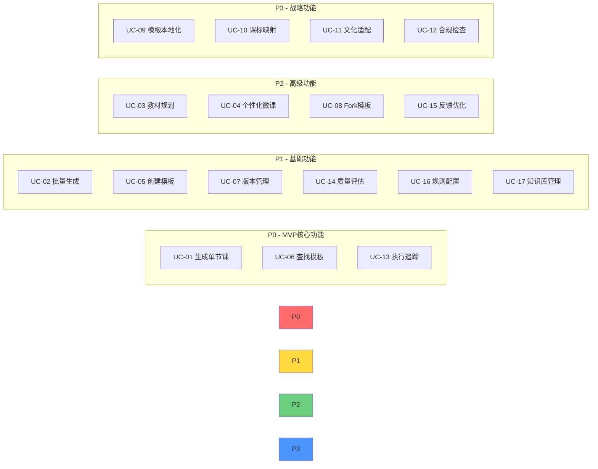
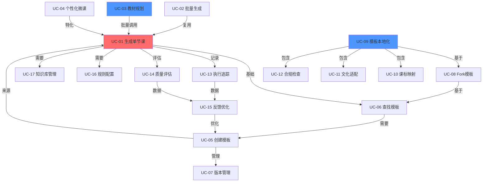

# K12教育内容生成·元工作流系统 - 核心用例分析

**文档版本**: V1.1  
**日期**: 2025-12-09  
**状态**: 设计阶段

---

## 目录

1. [用例概述](#1-用例概述)
2. [角色定义](#2-角色定义)
3. [核心用例图](#3-核心用例图)
4. [用例详细说明](#4-用例详细说明)

---

## 1. 用例概述

本系统面向K12教育内容生产场景，支持从**单节课**到**整本教材**的智能化内容生成，并具备**跨区域本地化**和**持续优化**能力。

### 1.1 用例分类

| 类别 | 用例数量 | 说明 |
|------|---------|------|
| **内容生成** | 4个 | 单课生成、批量生成、教材规划、微课定制 |
| **模板管理** | 7个 | 模板创建、查找、**智能推荐⭐**、**自动构建⭐**、版本控制、Fork、本地化 |
| **国际化** | 3个 | 模板本地化、课标映射、合规检查 |
| **质量优化** | 3个 | 执行追踪、质量评估、反馈优化 |
| **系统配置** | 2个 | 规则配置、知识库管理 |
| **合计** | **19个核心用例** | 新增2个⭐ |

---

## 2. 角色定义



### 角色说明

| 角色 | 职责 | 典型操作 |
|------|------|---------|
| **教师** | 日常教学内容生成使用者 | 生成单课教案、定制微课、批量生成 |
| **内容管理员** | 内容质量和模板管理 | 创建模板、版本管理、质量审核 |
| **教研员** | 教学设计和优化 | 教材规划、本地化适配、反馈优化 |
| **系统管理员** | 系统配置和维护 | 规则配置、知识库管理、监控 |
| **学生** | 内容消费者（间接） | 学习生成的内容 |
| **家长** | 监督者（间接） | 关注内容质量和合规性 |

---

## 3. 核心用例图

### 3.1 总览用例图



### 3.2 内容生成用例详图



### 3.3 模板管理与本地化用例详图



### 3.4 质量优化用例详图



---

## 4. 用例详细说明

### 4.1 内容生成类用例

#### UC-01: 生成单节课内容

**参与者**: 教师（主要）、系统（次要）、LLM API（外部）

**前置条件**: 
- 用户已登录系统
- 系统已配置相关学科的知识库和模板

**基本流程**:
1. 教师选择学科、年级、课型
2. 教师输入核心知识点和教学目标
3. 教师选择教学区域（决定课标和合规规则）
4. 系统推荐匹配的工作流模板
5. 教师确认或自定义模板
6. 系统根据输入参数动态构建工作流DAG
7. 系统执行工作流，调用LLM生成内容
8. 系统展示生成的教案预览
9. 教师审核并编辑内容
10. 教师导出为Word/PDF/PPT

**后置条件**: 
- 生成的教案已保存
- 执行轨迹已记录
- 可选：从本次执行创建模板

**扩展流程**:
- 3a. 如果是国际学校，需要指定多语言要求
- 7a. 如果执行失败，系统自动重试或降级
- 9a. 如果质量不满意，可以调整参数重新生成

**频率**: 高频（每天数百次）

**业务价值**: ⭐⭐⭐⭐⭐ 核心功能

---

#### UC-02: 批量生成课程内容

**参与者**: 教师、内容管理员

**前置条件**: 
- 已有课程规划或课时列表
- 已配置批量生成模板

**基本流程**:
1. 用户上传课时列表（Excel/CSV）
2. 系统解析并验证列表格式
3. 用户配置统一的生成参数（可选）
4. 系统创建批量任务队列
5. 系统并发执行多个工作流
6. 系统实时更新进度条
7. 系统生成批量任务报告
8. 用户批量下载生成的内容

**后置条件**: 
- 所有课时内容已生成
- 任务执行报告已保存

**特殊需求**:
- 支持暂停/恢复批量任务
- 失败的课时可单独重试
- 支持优先级调度

**频率**: 中频（每周数十次）

**业务价值**: ⭐⭐⭐⭐ 效率提升

---

#### UC-03: 规划整本教材 ⭐ 新增

**参与者**: 教研员（主要）、系统

**前置条件**: 
- 已上传教材PDF或目录
- 已配置课程标准知识库

**基本流程**:
1. 教研员上传教材资料和基本信息
   - 学科、年级、学期
   - 总课时数
   - 课程标准（如新课标2022）
2. 系统使用OCR和NLP提取教材结构
3. 系统调用LLM进行知识点聚类
4. 系统划分单元和主题
5. 系统构建知识依赖图谱
6. 教研员审核并调整单元划分
7. 系统根据课型比例分配课时
8. 系统设计故事世界观和主线
9. 系统生成完整的课程规划（72课时）
10. 教研员确认规划
11. 系统批量生成所有课时的课件
12. 系统生成课程规划报告

**后置条件**: 
- 整本教材的课程规划已生成
- 可选择性生成全部或部分课件
- 规划可保存为模板供其他年级/学期复用

**扩展流程**:
- 6a. 如果单元划分不合理，可手动调整
- 8a. 可选择不同的故事主题（侦探/科幻/魔法等）
- 11a. 可分批生成，避免资源占用过高

**频率**: 低频（每学期几次）

**业务价值**: ⭐⭐⭐⭐⭐ 战略级功能

---

#### UC-04: 定制个性化微课

**参与者**: 教师

**前置条件**: 
- 已有学生画像数据
- 已配置微课模板

**基本流程**:
1. 教师输入学生特征
   - 年龄段、认知水平
   - 兴趣标签（如游戏、动画）
   - 常见误区
2. 教师选择微课主题和时长（10-15分钟）
3. 系统根据画像选择叙事策略（故事化/游戏化）
4. 系统调整内容抽象度和互动密度
5. 系统生成个性化微课脚本
6. 教师预览并导出

**后置条件**: 
- 微课内容已生成并适配学生特点

**频率**: 中高频

**业务价值**: ⭐⭐⭐⭐ 差异化优势

---

### 4.2 模板管理类用例

#### UC-05: 创建工作流模板

**参与者**: 内容管理员

**前置条件**: 
- 已有成功的工作流执行实例
- 或从零设计新模板

**基本流程**:
1. 管理员选择创建模板的方式
   - 方式A：从执行实例创建
   - 方式B：从现有模板Fork
   - 方式C：从零设计
2. 系统提取工作流结构（节点+边）
3. 管理员定义模板元数据
   - 模板名称、描述
   - 适用学科、年级、区域
   - 标签（如"探究式"、"实验课"）
4. 管理员参数化配置
   - 标记哪些参数可由用户自定义
   - 设置参数默认值和约束
5. 系统验证模板完整性
6. 管理员设置版本号和发布状态
7. 系统保存模板到模板库

**后置条件**: 
- 新模板已发布
- 可被其他用户查找和使用

**频率**: 中频

**业务价值**: ⭐⭐⭐⭐⭐ 生态建设

---

#### UC-06: 查找并实例化模板

**参与者**: 教师、内容管理员

**前置条件**: 
- 模板库中已有可用模板

**基本流程**:
1. 用户输入查询条件
   - 学科、年级、课型
   - 关键词搜索
   - 标签筛选
2. 系统检索匹配的模板
   - 精确匹配 + 语义相似度
   - 按使用频率和评分排序
3. 系统展示模板列表
   - 显示元数据、预览、评分
4. 用户选择模板并预览详情
5. 用户确认并实例化模板
6. 系统创建工作流实例并执行

**后置条件**: 
- 工作流已基于模板创建
- 模板使用次数+1

**扩展流程**:
- 2a. 如果没有精确匹配，推荐相似模板
- 4a. 用户可在实例化前调整参数

**频率**: 高频

**业务价值**: ⭐⭐⭐⭐⭐ 效率核心

---

#### UC-06A: 智能模板推荐 ⭐ 新增

**参与者**: 教师（主要）、内容管理员（次要）

**前置条件**: 
- 模板库中已有足够数量的模板
- 系统已配置推荐算法和向量数据库
- 可选：用户有历史使用记录

**基本流程**:
1. 用户输入课程需求（自然语言或结构化）
   - 学科、年级、区域
   - 课型（新授课/复习课/实验课等）
   - 关键词和描述（如"分数加法"、"互动性强"）
   - 可选标签（如"故事化"、"游戏化"）
2. 系统启动三层推荐引擎
   - **第一层**：规则匹配（学科、年级、地区、课型精确匹配）
   - **第二层**：语义检索（基于关键词和描述的向量相似度）
   - **第三层**：协同过滤（基于用户历史行为和相似用户）
3. 系统综合排序
   - 计算加权分数（规则35% + 语义25% + 协同20% + 质量15% + 流行度5%）
   - 应用多样性调整（MMR算法避免推荐过于相似的模板）
4. 系统展示推荐结果（Top 10）
   - 每个模板显示匹配度评分（0-100分）
   - 显示推荐理由（可解释性）
     * "精确匹配您的需求（学科、年级、课型）"
     * "内容高度相关（相似度92%）"
     * "高质量模板（用户评分4.7★）"
     * "相似教师常用（协同推荐）"
   - 显示模板预览和关键特性
5. 用户浏览推荐列表
   - 可查看详细的评分拆解（规则分/语义分/协同分/质量分）
   - 可查看模板详情和使用示例
6. 用户选择合适的模板
7. 系统实例化模板并执行工作流
8. 系统记录用户选择（用于协同过滤优化）

**后置条件**: 
- 用户成功找到并使用了合适的模板
- 用户行为数据已记录（用于改进推荐算法）
- 推荐结果已缓存（15分钟TTL）

**扩展流程**:
- 2a. **冷启动问题**：如果用户无历史数据，协同过滤降级为热门模板推荐
- 3a. **无匹配结果**：如果规则匹配为空，放宽约束条件（如跨年级推荐）
- 4a. **多样性不足**：如果Top 10过于相似，增加MMR权重
- 5a. **用户反馈**：用户可标记"不相关"，系统实时调整推荐
- 7a. **模板不满意**：用户可切换到"自动构建"模式（UC-06B）

**特殊需求**:
- **性能要求**：推荐响应时间 < 500ms
- **准确性要求**：Top 3命中率 > 80%
- **可解释性**：每个推荐必须有清晰的理由
- **个性化**：考虑教师的历史偏好和教学风格

**技术实现**:
- **向量数据库**：Milvus / Qdrant
- **Embedding模型**：OpenAI text-embedding-3-small / BGE-M3
- **混合检索**：向量检索 + BM25关键词检索 + RRF融合
- **缓存策略**：三级缓存（会话级/Redis/预计算）
- **A/B测试**：支持不同推荐策略的对比实验

**典型场景**:

**场景1：新手教师快速上手**
```
用户：小学数学新教师，第一次使用系统
输入："小学三年级数学，分数加法，需要生动有趣"
推荐结果：
  1. 模板：故事化分数加法课（匹配度95%）
     理由：精确匹配 + 高质量（评分4.8★）+ 新手教师常用
  2. 模板：游戏化分数加法课（匹配度88%）
     理由：相似内容 + 互动性强 + 学生反馈好
```

**场景2：资深教师寻找创新方法**
```
用户：初中物理资深教师，尝试新教学法
输入："初中物理，电路，需要实验探究式，STEM融合"
推荐结果：
  1. 模板：STEM项目式电路课（匹配度92%）
     理由：精确匹配 + 创新教学法 + 相似教师高频使用
  2. 模板：Maker电路实验课（匹配度85%）
     理由：实践性强 + 跨学科融合
```

**场景3：跨区域教学适配**
```
用户：中国教师需要适配美国Common Core标准
输入："初中数学，代数方程，美国Common Core，双语"
推荐结果：
  1. 模板：US Common Core代数课（匹配度97%）
     理由：精确匹配区域 + 双语支持 + 已验证
  2. 模板：代数方程国际版（匹配度89%）
     理由：多国适配 + 灵活本地化
```

**频率**: 高频（预计占模板使用的70%+）

**业务价值**: ⭐⭐⭐⭐⭐ 核心竞争力（提升用户体验和效率）

**与其他用例的关系**:
- **被包含于**：UC-01（生成单节课）、UC-02（批量生成）
- **扩展为**：UC-06B（如果推荐不满意，引导用户自动构建）
- **数据来源于**：UC-05（创建模板）、UC-13（执行追踪）、UC-14（质量评估）

---

#### UC-06B: 自动化工作流构建 ⭐ 新增

**参与者**: 教师（主要）、教研员（主要）、内容管理员（次要）

**前置条件**: 
- 组件注册表已完整配置
- LLM API已连接
- 可选：已尝试模板推荐但未找到合适模板

**基本流程**:

**阶段1：需求分析**
1. 用户描述课程需求（自然语言）
   ```
   示例：设计一个高中物理课，主题是"牛顿第二定律"。
   要求：先用日常例子引入，生成3个计算题（难度递进），
   提供详细解题步骤，最后设计一个实验。
   ```
2. 系统调用 LLM 分析需求，提取结构化信息
   - 学科、年级、主题、区域
   - 教学目标
   - 内容需求（类型、数量、属性）
   - 流程步骤（描述、所需能力、依赖关系）
   - 约束条件和评估标准
3. 系统识别缺失信息
4. 系统生成澄清问题（如需要）
   - "请问是哪个地区的课程标准？"
   - "学生是否有相关前置知识？"
5. 用户补充信息（交互式完善）
6. 系统生成完整的 WorkflowRequirement 对象

**阶段2：工作流编排**
7. 系统分析每个步骤的能力需求
   - 步骤1："生成日常例子" → 需要 scenario_generation, real_world_context
   - 步骤2："生成3个计算题" → 需要 problem_generation, difficulty_control
   - 步骤3："生成解题步骤" → 需要 solution_generation, step_by_step
   - 步骤4："设计实验" → 需要 experiment_design, safety_check
8. 系统从组件注册表搜索匹配组件
   - 基于能力描述的语义搜索
   - 按类别、标签过滤
   - 每个步骤返回Top 3候选组件
9. 系统使用 LLM 选择最佳组件
   - 综合考虑：能力匹配度、学科适配性、历史表现
10. 系统构建节点配置
    - 使用 **Meta-Prompt 技术**为每个组件生成定制化提示词
    - 根据年级自动推断难度等级
    - 设置其他参数（temperature、max_tokens等）
11. 系统分析依赖关系，构建 DAG
    - 步骤1 → 步骤2 → 步骤3 → 步骤4（顺序依赖）
12. 系统验证 DAG 合法性
    - 无环检测（DFS算法）
    - 连通性检查
13. 系统生成完整工作流配置

**阶段3：试运行与评估**
14. 系统执行工作流（试运行模式）
    - 启用完整日志
    - 收集所有中间输出
    - 记录执行时间和资源消耗
15. 系统评估生成结果（自动评估 / 人工评估 / 混合）
    - **自动评估（默认）**：使用 LLM 评估5个维度
      * 内容准确性（是否符合知识点）
      * 难度适配性（是否符合年级水平）
      * 逻辑连贯性（步骤之间的逻辑）
      * 教学有效性（是否达成教学目标）
      * 语言表达（是否清晰易懂）
    - **人工评估（可选）**：教师/教研员打分和反馈
    - **混合评估**：自动+人工综合评分
16. 系统生成评估报告
    - 总体评分（0-1.0）
    - 各维度评分拆解
    - 问题列表（按严重程度分级：critical / major / minor）
    - 优点列表
    - 优化建议

**阶段4：迭代优化**
17. 系统判断是否需要优化
    - 如果评分 >= 0.8（默认阈值）→ 跳到步骤23
    - 如果已达最大迭代次数（默认5轮）→ 跳到步骤23
18. 系统根据问题类型选择优化策略
    - **内容问题** → 调整提示词（使用 LLM 改进 Prompt）
    - **结构问题** → 增删节点、修改连接
    - **语言问题** → 添加语言风格要求
    - **性能问题** → 调整参数（如temperature、max_tokens）
19. 系统应用优化方案
20. 系统执行优化后的工作流（新一轮试运行）
21. 系统重新评估
22. 重复步骤17-21，直到收敛或达到最大迭代次数

**阶段5：完成与保存**
23. 系统展示最终工作流和迭代历史
    - 最终评分
    - 总迭代次数
    - 每轮迭代的评分曲线
    - 应用的优化措施
24. 用户预览工作流配置和示例输出
25. 用户确认并保存工作流
26. 可选：用户将工作流保存为模板（用于复用）
27. 系统生成构建报告

**后置条件**: 
- 全新的工作流已成功构建并验证
- 工作流配置已保存
- 可选：新模板已添加到模板库
- 迭代历史已存档（用于分析和改进）

**扩展流程**:
- 6a. **需求过于模糊**：系统提供常见需求模板供参考
- 8a. **找不到合适组件**：系统提示用户自定义组件或联系管理员
- 15a. **执行失败**：系统诊断错误（配置错误/API失败/超时等），自动修复
- 18a. **多次优化仍不达标**：系统建议人工介入或切换到模板推荐
- 24a. **用户不满意**：支持交互式手动调整（调整提示词、替换组件等）

**特殊需求**:
- **智能性要求**：需求分析准确率 > 90%
- **质量要求**：最终评分 > 0.8（默认阈值可调）
- **效率要求**：单轮迭代时间 < 2分钟
- **可控性要求**：用户可随时介入调整
- **可追溯性**：完整记录每轮迭代的决策过程

**技术实现**:
- **需求分析**：LLM + JSON Schema（结构化输出）
- **组件搜索**：语义相似度（Embedding）+ 规则过滤
- **Meta-Prompt**：使用 LLM 生成 LLM 的 Prompt
- **DAG验证**：图算法（DFS检测环、连通性分析）
- **评估策略**：LLM批判性评估 + 规则检查 + 可选人工
- **优化策略**：基于问题诊断的多策略优化（Prompt改进/节点调整/参数优化）

**典型场景**:

**场景1：创新课型 - VR沉浸式化学实验**
```
用户输入："设计一个VR沉浸式化学实验课，主题是酸碱中和反应"
模板推荐结果：无匹配（模板库中没有VR相关模板）
自动构建流程：
  1. 需求分析：识别"VR"、"化学实验"、"酸碱中和"
  2. 组件选择：
     - VR场景生成器
     - 化学实验模拟器
     - 安全提示生成器
     - 实验步骤设计器
  3. 工作流构建：VR场景 → 实验准备 → 虚拟实验 → 安全检查 → 总结
  4. 试运行：生成VR实验脚本
  5. 评估：内容准确性0.9，沉浸感0.85
  6. 优化：调整VR交互提示词，增强沉浸感
  7. 最终评分：0.88（3轮迭代）
```

**场景2：跨学科融合 - STEAM艺术与科学**
```
用户输入："STEAM课程，结合物理光学和绘画艺术，主题是光的折射"
模板推荐结果：只有单学科模板，无法满足融合需求
自动构建流程：
  1. 需求分析：识别"跨学科"、"物理+艺术"、"光学"
  2. 组件选择：
     - 物理概念解释器（光的折射原理）
     - 艺术案例分析器（印象派光影技法）
     - 融合项目设计器（设计彩虹绘画项目）
     - 评估标准生成器（科学+艺术双重标准）
  3. 工作流构建：物理原理 → 艺术案例 → 融合项目 → 双重评估
  4. 迭代优化：增强科学与艺术的衔接过渡
  5. 最终评分：0.86（2轮迭代）
```

**场景3：特殊教学法 - 基于游戏化理论的数学课**
```
用户输入："基于游戏化学习理论设计数学课，主题是一元二次方程求解"
模板推荐结果：有普通数学模板，但无游戏化设计
自动构建流程：
  1. 需求分析：识别"游戏化"、"一元二次方程"
  2. 组件选择：
     - 游戏剧情设计器（数学冒险故事）
     - 关卡式问题生成器（难度递进的挑战）
     - 即时反馈生成器（游戏化评分系统）
     - 成就系统设计器（学习徽章）
  3. 工作流构建：游戏背景 → 任务发布 → 关卡挑战 → 奖励反馈 → 成就解锁
  4. 评估：教学有效性0.87，游戏性0.83
  5. 优化：增强游戏叙事连贯性
  6. 最终评分：0.89（3轮迭代）
```

**场景4：快速响应新需求 - 疫情期间的在线实验课**
```
用户输入："疫情期间无法做实验，设计在线模拟实验课，主题是电路连接"
模板推荐结果：有实验课模板，但都是线下的
自动构建流程：
  1. 需求分析：识别"在线"、"模拟实验"、"电路"
  2. 组件选择：
     - 在线实验平台集成器（PhET模拟器）
     - 视频演示生成器
     - 虚拟操作指导生成器
     - 在线互动问答设计器
  3. 工作流构建：视频演示 → 模拟器操作 → 互动答疑 → 在线测验
  4. 最终评分：0.84（2轮迭代）
```

**频率**: 中频（预计占模板使用的20-30%）

**业务价值**: ⭐⭐⭐⭐⭐ 战略级功能（创新能力和差异化竞争力）

**与其他用例的关系**:
- **补充于**：UC-06A（智能推荐）- 推荐失败时的备选方案
- **生成输入给**：UC-05（创建模板）- 优秀的自动构建结果可保存为模板
- **使用数据于**：UC-15（分析反馈）- 迭代数据用于改进构建算法
- **被包含于**：UC-01（生成单节课）- 作为高级生成模式

**成功指标**:
- **构建成功率** > 85%（最终评分 >= 0.8）
- **平均迭代次数** < 3轮
- **用户满意度** > 4.0/5.0
- **模板转化率** > 30%（优秀工作流保存为模板的比例）

**风险与挑战**:
1. **组件能力覆盖不足**：需要持续丰富组件库
2. **LLM成本较高**：每次构建需要多次LLM调用，需要成本控制
3. **评估主观性**：自动评估可能与人类判断有偏差，需要持续优化
4. **迭代效率**：过多迭代影响用户体验，需要优化收敛速度

**未来优化方向**:
- **强化学习**：从历史构建数据中学习最优策略
- **模板沉淀**：自动将高分工作流转化为模板，形成良性循环
- **协同构建**：支持多用户协作设计工作流
- **智能预测**：根据用户画像预测最可能需要的工作流结构

---

#### UC-07: 管理模板版本

**参与者**: 内容管理员

**前置条件**: 
- 模板已存在

**基本流程**:
1. 管理员选择模板查看版本历史
2. 系统展示版本列表
   - 版本号、发布日期、变更说明
   - 使用次数、质量评分
3. 管理员选择操作
   - **对比版本**：查看两个版本的差异
   - **回滚版本**：将当前版本回滚到历史版本
   - **发布新版本**：基于当前版本创建新版本
4. 系统执行相应操作
5. 系统记录版本变更日志

**后置条件**: 
- 版本历史已更新
- 使用该模板的用户会收到升级提示

**频率**: 中频

**业务价值**: ⭐⭐⭐⭐ 质量保障

---

#### UC-08: Fork和改编模板

**参与者**: 内容管理员、教研员

**前置条件**: 
- 源模板已存在
- 用户有Fork权限

**基本流程**:
1. 用户选择源模板并点击"Fork"
2. 系统创建模板副本
3. 用户修改模板
   - 调整节点配置
   - 修改Prompt模板
   - 改变参数约束
4. 用户保存为新模板
5. 系统建立Fork关系链
6. 可选：向源模板作者提交改进建议

**后置条件**: 
- 新模板已创建
- Fork关系已记录

**频率**: 中频

**业务价值**: ⭐⭐⭐⭐ 协作创新

---

#### UC-09: 本地化模板到新区域 ⭐ 新增

**参与者**: 内容管理员、教研员（主要）、翻译专家（次要）

**前置条件**: 
- 源模板已存在（如中国9年级化学）
- 目标区域课程标准已配置（如美国NGSS）

**基本流程**:
1. 教研员选择源模板
2. 教研员指定目标区域和语言
   - 区域：US / UK / SG / AU 等
   - 语言：en-US / zh-CN / es-ES 等
3. 教研员选择本地化策略
   - **Adaptive**（智能适配，推荐）
   - **Translate-only**（仅翻译）
   - **Full-rewrite**（完全重写）
4. 系统创建本地化任务
5. **Step 1: 课程标准映射**
   - 系统使用LLM映射知识点
   - 生成映射报告（置信度评分）
   - 教研员审核并调整
6. **Step 2: 语言翻译**
   - 系统构建术语表
   - 批量翻译内容（保持教学语境）
   - 调整语言风格（正式度/互动性）
7. **Step 3: 文化适配**
   - 系统识别文化元素（故事/案例/角色）
   - 生成本地化替代方案
   - 敏感内容审查
8. **Step 4: 教学法调整**
   - 调整课型比例（如增加探究课）
   - 替换教学流程模板（5段→5E）
9. **Step 5: 合规性检查**
   - 检查COPPA/ADA/GDPR等
   - 自动修复（如添加alt文本）
   - 标记需人工处理的问题
10. **Step 6: 质量评估**
    - 多维度评分（结构/语言/文化/对齐/合规）
    - 生成质量报告
11. 教研员审核本地化结果
12. 可选：试点测试（2-4周）
13. 教研员发布本地化模板

**后置条件**: 
- 本地化模板已创建并可用
- 本地化报告已保存
- 建立source-target模板关联

**扩展流程**:
- 5a. 如果置信度<0.7，强制人工审核
- 9a. 如果有高严重性合规问题，阻止发布
- 12a. 试点反馈可触发迭代优化

**频率**: 低频但高价值（每季度几次）

**业务价值**: ⭐⭐⭐⭐⭐ 战略级（国际化扩张）

**性能要求**:
- 自动化处理时间：10-30分钟
- 整体周期（含人工）：≤2周

**成本节约**:
- vs 从零开发：节省67%时间和成本

---

### 4.3 国际化类用例

#### UC-10: 映射课程标准

**参与者**: 系统（主要）、教研员（审核）

**前置条件**: 
- 源课标和目标课标已配置在知识库
- LLM API可用

**基本流程**:
1. 系统接收源标准列表和目标标准系统
2. 系统使用向量检索查找候选匹配
3. 系统调用LLM进行语义理解
   - 分析知识点边界
   - 识别认知层级差异（布鲁姆分类法）
   - 生成映射理由
4. 系统计算置信度评分
5. 系统生成映射报告
   - 一对一映射
   - 知识缺口（源有目标无）
   - 新增要求（目标有源无）
6. 如果置信度<0.7，标记需人工审核
7. 教研员审核并确认映射
8. 系统保存映射结果

**后置条件**: 
- 课标映射已完成
- 映射结果可复用（缓存）

**质量指标**:
- 映射准确率：>85%
- 需人工审核比例：<30%

**频率**: 中频（本地化任务的一部分）

**业务价值**: ⭐⭐⭐⭐ 本地化基础

---

#### UC-11: 文化适配与翻译

**参与者**: 系统、翻译专家（审核）

**前置条件**: 
- 源内容已准备
- 目标区域文化规则已配置

**基本流程**:
1. 系统提取所有可翻译文本
2. 系统构建专业术语表
   - NER识别领域术语
   - 查询术语库
   - LLM翻译未知术语
3. 系统批量翻译
   - 使用GPT-4保持教学语境
   - 应用术语一致性规则
   - 调整语言风格
4. 系统识别文化特定元素
   - 故事场景、角色名
   - 案例和比喻
   - 节日和价值观
5. 系统生成本地化替代
   - LLM生成符合目标文化的内容
   - 保持学习目标不变
6. 系统进行敏感内容审查
   - 应用文化敏感性规则库
   - 标记潜在问题
7. 翻译专家审核
8. 系统应用审核反馈

**后置条件**: 
- 内容已翻译和文化适配
- 术语表已更新（Translation Memory）

**质量指标**:
- 翻译准确性：>90%
- 术语一致性：100%
- 文化适当性：无重大问题

**频率**: 中频

**业务价值**: ⭐⭐⭐⭐ 质量关键

---

#### UC-12: 合规性检查

**参与者**: 系统、法务专家（审核）

**前置条件**: 
- 目标区域法规规则已配置
- 内容已准备完毕

**基本流程**:
1. 系统加载目标区域合规规则
   - 隐私法规（COPPA/FERPA/GDPR）
   - 无障碍标准（ADA/WCAG）
   - 版权法规
2. 系统执行自动检查
   - 检查图片alt文本
   - 检查视频字幕
   - 检查颜色对比度
   - 检查数据收集合规性
3. 系统生成合规问题列表
   - 按严重性分级（high/medium/low）
   - 标记是否可自动修复
4. 系统自动修复可修复项
   - 使用视觉模型生成alt文本
   - 调整颜色对比度
5. 系统生成合规报告
6. 法务专家审核不可自动修复项
7. 系统应用人工修复

**后置条件**: 
- 合规检查已完成
- 高严重性问题已解决

**质量指标**:
- 自动检测准确率：>95%
- 自动修复成功率：>80%

**频率**: 中频

**业务价值**: ⭐⭐⭐⭐⭐ 风险控制

---

### 4.4 质量优化类用例

#### UC-13: 追踪执行轨迹

**参与者**: 系统（自动）、教师（查看）

**前置条件**: 
- 工作流正在执行或已完成

**基本流程**:
1. 系统在工作流执行时自动记录
   - 执行的节点列表和顺序
   - 每个节点的输入/输出
   - 调用的LLM模型和参数
   - 执行时间和资源消耗
2. 系统保存中间结果
3. 系统关联执行实例与模板
4. 系统生成执行报告
5. 教师可查看执行详情
   - 可视化执行流程图
   - 每个节点的详细日志
   - 资源使用统计

**后置条件**: 
- 执行轨迹已完整保存
- 可用于后续分析和优化

**数据保留**: 
- 详细轨迹：30天
- 聚合统计：永久

**频率**: 自动（每次执行）

**业务价值**: ⭐⭐⭐⭐ 可观测性

---

#### UC-14: 评估内容质量

**参与者**: 系统（自动）、内容管理员（人工）

**前置条件**: 
- 内容已生成

**基本流程**:
1. **自动质量检测**
   - 事实准确性检查（RAG验证）
   - 语言流畅度评分
   - 结构完整性检查
   - 知识点覆盖度分析
2. **专家人工评审**（抽样）
   - 教学设计合理性
   - 内容深度和广度
   - 创新性和趣味性
3. **用户反馈收集**
   - 教师满意度评分
   - 学生学习效果（间接）
4. 系统聚合评分
5. 系统生成质量报告
   - 总体评分
   - 各维度得分
   - 改进建议

**后置条件**: 
- 质量评分已记录
- 反馈已保存用于优化

**质量维度**:
- 准确性：权重30%
- 完整性：权重20%
- 适用性：权重25%
- 创新性：权重15%
- 用户满意度：权重10%

**频率**: 自动+人工抽样

**业务价值**: ⭐⭐⭐⭐⭐ 持续改进

---

#### UC-15: 分析反馈并优化

**参与者**: 教研员、系统

**前置条件**: 
- 已积累足够的执行记录和质量评分

**基本流程**:
1. 教研员发起优化分析
2. 系统聚合数据
   - 同一模板的多次执行记录
   - 质量评分趋势
   - 用户反馈
3. 系统进行多维度分析
   - **性能分析**：识别慢节点
   - **质量分析**：识别低分节点
   - **成本分析**：识别高成本节点
4. 系统生成优化建议
   - 调整Prompt模板
   - 更换LLM模型
   - 增加缓存
   - 优化节点顺序
5. 教研员审核建议
6. 教研员应用优化方案
7. 系统创建模板新版本
8. 系统A/B测试新旧版本
9. 根据测试结果决定是否正式发布

**后置条件**: 
- 模板已优化
- 优化效果已验证

**优化指标**:
- 质量提升：>10%
- 性能提升：>20%
- 成本降低：>15%

**频率**: 定期（每月）或阈值触发

**业务价值**: ⭐⭐⭐⭐⭐ 持续进化

---

### 4.5 系统配置类用例

#### UC-16: 配置规则和策略

**参与者**: 系统管理员

**前置条件**: 
- 管理员已登录

**基本流程**:
1. 管理员选择配置类型
   - **节点选择规则**：何时启用哪些节点
   - **资源绑定规则**：根据上下文选择资源
   - **模型路由策略**：根据任务选择LLM
   - **合规规则**：区域专属的合规要求
2. 管理员编辑YAML配置文件
3. 系统验证配置语法
4. 管理员提交配置
5. 系统热加载配置（无需重启）
6. 系统记录配置变更历史

**后置条件**: 
- 新规则已生效
- 可回滚到历史配置

**频率**: 低频（新学科/新区域上线时）

**业务价值**: ⭐⭐⭐⭐ 灵活性

---

#### UC-17: 管理知识库

**参与者**: 系统管理员、学科专家

**前置条件**: 
- 知识库系统已部署

**基本流程**:
1. 管理员选择知识库类型
   - 课程标准库
   - 学科知识库
   - 术语库
   - 案例库
2. 管理员上传知识文档
   - PDF、Word、网页
3. 系统进行文档处理
   - OCR识别
   - 文本清洗
   - 向量化
   - 构建索引
4. 学科专家审核知识准确性
5. 管理员发布知识库
6. 系统定期更新向量索引

**后置条件**: 
- 知识库已更新
- RAG检索可用

**频率**: 定期更新（季度）

**业务价值**: ⭐⭐⭐⭐ 准确性基础

---

## 5. 用例优先级与实施路线

### 5.1 优先级矩阵



### 5.2 实施路线图

| 阶段 | 时间 | 目标用例 | 里程碑 |
|------|------|---------|--------|
| **V1.0 MVP** | Q1 | UC-01, UC-06, UC-13 | 单课生成可用 |
| **V1.5 基础版** | Q2 | +UC-02, UC-05, UC-07, UC-14 | 模板体系建立 |
| **V2.0 增强版** | Q3 | +UC-03, UC-04, UC-15 | 教材级规划 |
| **V2.5 国际版** | Q4 | +UC-09, UC-10, UC-11, UC-12 | 全球化能力 |

---

## 6. 用例关系图

### 6.1 用例依赖关系



---

## 7. 总结

### 7.1 用例统计

- **总用例数**: 17个
- **核心用例**: 5个（UC-01, UC-03, UC-06, UC-09, UC-15）
- **高频用例**: 4个（UC-01, UC-02, UC-06, UC-13）
- **战略用例**: 3个（UC-03, UC-09, UC-15）

### 7.2 关键价值点

1. **效率提升**: UC-01, UC-02 实现内容自动生成，节省80%人工时间
2. **质量保障**: UC-14, UC-15 形成持续优化闭环
3. **规模化**: UC-03 支持教材级规划，从单课到整本
4. **国际化**: UC-09 实现快速本地化，降低67%国际化成本
5. **生态建设**: UC-05, UC-06, UC-07, UC-08 构建可复用模板生态

### 7.3 技术亮点

- ✅ **智能化**: LLM辅助课标映射、文化适配、质量评估
- ✅ **自动化**: 68%本地化自动化率、自动合规检查
- ✅ **可扩展**: 规则驱动、模板化、插件化架构
- ✅ **可观测**: 全链路执行追踪、多维度质量评估
- ✅ **协作化**: Fork机制、版本控制、反馈优化

---

**文档状态**: ✅ 已完成  
**下一步**: 基于用例开展原型设计和开发
