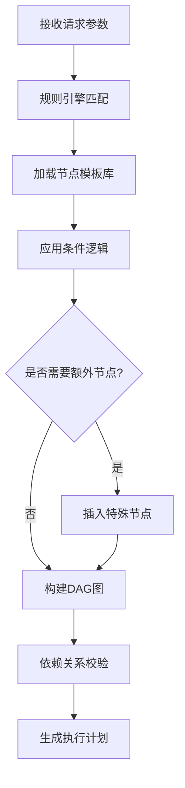
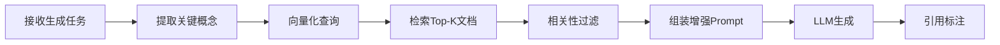

# 通用领域内容生成·元工作流平台 - 需求分析文档

**文档版本**: V2.0 ⭐ 重大升级  
**日期**: 2025-12-09  
**作者**: Meta-Workflow开发团队  
**核心理念**: 以配置定义流程，以流程生成内容（Workflow as Code, Content as Data）  
**系统定位**: 从"K12教育垂直工具"升级为"通用领域内容生成平台"

---

## 目录

1. [项目概述](#1-项目概述)
   - 1.1 系统定位升级 ⭐ 新增
   - 1.2 核心概念：孵化器-鸡-蛋模型 ⭐ 新增
   - 1.3 项目背景
   - 1.4 项目目标
   - 1.5 项目范围
2. [业务需求分析](#2-业务需求分析)
3. [功能需求](#3-功能需求)
4. [非功能需求](#4-非功能需求)
5. [用户画像与用例](#5-用户画像与用例)
6. [约束与假设](#6-约束与假设)

---

## 1. 项目概述

### 1.1 系统定位升级 ⭐ 新增

#### 从垂直工具到通用平台

**原定位**：K12教育内容生成·元工作流系统  
**新定位**：**通用领域内容生成·元工作流平台**

系统将从专注K12教育领域，扩展为支持**多个内容创作领域**的通用平台，包括但不限于：

| 领域 | 应用场景 | 核心特点 |
|------|---------|---------|
| **K12教育** | 课程教案、习题、课件 | 符合课标、分级适配、教学设计 |
| **美术史教育** | 名画解读、艺术史讲稿、鉴赏指南 | 视觉描述、风格分析、历史考据 |
| **畅销书解读** | 书籍精读、思维导图、读书笔记 | 提炼精华、关联生活、启发思考 |
| **职业培训** | 技能培训、案例教学、实操指南 | 实战导向、项目制、成人学习 |
| **企业培训** | 管理课程、合规培训、技术分享 | 业务场景、短平快、可落地 |
| **通识教育** | 历史、哲学、科普、文化 | 跨学科、深度思考、知识关联 |
| **兴趣课程** | 摄影、烹饪、健身、投资理财 | 趣味性强、实践性强、生活化 |

**关键升级点**：

1. **AI驱动的目标生成** ⭐ 新增
   - **原模式**：用户必须明确提供"学习目标"（如"掌握一元二次方程求解"）
   - **新模式**：AI根据**需求描述、目标用户、使用场景**自动推断和生成学习目标
   - **典型场景**：
     ```
     用户输入："我想给公司中层管理者做一个关于时间管理的培训"
     AI分析：
       - 目标用户：中层管理者（工作5-10年，有团队，时间压力大）
       - 使用场景：企业内训（1-2小时，需要可落地）
       - 学习目标（AI生成）：
         1. 理解时间管理的四象限法则
         2. 掌握3种优先级排序工具
         3. 学会委派与拒绝的技巧
         4. 制定个人时间管理改进计划
     ```

2. **AI驱动的内容发现** ⭐ 新增
   - **原模式**：依赖预先配置的知识库（如数学知识图谱）
   - **新模式**：AI根据学习目标，自动从多个来源检索和筛选内容
   - **内容来源**：
     * 在线百科（Wikipedia、Britannica）
     * 学术数据库（arXiv、JSTOR）
     * 视频平台（YouTube、B站教育区）
     * 图书数据库（豆瓣读书、Goodreads）
     * 艺术数据库（WikiArt、Google Arts & Culture）
     * 企业知识库（内部文档、最佳实践）
   - **典型场景**：
     ```
     学习目标："了解印象派绘画的艺术特点"
     AI内容发现：
       - 搜索WikiArt获取莫奈、雷诺阿的代表作
       - 从艺术史书籍中提取印象派的历史背景
       - 查找相关视频讲解和高清图片
       - 整合成结构化的教学素材
     ```

3. **故事化叙述引擎** ⭐ 新增
   - **原模式**：内容以"知识点 + 例题 + 解析"的传统形式呈现
   - **新模式**：将枯燥内容转化为**引人入胜的故事**
   - **叙述策略**：
     * **人物驱动**：引入虚拟角色（如"侦探小明"、"科学家Alice"）
     * **情节设计**：设置悬念、冲突、解决方案
     * **情境嵌入**：将知识点嵌入真实或虚构的场景
     * **情感共鸣**：加入人物情感和价值观引导
   - **典型场景**：
     ```
     传统模式："牛顿第一定律：物体在不受外力时保持静止或匀速直线运动"
     
     故事化模式：
     "小明坐在高铁上，看着窗外的风景飞速倒退。突然，列车开始减速。
     小明手中的水杯没拿稳，水向前溅了出来。'为什么水会向前？'他好奇地想。
     这时，隔壁的物理老师微笑着说：'这就是惯性！当列车减速时，
     水还想保持原来的速度继续前进...' 这背后，隐藏着牛顿第一定律的奥秘。"
     ```

4. **多领域适配器架构** ⭐ 新增
   - **设计模式**：插件化的领域适配器（Domain Adapter）
   - **每个领域适配器包含**：
     * 领域知识图谱（可选）
     * 内容发现策略（检索源配置）
     * 叙述风格模板（故事化策略）
     * 质量评估标准（领域特定的评判规则）
     * 输出格式模板（PPT、讲稿、视频脚本等）

---

### 1.2 核心概念：孵化器-鸡-蛋模型 ⭐ 新增

#### 三层架构隐喻

```
┌─────────────────────────────────────────────────────────┐
│                  【孵化器】                              │
│            元工作流引擎 (Meta-Workflow Engine)            │
│                                                          │
│  核心能力：                                               │
│  - 需求分析 (AI驱动目标生成)                             │
│  - 内容发现 (AI检索与筛选)                               │
│  - 工作流编排 (自动构建DAG)                              │
│  - 故事化叙述 (多策略转化)                               │
│  - 质量评估与优化                                        │
└─────────────────────────────────────────────────────────┘
                          │
                          │ 加载不同的"鸡"
                          ▼
        ┌─────────────────────────────────────┐
        │         【不同品种的鸡】             │
        │      领域适配器 (Domain Adapters)    │
        └─────────────────────────────────────┘
                 │        │        │
        ┌────────┼────────┼────────┼────────┐
        │        │        │        │        │
        ▼        ▼        ▼        ▼        ▼
    ┌──────┐ ┌──────┐ ┌──────┐ ┌──────┐ ┌──────┐
    │ K12  │ │美术史│ │畅销书│ │ 高职 │ │企业  │
    │ 教育 │ │ 教育 │ │ 解读 │ │ 培训 │ │ 培训 │
    └──────┘ └──────┘ └──────┘ └──────┘ └──────┘
        │        │        │        │        │
        │ 生蛋   │ 生蛋   │ 生蛋   │ 生蛋   │ 生蛋
        ▼        ▼        ▼        ▼        ▼
    ┌──────┐ ┌──────┐ ┌──────┐ ┌──────┐ ┌──────┐
    │数学课│ │名画讲│ │读书笔│ │技能培│ │管理课│
    │教案  │ │解稿  │ │记    │ │训稿  │ │件    │
    └──────┘ └──────┘ └──────┘ └──────┘ └──────┘
```

#### 隐喻解读

**孵化器（元工作流引擎）**：
- 提供通用的内容生成基础设施
- 与具体领域无关，高度抽象和可复用
- 负责任务调度、流程编排、质量控制

**鸡（领域适配器）**：
- 每个"鸡"代表一个垂直领域的专业知识和规则
- "鸡"可以培育、改良、繁殖（Fork和改编）
- 不同的"鸡"有不同的"基因"（配置和策略）

**蛋（工作流实例/内容产物）**：
- 每次执行生成的具体内容
- 同一只"鸡"可以根据不同参数生出不同的"蛋"
- "蛋"的质量取决于"鸡"的品质和"孵化器"的温度控制

#### 示例对比

**场景1：K12数学课 vs 美术史名画讲解**

| 维度 | K12数学（鸡A） | 美术史（鸡B） |
|------|---------------|--------------|
| **目标生成** | 根据课标自动提取知识点 | 根据画作自动生成鉴赏维度 |
| **内容发现** | 数学题库、教材知识图谱 | WikiArt、艺术史书籍 |
| **叙述策略** | 生活场景 + 数学建模 | 时代背景 + 艺术家故事 |
| **质量标准** | 知识点准确、难度适配 | 艺术史准确、鉴赏深度 |
| **输出格式** | PPT课件 + 习题 + 讲义 | 讲解稿 + 配图 + 赏析 |

**场景2：畅销书解读 vs 企业培训**

| 维度 | 畅销书解读（鸡C） | 企业培训（鸡D） |
|------|-----------------|---------------|
| **目标生成** | 提炼书籍核心观点和实用价值 | 分析业务痛点和技能需求 |
| **内容发现** | 豆瓣书评、章节摘要 | 公司文档、行业最佳实践 |
| **叙述策略** | 书摘 + 案例 + 行动建议 | 案例 + 方法论 + 落地工具 |
| **质量标准** | 观点提炼准确、可操作性 | 业务相关性、可落地性 |
| **输出格式** | 思维导图 + 读书笔记 | 培训PPT + 工作坊材料 |

---

### 1.3 项目背景

#### 从K12到通用内容创作的共性痛点

无论是K12教育、美术史教学、畅销书解读，还是职业培训，内容创作领域都面临着**"规模化"与"个性化"的根本矛盾**：

**核心痛点**：

1. **领域差异大** ⭐ 扩展
   - **K12教育**：语文需要感性叙事，数学需要严密逻辑，每个学科认知结构不同
   - **美术史教育**：需要视觉描述能力、艺术风格分析、历史文化考据
   - **畅销书解读**：需要提炼核心观点、关联生活场景、启发思考
   - **职业培训**：需要实战导向、案例教学、技能可落地
   - **企业培训**：需要紧贴业务场景、短平快、可操作
   - **通识教育**：需要跨学科整合、深度思考、知识关联
   - 👉 **共性**：每个领域都有独特的知识结构、叙述方式和质量标准

2. **受众差异多** ⭐ 扩展
   - **K12学生**：按年龄分级（认知水平差异大），需要趣味性和互动性
   - **成人学习者**：时间碎片化，需要实用性和即时反馈
   - **专业人士**：需要深度和专业性，关注前沿动态
   - **兴趣爱好者**：需要降低门槛，强调乐趣和成就感
   - **企业员工**：需要快速培训，关注业务应用
   - 👉 **共性**：不同受众的认知水平、学习动机、时间投入差异巨大

3. **场景差异广** ⭐ 新增
   - **课堂教学**：45分钟标准课时，师生互动，需要板书和课件
   - **在线学习**：碎片化时间，自学为主，需要视频和交互
   - **企业培训**：1-2小时工作坊，需要案例和工具
   - **兴趣课程**：灵活时长，强调体验和实践
   - **阅读分享**：个人阅读，需要笔记和思维导图
   - 👉 **共性**：不同场景对内容形式、时长、互动方式要求各异

4. **AI生成不可控**（所有领域共同面临）：
   - 直接使用LLM生成长文本容易产生事实性错误（幻觉问题）
   - 内容结构松散，缺乏系统性和教学设计
   - 难以满足工业级交付的质量标准和合规要求
   - 缺乏一致性和可复现性
   - 👉 **共性**：所有内容创作都需要质量保障和流程控制

5. **内容获取困难** ⭐ 新增
   - **传统模式局限**：依赖预先构建的知识库（成本高、覆盖窄、更新慢）
   - **检索质量不稳定**：简单的关键词搜索无法精准定位优质内容
   - **来源分散**：优质内容散落在百科、学术库、视频平台、图书等多个来源
   - **缺乏智能筛选**：海量信息中难以快速找到最相关、最权威的内容
   - 👉 **共性**：所有领域都需要AI驱动的智能内容发现能力

6. **目标定义模糊** ⭐ 新增
   - **K12相对明确**：有课程标准和教学大纲作为依据
   - **非结构化领域困难**：美术史、畅销书、兴趣课程等缺乏标准化的学习目标
   - **用户表达不清**：用户往往只有模糊需求（"我想学摄影"），无法明确学习目标
   - **需要AI辅助**：根据场景、受众、需求自动推断和生成学习目标
   - 👉 **共性**：需要AI辅助将模糊需求转化为结构化的学习目标

7. **叙述枯燥乏味** ⭐ 新增
   - **知识点堆砌**：传统内容只是罗列知识点和例题，缺乏吸引力
   - **缺乏情境**：脱离真实或虚构的场景，难以引发兴趣
   - **缺乏情感**：纯理性表达，缺少人物、冲突、情感共鸣
   - **难以记忆**：没有故事线索，学习者难以形成长期记忆
   - 👉 **共性**：所有内容都需要故事化叙述来提升吸引力和学习效果

---

### 1.4 项目目标 ⭐ 升级

构建一个**通用领域内容生成·元工作流平台**，该平台不直接生产内容，而是作为"孵化器"，通过加载不同的"领域适配器"（鸡），根据输入需求，**动态生成学习目标、智能发现内容、自动构建工作流、转化为故事叙述**，最终生成高质量的内容产物（蛋）。

**核心价值主张**：

1. **从垂直工具到通用平台** ⭐ 新增
   - **原价值**：专注K12教育领域
   - **新价值**：支持任意内容创作领域（通过领域适配器扩展）
   - **业务意义**：一套系统服务多个行业，降低边际成本，扩大市场规模

2. **从预设目标到AI生成目标** ⭐ 新增
   - **原价值**：用户必须明确提供学习目标
   - **新价值**：AI根据需求、受众、场景自动推断和生成学习目标
   - **业务意义**：降低用户使用门槛，支持更多非结构化领域

3. **从静态知识库到智能内容发现** ⭐ 新增
   - **原价值**：依赖预先配置的知识库
   - **新价值**：AI实时从多个来源检索、筛选、整合内容
   - **业务意义**：覆盖更广泛的知识领域，内容更新更及时

4. **从平铺直叙到故事化叙述** ⭐ 新增
   - **原价值**：传统的知识点+例题模式
   - **新价值**：将内容转化为引人入胜的故事
   - **业务意义**：提升学习体验和完成率，增强用户粘性

5. **从硬编码到可配置**（保留原价值）
   - 新领域上线只需配置适配器，无需重写代码
   - 支持快速复制和本地化

6. **从黑盒到白盒**（保留原价值）
   - 将生成过程拆解为可控、可校验、可追溯的标准化步骤（SOP）
   - 支持质量保障和持续优化

7. **从单一模型到多模态路由**（保留原价值）
   - 灵活调度大模型、小模型、知识库与传统规则引擎
   - 根据任务类型选择最优模型

8. **从一次性生成到持续优化**（保留原价值）
   - 建立数据反馈闭环，不断提升生成质量
   - 支持A/B测试和策略优化

**系统定位演进**：

```
V1.0（原定位）：
  "K12教育内容生成的流水线工厂"
  
V2.0（新定位）：
  "通用内容创作领域的智能孵化器"
  
不是制造一个"全能AI老师"，
而是制造一个能够根据不同领域，
快速培育出专业AI助手的"平台工厂"
```

---

### 1.5 项目范围 ⭐ 扩展

**V2.0 包含内容**：

**核心平台能力**：
- ✅ 元工作流引擎核心框架（通用、领域无关）
- ✅ **AI驱动的学习目标生成器** ⭐ 新增
- ✅ **AI驱动的智能内容发现引擎** ⭐ 新增
- ✅ **故事化叙述转化引擎** ⭐ 新增
- ✅ 领域适配器架构（插件化、可扩展）
- ✅ 工作流自动构建与优化系统
- ✅ 智能模板推荐匹配系统
- ✅ 质量保障与合规审查机制
- ✅ 可视化配置与监控界面

**初始领域适配器（V2.0包含）**：
- ✅ **K12教育适配器**（数学、语文、科学等学科）
- ✅ **美术史教育适配器** ⭐ 新增
  * 名画解读、艺术家传记、风格分析
  * 集成WikiArt、Google Arts & Culture
- ✅ **畅销书解读适配器** ⭐ 新增
  * 书籍精读、思维导图、读书笔记
  * 集成豆瓣读书、Goodreads
- ✅ **职业培训适配器** ⭐ 新增
  * 技能培训、案例教学、实操指南
  * 面向成人学习者

**后续扩展领域（V3.0+）**：
- ⏳ 企业培训适配器（管理、合规、技术培训）
- ⏳ 通识教育适配器（历史、哲学、科普）
- ⏳ 兴趣课程适配器（摄影、烹饪、健身、投资理财）
- ⏳ 学术研究适配器（论文写作、文献综述）

**不包含内容**（V2.0阶段）：
- ❌ 学生学习行为分析
- ❌ 实时互动教学系统
- ❌ 作业自动批改功能
- ❌ 学习效果评估系统
- ❌ 内容生成后的分发和商业化（专注生成环节）

---

## 2. 业务需求分析 ⭐ 扩展

### 2.1 核心业务场景 ⭐ 扩展多领域

#### 场景1：K12跨学科内容批量生成（原有场景，保留）
**业务描述**：教育机构需要为新学期快速生成多学科（语文、数学、科学、美术等）的教学内容。

**业务挑战**：
- 不同学科的教学设计方法论完全不同
- 统一的生成模板无法满足差异化需求
- 人工定制成本高、周期长

**系统响应**：
- 根据学科自动加载对应的"教学设计模板"
- 动态选择适合该学科的AI模型（如数学用逻辑推理强的模型）
- 自动应用该学科特有的质量检验规则

---

#### 场景2：美术史名画讲解内容生成 ⭐ 新增

**业务描述**：美术教育机构需要为一系列名画（如莫奈的《日出·印象》、达芬奇的《蒙娜丽莎》）生成深度讲解稿，用于在线课程或博物馆导览。

**用户输入**（模糊需求）：
```
"我想讲莫奈的《日出·印象》，目标受众是艺术爱好者，
时长10-15分钟，要生动有趣"
```

**系统处理流程**：

1. **AI生成学习目标**（目标生成器）：
   ```
   分析：
   - 画作：《日出·印象》（印象派开山之作）
   - 受众：艺术爱好者（非专业，但有一定鉴赏基础）
   - 时长：10-15分钟（需要精简，突出重点，用户可指定具体分钟数）
   
   生成学习目标：
   1. 了解《日出·印象》的创作背景和历史地位
   2. 识别印象派的核心艺术特点（光影、色彩、笔触）
   3. 理解莫奈的创作意图和艺术追求
   4. 学会用"印象派视角"欣赏其他作品
   ```

2. **AI内容发现**（内容发现引擎）：
   ```
   检索来源：
   - WikiArt：高清画作图片、技术参数
   - 艺术史书籍：印象派历史、莫奈传记
   - YouTube：相关讲解视频（提取要点）
   - 学术论文：关于《日出·印象》的研究
   
   筛选结果：
   - 画作创作于1872年，勒阿弗尔港口
   - 首次展出引发争议，被评论家讽刺为"印象派"
   - 光影效果：清晨薄雾中的太阳倒影
   - 笔触特点：快速、松散、捕捉瞬间印象
   ```

3. **AI工作流构建**（自动构建系统）：
   ```
   选择组件：
   - 艺术家传记生成器
   - 历史背景分析器
   - 画作细节解读器（光影、色彩、构图）
   - 艺术风格对比器（印象派 vs 古典主义）
   - 故事化叙述转化器
   ```

4. **故事化叙述转化**（故事引擎）：
   ```
   传统模式：
   "《日出·印象》创作于1872年，画面描绘了勒阿弗尔港口的日出景象..."
   
   故事化模式：
   "1872年的一个清晨，莫奈站在勒阿弗尔港口的窗前。
   薄雾笼罩着海面，太阳刚刚升起，橙红色的光芒在水面上跳跃。
   他抓起画笔，快速地在画布上涂抹，试图捕捉这转瞬即逝的瞬间。
   
   '我不是在画港口，我是在画光。'莫奈后来这样说。
   
   然而，当这幅画首次展出时，评论家们嘲讽道：'这算什么？
   连草图都不如，只是一些印象罢了！'
   
   谁也没想到，这句嘲讽竟然成就了一个伟大的艺术流派——印象派。"
   ```

**输出内容**：
- 讲解稿（含故事化叙述、画作分析、艺术史背景），时长根据用户需求3-15分钟可配置
- 配图PPT（高清画作、对比图、时间线）
- 延伸阅读清单（相关书籍、纪录片）

**业务挑战**：
- 艺术史知识准确性要求高（不能编造历史事实）
- 需要高质量的画作图片和版权信息
- 语言要有感染力，能激发艺术兴趣
- 不同受众（专业/业余）需要不同深度

**系统优势**：
- AI自动从多个来源整合权威信息
- 故事化叙述提升吸引力
- 可根据时长自动调整内容详略（3-15分钟微课或更长）
- 支持不同风格（学术/通俗/趣味）

---

#### 场景3：畅销书精读笔记生成 ⭐ 新增

**业务描述**：读书会组织者需要为《原则》（Ray Dalio）生成一份精读笔记，用于社群分享和讨论。

**用户输入**（模糊需求）：
```
"《原则》这本书太厚了，我想给读书会成员准备一份精读笔记，
时间1小时，要提炼核心观点，最好有行动建议"
```

**系统处理流程**：

1. **AI生成学习目标**：
   ```
   分析：
   - 书籍：《原则》（管理/自我提升类，500+页）
   - 受众：读书会成员（职场人士，追求自我提升）
   - 时长：1小时（需要高度提炼）
   
   生成学习目标：
   1. 理解Ray Dalio的"原则"哲学核心
   2. 掌握5个最重要的生活原则
   3. 掌握5个最重要的工作原则
   4. 制定个人的3条实践原则
   ```

2. **AI内容发现**：
   ```
   检索来源：
   - 豆瓣读书：书评、读书笔记（用户智慧）
   - Goodreads：英文书评、评分
   - YouTube：Ray Dalio的TED演讲
   - 书籍章节摘要（OCR或API获取）
   
   提炼核心观点：
   - 拥抱现实，应对现实
   - 极度求真，极度透明
   - 从更高层次俯视问题
   - 可信度加权决策
   - 痛苦 + 反思 = 进步
   ```

3. **故事化叙述转化**：
   ```
   传统模式：
   "Ray Dalio提出，痛苦+反思=进步，这是一个重要原则..."
   
   故事化模式：
   "2008年金融危机，Ray Dalio的桥水基金逆势增长14%。
   他的秘诀是什么？
   
   '每次犯错，我都会痛苦。但我学会了把痛苦当作信号：
   这里有东西值得学习。'
   
   他把这个过程总结为公式：痛苦 + 反思 = 进步。
   
   想象一下：当你的项目失败时，大多数人选择逃避或抱怨。
   但如果你停下来，问自己：'我能从这次失败中学到什么？'
   你就启动了进步的循环。"
   ```

4. **行动建议生成**：
   ```
   基于书中原则，为读者生成个性化行动清单：
   
   本周挑战：
   1. 记录一次"痛苦时刻"，写下3点反思
   2. 在一个决策中，列出3个不同可信度来源的意见
   3. 用"5个为什么"分析一个遇到的问题
   ```

**输出内容**：
- 1小时分享稿（含核心观点、故事案例、行动建议）
- 思维导图（全书结构和关键原则）
- 读书笔记模板（供成员使用）
- 讨论问题清单（引导深度交流）

---

#### 场景4：职业技能培训课程生成 ⭐ 新增

**业务描述**：企业培训机构需要为"Excel数据分析"生成一套2小时的培训课程，面向市场部门员工。

**用户输入**（模糊需求）：
```
"公司市场部的人Excel用得不好，总是手工整理数据，
想做个培训，2小时，要实用，最好有案例"
```

**系统处理流程**：

1. **AI生成学习目标**：
   ```
   分析：
   - 技能：Excel数据分析
   - 受众：市场部员工（非技术背景，需要处理客户数据、销售报表）
   - 时长：2小时（需要精选高频功能）
   - 场景：工作中实际使用
   
   生成学习目标：
   1. 掌握数据透视表（处理销售报表）
   2. 掌握VLOOKUP和INDEX-MATCH（关联客户信息）
   3. 掌握基础图表制作（可视化呈现）
   4. 学会用条件格式突出关键数据
   5. 完成一个完整的市场分析案例
   ```

2. **AI内容发现**：
   ```
   检索来源：
   - Excel教程网站（函数用法、快捷键）
   - YouTube教程（筛选高赞视频，提取操作步骤）
   - 市场部常见数据分析场景（检索行业最佳实践）
   
   整合内容：
   - 数据透视表创建步骤（7步法）
   - VLOOKUP函数详解（参数、常见错误）
   - 图表类型选择指南（柱状图 vs 折线图 vs 饼图）
   ```

3. **案例设计**（故事化）：
   ```
   场景案例：
   "小王是市场部新人，老板要他分析上季度各区域的销售情况。
   
   他面前有两张表：
   - 销售明细表（5000行，含订单号、产品、金额、日期）
   - 客户信息表（1000行，含客户ID、区域、行业）
   
   传统方法：手工筛选、复制粘贴，花了一整天。
   
   用Excel技能：
   Step 1: 用VLOOKUP关联两张表（5分钟）
   Step 2: 创建数据透视表，按区域汇总（2分钟）
   Step 3: 插入柱状图，一目了然（1分钟）
   
   从8小时到8分钟，这就是效率的差距。"
   ```

**输出内容**：
- 2小时培训PPT（含理论讲解、操作演示、案例分析）
- 练习数据文件（Excel模拟真实业务数据）
- 操作手册（PDF，供课后查阅）
- 在线测验（检验学习效果）

---

#### 场景5：国际化教学内容适配（原有场景，保留）

### 1.3 项目范围

**包含内容**：
- 元工作流引擎核心框架
- 多学科适配的配置系统
- 跨国别教学内容生成能力
- 质量保障与合规审查机制
- 可视化配置与监控界面

**不包含内容**（V1.0阶段）：
- 学生学习行为分析
- 实时互动教学系统
- 作业自动批改功能
- 学习效果评估系统

---

## 2. 业务需求分析

### 2.1 核心业务场景

#### 场景1：跨学科内容批量生成
**业务描述**：教育机构需要为新学期快速生成多学科（语文、数学、科学、美术等）的教学内容。

**业务挑战**：
- 不同学科的教学设计方法论完全不同
- 统一的生成模板无法满足差异化需求
- 人工定制成本高、周期长

**系统响应**：
- 根据学科自动加载对应的"教学设计模板"
- 动态选择适合该学科的AI模型（如数学用逻辑推理强的模型）
- 自动应用该学科特有的质量检验规则

#### 场景2：国际化教学内容适配
**业务描述**：同一家教育公司在中国、美国、新加坡三地运营，需要为相同知识点生成符合当地课标和文化的内容。

**业务挑战**：
- 课程标准差异（如美国Common Core vs 中国新课标）
- 文化敏感度不同（宗教、政治、价值观）
- 教学法偏好不同（探究式 vs 讲授式）

**系统响应**：
- 维护"区域特征库"（Region Profile）
- 自动挂载对应国家的课标知识库
- 应用区域专属的合规检查规则
- 调整叙事风格和案例选择

#### 场景3：个性化微课模块生成
**业务描述**：教师需要针对不同认知水平的学生群体，快速生成差异化的15分钟微课内容。

**业务挑战**：
- 需要深度理解学生的认知特征和兴趣点
- 内容需要既有趣又有效
- 需要快速迭代和调整

**系统响应**：
- 先执行"用户画像分析"节点
- 根据画像结果动态选择"故事化外壳"（如侦探解谜、魔法学院）
- 自动调整内容的抽象程度和互动密度

#### 场景4：跨区域模板本地化适配 ⭐ 新增
**业务描述**：教育机构已有中国市场的成熟课程模板，现需快速进入美国/新加坡等国际市场，需要对模板进行本地化适配。

**业务挑战**：
- **课程标准差异**：中国新课标 vs 美国NGSS vs 新加坡MOE标准
- **文化敏感性**：故事场景、案例比喻、价值观表达需本地化
- **教学法差异**：讲授式 vs 探究式，课型比例需调整
- **合规要求**：COPPA儿童隐私保护、ADA无障碍标准、版权法规差异
- **语言本地化**：不仅是翻译，更是教学语言风格的适配

**典型用例**：
- 📘 已有"中国9年级化学上册"完整模板（72课时）
- 🌍 需要创建"美国9年级化学"模板（80课时，基于NGSS）
- 🔄 需要识别哪些可以复用，哪些必须重新设计

**系统响应**：
- 提供**模板本地化适配器**（Template Localizer）
- 自动分析源模板与目标区域的差异
- 生成适配方案（课程标准映射、文化元素替换、教学法调整）
- 保留可复用的工作流结构，重构需适配的内容
- 支持**自动化率68%** + 专家审核 + 试点测试的混合流程

### 2.2 多维度输入解析需求

系统需要支持复杂的上下文输入，作为元工作流的"触发器"：

#### 2.2.1 基础教学属性
| 属性名 | 类型 | 示例 | 必填 |
|--------|------|------|------|
| 学科 (Subject) | Enum | 语文/数学/科学/美术/音乐/体育 | ✓ |
| 年级 (Grade) | Enum | K-12 | ✓ |
| 教材版本 (Textbook) | String | 人教版/北师大版/牛津版 | × |
| 课型 (LessonType) | Enum | 新授课/复习课/习题课/实验课 | ✓ |
| 课时时长 (Duration) | Integer | 15/30/45分钟 | ✓ |
| 核心知识点 (Topics) | Array[String] | ["分数加减法", "通分"] | ✓ |

#### 2.2.2 区域与文化属性
| 属性名 | 类型 | 示例 | 用途 |
|--------|------|------|------|
| 国家/地区 (Region) | Enum | CN/US/SG/UK | 决定课标和合规规则 |
| 语言 (Language) | Enum | zh-CN/en-US | 内容生成语言 |
| 文化背景 (CulturalContext) | String | 东亚儒家文化/西方自由主义 | 影响案例选择 |

#### 2.2.3 教学法属性
| 属性名 | 类型 | 示例 | 用途 |
|--------|------|------|------|
| 教学模式 (PedagogyModel) | Enum | 探究式/讲授式/翻转课堂 | 决定教学活动设计 |
| 互动密度 (InteractionLevel) | Enum | Low/Medium/High | 控制提问和活动频率 |
| 目标认知层级 (BloomLevel) | Enum | 记忆/理解/应用/分析/综合/评价 | 基于布鲁姆分类法 |

#### 2.2.4 受众画像属性
| 属性名 | 类型 | 示例 | 用途 |
|--------|------|------|------|
| 年龄段 (AgeRange) | String | 6-8岁 | 决定语言复杂度 |
| 兴趣标签 (Interests) | Array[String] | ["游戏", "动画", "科幻"] | 用于故事化包装 |
| 常见误区 (CommonMisconceptions) | Array[String] | ["分数越大分母越大"] | 重点讲解内容 |

### 2.3 动态流程编排能力需求

#### 需求1：节点动态选择
系统需要根据输入属性，自动决定是否启用某些节点：

**决策规则示例**：
```yaml
IF Subject == "数学" THEN
  - 启用 "逻辑验算节点"
  - 启用 "反幻觉强化节点"（因数学对事实准确性要求极高）

IF Subject == "美术史" THEN
  - 启用 "图片版权校验节点"
  - 启用 "视觉描述增强节点"

IF Region == "US" THEN
  - 启用 "COPPA合规检查节点"（儿童在线隐私保护法）

IF Age < 10 THEN
  - 启用 "故事化包装节点"
  - 设置 LanguageComplexity = "Simple"
```

#### 需求2：资源动态绑定
根据上下文，自动选择合适的资源库：

**绑定规则示例**：
```yaml
知识库绑定:
  - Region: US → US_CommonCore_Standards.db
  - Region: CN → CN_NewCurriculum_2022.db
  - Subject: 数学 → Math_Formulas_Verified.db

提示词模板绑定:
  - Subject: 语文 → Narrative_Prompt_Template
  - Subject: 数学 → Logic_Prompt_Template
  - PedagogyModel: 探究式 → Inquiry_Based_Prompt

合规规则绑定:
  - Region: CN → CN_Content_Policy.rules
  - Region: US → US_COPPA_FERPA.rules
```

#### 需求3：模型智能路由
不同环节调用不同能力的模型，优化成本和质量：

**路由策略示例**：
```yaml
节点 -> 模型映射:
  - 创意类节点 (故事设计、比喻生成) → GPT-4 / Claude-3
  - 逻辑类节点 (数学验算、代码生成) → DeepSeek-V2 / GPT-4
  - 合规检查节点 (敏感词过滤) → 本地小模型 (BERT)
  - 事实核查节点 (知识检索) → RAG系统 + Embedding模型
```

### 2.4 内容质量保障需求

#### 2.4.1 幻觉抑制机制
**需求描述**：AI生成的内容必须事实准确，特别是涉及历史事件、科学公式、文学原文时。

**技术要求**：
1. **强制RAG检索**：
   - 生成前先检索权威知识库
   - Prompt中注入"仅依据以下参考资料回答"的指令
   - 对于无法从知识库验证的内容，标记为"需人工审核"

2. **事实核查层**：
   - 对于年代、人名、地名、公式等硬知识，使用确定性规则验证
   - 建立"高风险知识点清单"，这些内容必须通过双重验证

3. **引用溯源**：
   - 生成内容必须附带引用来源
   - 支持点击跳转到原始教材或资料

#### 2.4.2 合规性审查
**需求描述**：生成的内容必须符合不同国家和地区的法律法规和文化规范。

**审查维度**：

| 审查类型 | 示例规则 | 处理方式 |
|---------|---------|---------|
| 政治敏感 | 涉及领土争议、政治体制批评 | 自动拦截 + 人工复审 |
| 宗教禁忌 | 特定宗教的负面描述 | 区域定制规则库 |
| 暴力色情 | 不适合未成年人的内容 | 分级过滤 |
| 版权合规 | 未授权的图片、文本引用 | 版权数据库比对 |
| 数据隐私 | COPPA、GDPR合规 | 脱敏处理 |

#### 2.4.3 结构化输出
**需求描述**：生成的内容需要结构化，便于前端渲染、编辑和存档。

**输出格式要求**：
```json
{
  "lesson_id": "MATH_G5_FRACTION_001",
  "metadata": {
    "subject": "数学",
    "grade": 5,
    "topic": "分数加减法",
    "duration": 45,
    "region": "CN"
  },
  "sections": [
    {
      "type": "导入环节",
      "duration": 5,
      "content": {
        "narrative": "...",
        "media": ["image_url", "video_url"],
        "interaction": {...}
      }
    },
    {
      "type": "核心讲解",
      "duration": 20,
      "content": {...}
    }
  ],
  "materials": ["PPT", "学生练习册"],
  "qa_pairs": [...],
  "references": [
    {"source": "人教版数学五年级上册", "page": 42}
  ]
}
```

---

## 2.5 教材级课程规划需求 ⭐ 新增

### 2.5.1 业务场景

当前系统专注于**单节课**（45分钟）的内容生成，但实际教学需要从**整本教材**（一学期/一学年）层面进行系统规划。

**典型场景**：
- 📘 **新学期备课**：老师需要在开学前规划整学期的教学
  - 输入：9年级·化学·上册·人教版
  - 输出：72课时的完整规划（主题、课型、课时分配）

- 📚 **教研组协作**：多位老师共同设计一门课程
  - 需求：统一的教学体系、一致的故事线、合理的进度安排
  
- 🎯 **个性化适配**：根据班级情况调整教学计划
  - 学习能力强的班级：加快进度，增加拓展内容
  - 学习能力弱的班级：放慢节奏，增加练习巩固

### 2.5.2 核心诉求

#### A. 主题划分与知识体系

**需求**：自动分析教材内容，划分单元和主题。

**输入**：
- 教材PDF或目录
- 课程标准文档
- 总课时数（如72课时）

**输出**：
```yaml
curriculum:
  units:
    - name: "走进化学世界"
      topics: ["物质的变化", "实验方法", "实验室规则"]
      periods: 8
      difficulty: "基础"
    
    - name: "我们周围的空气"
      topics: ["空气组成", "氧气性质", "制取氧气"]
      periods: 10
      difficulty: "中等"
```

**关键能力**：
- ✅ 知识点提取与聚类
- ✅ 难度评估与排序
- ✅ 课时分配优化
- ✅ 依赖关系分析（前置知识）

#### B. 课时序列编排

**需求**：生成整学期的课程序列，合理安排课型。

**课型分类**：
- **新授课**：讲授新知识（占60%）
- **复习课**：巩固旧知识（占15%）
- **实验课**：动手操作（占10%）
- **练习课**：习题训练（占10%）
- **测验课**：阶段评估（占5%）

**编排规则**：
```yaml
scheduling_rules:
  # 新授课后的巩固
  - after: "NEW"
    follow_within: 2  # 2课时内安排练习
    follow_type: "PRACTICE"
  
  # 单元结束前的复习
  - before: "UNIT_END"
    precede_type: "REVIEW"
    required: true
  
  # 实验课的安排
  - type: "EXPERIMENT"
    position: "after_theory"
    gap: 1  # 理论课后1课时
```

**输出**：72课时的完整序列
```
第1周: [新授1, 新授2, 实验1]
第2周: [练习1, 新授3, 新授4]
第3周: [练习2, 新授5, 复习1]
...
```

#### C. 故事世界观与主线设计

**需求**：为整本教材设计统一的故事宇宙。

**故事要素**：
1. **世界观**：故事发生的背景和设定
   - 示例：化学侦探社、元素市、未来世界

2. **主要角色**：贯穿全学期的角色
   - 主角：学生代入的角色
   - 导师：引导者、知识传授者
   - 反派：制造冲突、推动剧情

3. **主线剧情**：整学期的故事发展
   - 第一幕（前3单元）：引入世界观，建立冲突
   - 第二幕（中间4单元）：深入探索，解决问题
   - 第三幕（最后1单元）：高潮与解决

4. **支线剧情**：每个单元的小故事
   - 承接主线
   - 融入知识点
   - 设置悬念

**故事连贯性要求**：
```python
# 每节课的故事要承接上一节
lesson_story = {
    "previous_summary": "上节课小凯发现了...",
    "current_plot": "这节课小凯需要通过氧气实验来...",
    "next_hint": "下一节课将揭晓..."
}
```

#### D. 知识图谱与依赖管理

**需求**：构建教材级知识图谱，确保学习路径合理。

**知识依赖示例**：
```
物质的变化 → 化学变化 → 氧化反应 → 燃烧 → 灭火原理
              ↓
         物理变化 → 状态变化
```

**依赖规则**：
- ✅ 前置知识必须先讲
- ✅ 依赖深度影响难度评级
- ✅ 检测并消除循环依赖
- ✅ 支持知识点的横向关联

#### E. 个性化适配

**需求**：根据班级情况动态调整课程计划。

**适配维度**：

| 维度 | 调整策略 | 示例 |
|------|---------|------|
| 学习能力 | 能力强→加快进度、增加拓展<br>能力弱→放慢节奏、增加练习 | 学霸班72课时压缩到60课时<br>普通班增加12课时巩固 |
| 学习风格 | 视觉型→增加实验和视频<br>听觉型→增加讨论和讲解 | 视觉型班级：实验课占比15%→25% |
| 进度情况 | 落后→合并非核心主题<br>超前→增加拓展内容 | 进度落后时：跳过部分选修内容 |
| 兴趣偏好 | 喜欢故事→增强故事性<br>喜欢竞赛→增加挑战题 | 故事偏好高→每课必有故事引入 |

### 2.5.3 两层元工作流架构需求

**需求**：设计一个两层元工作流系统，上层规划课程，下层生成课件。

```
┌─────────────────────────────────────────┐
│  上层：Curriculum Meta-Workflow         │
│  输入：教材信息                          │
│  输出：课程规划（72个课时元数据）         │
└─────────────────────────────────────────┘
                ↓ 驱动
┌─────────────────────────────────────────┐
│  下层：Lesson Meta-Workflow (复用现有)   │
│  输入：单课时元数据                      │
│  输出：具体课件内容                      │
└─────────────────────────────────────────┘
```

**集成要求**：
1. ✅ 上层输出的课时元数据能无缝传递给下层
2. ✅ 支持批量生成（一次性生成72课时）
3. ✅ 支持单独生成（只生成某一课时）
4. ✅ 支持增量更新（修改某几课时）
5. ✅ 进度追踪（已生成/进行中/待生成）

**数据继承示例**：
```python
# 上层输出
lesson_meta = {
    "lesson_id": "lesson_015",
    "sequence_number": 15,
    "unit": "unit_02",
    "topic": "制取氧气",
    "lesson_type": "EXPERIMENT",
    "story_segment": {
        "plot": "小凯需要制取纯净氧气来验证他的假设...",
        "previous": "上节课发现了氧气的神奇性质..."
    },
    "objectives": ["掌握制取氧气的方法", "理解催化剂的作用"],
    "duration": 45
}

# 下层接收并扩展
lesson_content = lesson_engine.generate(
    # 从上层继承
    topic=lesson_meta["topic"],
    lesson_type=lesson_meta["lesson_type"],
    story_context=lesson_meta["story_segment"],
    objectives=lesson_meta["objectives"],
    
    # 下层特有参数
    interaction_level="high",
    enable_experiment=True,
    experiment_type="演示实验"
)
```

---

### 2.6 模板国际化与本地化需求 ⭐ 新增

当组织需要将成熟的教学模板推广到新市场时，面临**"快速复制" vs "深度适配"**的平衡挑战。完全从零开发成本高昂（6-8周），简单翻译又无法满足本地化需求。

### 2.6.1 核心场景

#### 场景：中国化学模板 → 美国市场

**起点**：
- ✅ 已有"中国9年级化学上册"完整课程模板
- ✅ 包含72课时规划、故事世界观、知识图谱
- ✅ 基于人教版教材和中国新课标2022

**目标**：
- 🎯 创建"美国9年级化学"课程模板
- 🎯 符合NGSS标准（Next Generation Science Standards）
- 🎯 适应美国探究式教学法
- 🎯 通过COPPA、ADA等合规要求
- 🎯 上线周期≤2周（vs 从零开发6-8周）

### 2.6.2 本地化适配需求矩阵

#### A. 课程标准对齐

**需求**：自动映射源课标到目标课标

| 源标准 | 目标标准 | 映射挑战 | 系统能力 |
|--------|---------|---------|---------|
| 中国新课标2022 | 美国NGSS | 知识点边界不同 | LLM辅助映射+专家审核 |
| 人教版教材 | Pearson/McGraw-Hill | 章节结构差异 | 主题聚类重组 |
| 知识点表述 | 三维学习目标 | 表述范式转换 | 提示词模板转换 |

**映射示例**：
```yaml
# 中国新课标
standard_cn:
  code: "初中化学-2.1"
  content: "掌握空气的组成，理解氧气的性质和用途"

# 映射到NGSS
standard_us:
  code: "MS-PS1-2"
  content: "Analyze and interpret data on the properties of substances 
            before and after the substances interact"
  
  # 差异说明
  differences:
    - "NGSS更强调数据分析能力"
    - "需要增加原子层面的理解"
    - "实验设计要求更高"
```

**系统功能**：
- ✅ 课标知识库（预置主流课标）
- ✅ LLM辅助语义映射
- ✅ 人工校验接口
- ✅ 映射结果可视化对比

#### B. 语言本地化

**需求**：不仅翻译，更要适配教学语言风格

| 层面 | 中文特点 | 英文特点 | 转换策略 |
|------|---------|---------|---------|
| 术语 | 化学变化、物理变化 | Chemical change, Physical change | 专业术语库+校验 |
| 语气 | 正式、权威 | 互动、探究式 | 提示词风格调整 |
| 句式 | 陈述句为主 | 疑问句引导思考 | 句式转换规则 |
| 教学目标 | "掌握...理解..." | "Students will be able to..." | 模板替换 |

**转换示例**：
```yaml
# 中文版
introduction_cn: |
  今天我们将学习氧气的性质。氧气是一种无色无味的气体，
  化学式为O₂。氧气支持燃烧，这是它最重要的化学性质之一。

# 美式英文版（互动式）
introduction_us: |
  What makes oxygen so special? Let's find out! 
  Have you ever wondered why things burn? Today, we'll explore 
  the fascinating properties of oxygen (O₂) through hands-on experiments.
  Can you predict what will happen when we...
```

**系统功能**：
- ✅ 基于GPT-4的教学语境翻译
- ✅ 术语一致性检查
- ✅ 语言风格评分（正式度/互动性）
- ✅ 母语者审核工作流

#### C. 文化适配

**需求**：替换文化特定的元素

| 元素类型 | 中国版 | 美国版 | 适配方式 |
|---------|--------|--------|---------|
| **故事背景** | 元素市（中国城市） | Silicon Valley科技城 | 场景重构 |
| **角色名** | 小明、小红 | Alex, Emma | 本地化命名 |
| **案例** | 做馒头（碱面） | Baking cookies (baking soda) | 生活场景替换 |
| **节日** | 春节、中秋节 | Thanksgiving, Halloween | 时令调整 |
| **价值观** | 集体主义 | 个人主义+社会责任 | 叙事角度调整 |

**文化敏感性检查**：
```yaml
sensitivity_rules:
  us:
    avoid:
      - "种族/性别刻板印象"
      - "宗教偏见"
      - "政治立场"
    
    emphasize:
      - "多元化角色（LGBTQ+友好）"
      - "环境保护意识"
      - "批判性思维"
```

**系统功能**：
- ✅ 文化元素识别（基于NER+语义分析）
- ✅ LLM生成本地化替代方案
- ✅ 敏感内容自动标记
- ✅ 文化顾问审核接口

#### D. 教学法调整

**需求**：适配不同教学范式

| 维度 | 中国模式 | 美国模式 | 调整方案 |
|------|---------|---------|---------|
| **课型比例** | 新授60%,练习15%,实验10% | 探究30%,协作15%,讲授40% | 重新编排课时 |
| **教学流程** | 讲授为主（5段教学法） | 5E探究模型 | 流程模板替换 |
| **评估方式** | 总结性评估（期中/期末） | 形成性评估为主 | 评估节点调整 |
| **互动密度** | 中等 | 高（频繁提问） | 互动参数调高 |

**5E模型适配示例**：
```yaml
# 中国版教学流程
lesson_flow_cn:
  - phase: "导入" (5min)
  - phase: "新授" (25min)
  - phase: "巩固" (10min)
  - phase: "总结" (5min)

# 美国版5E模型
lesson_flow_us:
  - phase: "Engage" (10min)
    activity: "Phenomenon presentation + driving question"
  
  - phase: "Explore" (15min)
    activity: "Hands-on investigation in groups"
  
  - phase: "Explain" (10min)
    activity: "Student-led discussion + teacher facilitation"
  
  - phase: "Elaborate" (10min)
    activity: "Apply to new situations"
  
  - phase: "Evaluate" (5min)
    activity: "Formative assessment + reflection"
```

**系统功能**：
- ✅ 教学法模板库（预置主流教学法）
- ✅ 课型比例自动调整
- ✅ 教学活动序列重组
- ✅ 评估方式转换

#### E. 合规性适配

**需求**：满足不同司法管辖区的法规要求

| 法规 | 适用区域 | 要求 | 技术实现 |
|------|---------|------|---------|
| **COPPA** | 美国 | 13岁以下儿童数据保护 | 年龄验证+家长同意 |
| **ADA** | 美国 | 无障碍访问（字幕/alt文本） | 自动添加辅助标签 |
| **GDPR** | 欧盟 | 数据隐私和删除权 | 数据加密+删除接口 |
| **个人信息保护法** | 中国 | 本地化存储+实名认证 | 数据隔离部署 |

**合规检查清单**：
```yaml
compliance_checklist:
  us:
    coppa:
      - "年龄验证机制"
      - "家长同意表单（13岁以下）"
      - "数据匿名化处理"
    
    ada:
      - "所有视频包含字幕"
      - "图片包含alt描述"
      - "键盘导航支持"
      - "颜色对比度≥4.5:1"
    
    copyright:
      - "引用遵循Fair Use原则"
      - "图片来源合法（CC BY-SA/Public Domain）"
      - "引用格式：APA 7th Edition"
```

**系统功能**：
- ✅ 合规性自动检测
- ✅ 缺失项自动修复（如添加alt文本）
- ✅ 人工审核工作流
- ✅ 合规报告生成

### 2.6.3 本地化适配流程

```
┌─────────────────────────────────────────┐
│ Step 1: 模板克隆                         │
│  - 深拷贝源模板结构                      │
│  - 保留工作流DAG和节点逻辑               │
│  - 标记source_template关系               │
└─────────────────────────────────────────┘
                ↓
┌─────────────────────────────────────────┐
│ Step 2: 课程标准对齐                     │
│  - LLM辅助映射知识点                     │
│  - 专家审核映射结果                      │
│  - 调整/增删知识点                       │
└─────────────────────────────────────────┘
                ↓
┌─────────────────────────────────────────┐
│ Step 3: 语言本地化                       │
│  - 机器翻译+术语校准                     │
│  - 语言风格调整                          │
│  - 母语者审核                            │
└─────────────────────────────────────────┘
                ↓
┌─────────────────────────────────────────┐
│ Step 4: 文化适配                         │
│  - 识别文化元素                          │
│  - LLM生成本地化替代                     │
│  - 敏感内容审查                          │
└─────────────────────────────────────────┘
                ↓
┌─────────────────────────────────────────┐
│ Step 5: 教学法调整                       │
│  - 课型比例重组                          │
│  - 教学流程模板替换                      │
│  - 评估方式转换                          │
└─────────────────────────────────────────┘
                ↓
┌─────────────────────────────────────────┐
│ Step 6: 合规性处理                       │
│  - 自动检测合规问题                      │
│  - 自动修复（如添加字幕）                │
│  - 法务审核                              │
└─────────────────────────────────────────┘
                ↓
┌─────────────────────────────────────────┐
│ Step 7: 测试与验证                       │
│  - 试点学校测试（2-4周）                 │
│  - 收集反馈                              │
│  - 迭代优化                              │
└─────────────────────────────────────────┘
```

### 2.6.4 关键指标

| 指标 | 目标值 | 对比基准 |
|------|-------|---------|
| **自动化率** | ≥68% | vs 人工适配100% |
| **上线周期** | ≤2周 | vs 从零开发6-8周 |
| **成本节省** | ≥67% | $3,300 vs $10,000 |
| **质量保证** | 继承已验证结构 | 降低新结构风险 |
| **迭代效率** | 支持快速A/B测试 | 新市场快速试错 |

---

## 3. 功能需求 ⭐ V2.0扩展

### 3.0 平台能力总览 ⭐ 新增

**功能模块分层**：

```
┌─────────────────────────────────────────────────────────┐
│              V2.0 新增核心能力                           │
│  ┌──────────────────────────────────────────────┐      │
│  │ 3.0.1 AI驱动的学习目标生成器                  │      │
│  │ 3.0.2 AI驱动的智能内容发现引擎                │      │
│  │ 3.0.3 故事化叙述转化引擎                      │      │
│  │ 3.0.4 领域适配器架构                          │      │
│  └──────────────────────────────────────────────┘      │
└─────────────────────────────────────────────────────────┘
                          ↓
┌─────────────────────────────────────────────────────────┐
│              V1.0 原有核心能力（保留增强）                │
│  ┌──────────────────────────────────────────────┐      │
│  │ 3.1 三级节点体系（战略/设计/生产层）           │      │
│  │ 3.2 工作流模板管理引擎                        │      │
│  │ 3.3 智能模板推荐匹配系统                      │      │
│  │ 3.4 自动化工作流构建与优化系统                │      │
│  │ 3.5 参数驱动的内容生成引擎                    │      │
│  │ 3.6 多模态内容生产与审查                      │      │
│  │ 3.7 质量保障与反馈闭环                        │      │
│  └──────────────────────────────────────────────┘      │
└─────────────────────────────────────────────────────────┘
```

---

### 3.0.1 AI驱动的学习目标生成器 ⭐ 新增

**FR-00A: 从模糊需求到结构化学习目标的自动推断**

**背景与动机**：
- V1.0假设用户能够明确提供学习目标（如"掌握一元二次方程求解"）
- V2.0支持模糊需求场景（如"我想讲莫奈的画"、"给团队做时间管理培训"）
- 需要AI根据**需求描述、目标受众、使用场景**自动生成学习目标

**核心能力**：

1. **需求解析**：
   - **输入**：用户的自然语言描述
   - **输出**：结构化的需求对象
   ```python
   @dataclass
   class UserRequest:
       domain: str              # 领域（K12/美术史/畅销书/职业培训等）
       content_topic: str       # 主题/内容（如"莫奈的日出印象"）
       target_audience: Dict    # 受众画像（年龄/背景/水平）
       usage_scenario: str      # 使用场景（课堂/在线/读书会/企业培训）
       time_duration: int       # 时长（分钟）
       special_requirements: List[str]  # 特殊要求（如"生动有趣"、"实用"）
   ```

2. **受众分析**：
   - 根据受众类型推断认知水平、学习动机、知识基础
   - 示例：
     ```
     输入："艺术爱好者"
     推断：
       - 认知水平：非专业，但有一定鉴赏基础
       - 学习动机：兴趣驱动，追求审美体验
       - 知识基础：可能了解基本艺术史，但不系统
       - 学习偏好：喜欢故事化、可视化、有情感共鸣的内容
     ```

3. **场景适配**：
   - 根据使用场景调整目标的深度和广度
   - 示例对比：
     ```
     同一主题："Excel数据分析"
     
     场景A：2小时企业培训
       目标：掌握3-5个高频功能，能立即应用到工作中
     
     场景B：10小时系统课程
       目标：理解Excel数据分析原理，掌握20+函数，能独立完成复杂分析
     ```

4. **学习目标生成**：
   - 使用LLM生成结构化的学习目标
   - 遵循SMART原则（Specific, Measurable, Achievable, Relevant, Time-bound）
   - 输出格式：
     ```python
     @dataclass
     class LearningObjective:
         cognitive_objectives: List[str]    # 认知目标（知识层面）
         skill_objectives: List[str]        # 技能目标（能力层面）
         affective_objectives: List[str]    # 情感目标（态度/价值观层面）
         assessment_criteria: List[str]     # 评估标准（如何验证达成）
     ```

5. **交互式完善**：
   - 生成初步目标后，向用户确认
   - 支持用户调整优先级、增删目标
   - 迭代优化直到用户满意

**典型流程示例**：

**示例1：美术史教学**
```
用户输入：
"我想讲莫奈的《日出·印象》，目标受众是艺术爱好者，时长15分钟"

AI解析：
- 领域：美术史教育
- 主题：《日出·印象》（莫奈，印象派）
- 受众：艺术爱好者（非专业，兴趣驱动）
- 场景：讲座/分享（15分钟，需精简）

AI生成学习目标：
认知目标：
  1. 了解《日出·印象》的创作背景和历史地位
  2. 识别印象派的核心艺术特点（光影、色彩、笔触）
  3. 理解莫奈的创作意图和艺术追求

技能目标：
  1. 学会用"印象派视角"欣赏其他作品
  2. 能够简单分析一幅画的光影效果

情感目标：
  1. 感受艺术创新的勇气和价值
  2. 激发对艺术史的兴趣

评估标准：
  1. 能说出印象派的3个特点
  2. 能举例说明莫奈与古典派的区别
```

**示例2：职业培训**
```
用户输入：
"公司市场部的人Excel用得不好，想做个培训，2小时，要实用"

AI解析：
- 领域：职业技能培训
- 主题：Excel数据分析
- 受众：市场部员工（非技术背景，实战需求）
- 场景：企业内训（2小时，短平快）

AI生成学习目标：
认知目标：
  1. 理解数据透视表的作用和适用场景
  2. 了解VLOOKUP函数的工作原理

技能目标：
  1. 掌握数据透视表（处理销售报表）
  2. 掌握VLOOKUP和INDEX-MATCH（关联客户信息）
  3. 掌握基础图表制作（可视化呈现）
  4. 学会用条件格式突出关键数据

情感目标：
  1. 建立"工具能提升效率"的信心
  2. 培养数据驱动决策的意识

评估标准：
  1. 能在10分钟内完成一个销售数据透视表
  2. 能正确使用VLOOKUP关联两张表
  3. 能选择合适的图表类型呈现数据
```

**技术实现**：
- **LLM Prompt工程**：精心设计的提示词模板（含领域知识、受众分析、SMART原则）
- **Few-shot Learning**：提供典型案例作为参考
- **JSON Schema输出**：确保结构化输出
- **后处理规则**：验证目标的合理性（如数量、难度梯度）

**质量保障**：
- 目标数量控制：3-8个（根据时长调整）
- 难度适配：根据受众水平自动调整
- 可评估性检查：每个目标必须可验证
- 领域专家审核：可选的人工审核环节

---

### 3.0.2 AI驱动的智能内容发现引擎 ⭐ 新增

**FR-00B: 多源智能检索与内容整合**

**背景与动机**：
- V1.0依赖预先构建的知识库（成本高、覆盖窄、更新慢）
- V2.0需要支持更广泛的领域，无法为每个领域都建立知识库
- 需要AI实时从多个公开或私有数据源检索、筛选、整合内容

**核心能力**：

1. **多源内容检索**：
   
   **支持的内容源**：
   ```python
   @dataclass
   class ContentSource:
       source_type: str  # wikipedia / academic / video / book / image / company_kb
       api_endpoint: str
       auth_config: Dict
       search_strategy: str  # keyword / semantic / hybrid
   ```

   **各领域的典型内容源**：
   
   | 领域 | 主要内容源 | 检索策略 |
   |------|-----------|---------|
   | **K12教育** | 教材知识图谱、题库、课标文件 | 关键词+知识图谱查询 |
   | **美术史** | WikiArt、Google Arts & Culture、艺术史书籍 | 图像检索+文本检索 |
   | **畅销书** | 豆瓣读书、Goodreads、书籍OCR文本 | 语义检索+书评聚合 |
   | **职业培训** | YouTube教程、行业最佳实践文档、工具官方文档 | 视频检索+文档检索 |
   | **企业培训** | 公司内部知识库、Confluence、行业报告 | 语义检索+权限过滤 |

2. **智能检索策略**：

   **混合检索（Hybrid Retrieval）**：
   - **关键词检索**：基于BM25算法，快速初筛
   - **语义检索**：基于Embedding的向量相似度，捕捉概念相关性
   - **结构化查询**：针对知识图谱的SPARQL查询
   - **图像检索**：针对艺术作品的视觉相似度检索

   **检索融合（Fusion）**：
   - Reciprocal Rank Fusion (RRF)：合并多个检索结果
   - 加权融合：根据来源可信度调整权重
   - 去重与聚类：合并相似内容

3. **内容质量评估**：

   **评估维度**：
   ```python
   @dataclass
   class ContentQuality:
       authority_score: float      # 权威性（来源可信度）
       relevance_score: float      # 相关性（与学习目标的匹配度）
       freshness_score: float      # 时效性（内容更新时间）
       completeness_score: float   # 完整性（信息是否充分）
       readability_score: float    # 可读性（语言难度）
   ```

   **自动筛选规则**：
   - 低质量内容过滤（权威性<0.3）
   - 重复内容去重（相似度>0.9）
   - 时效性检查（如科技类内容需要<2年）

4. **内容整合与结构化**：

   **从碎片到结构**：
   ```
   输入：多个检索结果（文本片段、图片、视频链接）
   
   整合步骤：
   1. 信息抽取：从文本中提取关键事实、概念、关系
   2. 知识融合：合并来自不同源的互补信息
   3. 结构化组织：按照学习目标组织内容
   4. 引用标注：记录每条信息的来源（可追溯）
   
   输出：结构化的教学素材
   ```

   **示例：美术史内容整合**：
   ```
   学习目标："了解《日出·印象》的创作背景"
   
   检索结果（原始）：
   - WikiArt：画作图片、创作年份、尺寸
   - Wikipedia：莫奈传记、印象派历史
   - 艺术史书籍：关于这幅画的学术分析
   - YouTube：艺术评论家的讲解视频
   
   整合结果（结构化）：
   {
     "painting_info": {
       "title": "Impression, Sunrise",
       "artist": "Claude Monet",
       "year": 1872,
       "location": "Le Havre港口",
       "image_url": "https://...",
       "technique": "油画",
       "size": "48 × 63 cm"
     },
     "historical_context": {
       "background": "1872年，法国正处于普法战争后的重建期...",
       "first_exhibition": "1874年，在巴黎卡普辛大道35号展出...",
       "critical_reception": "艺术评论家Louis Leroy讽刺这幅画只是'印象'...",
       "source": "Wikipedia: Impressionism"
     },
     "artistic_analysis": {
       "light_and_color": "莫奈捕捉了清晨薄雾中太阳升起的瞬间...",
       "brushwork": "快速、松散的笔触，强调光影变化...",
       "innovation": "打破了古典主义的精细描绘传统...",
       "source": "《印象派艺术史》第3章"
     },
     "visual_resources": [
       {"type": "image", "url": "...", "caption": "《日出·印象》高清图"},
       {"type": "video", "url": "...", "caption": "BBC纪录片片段"}
     ]
   }
   ```

5. **缓存与更新策略**：

   **多级缓存**：
   - L1：会话级缓存（当前任务）
   - L2：用户级缓存（Redis，7天TTL）
   - L3：全局缓存（热门内容，30天TTL）

   **增量更新**：
   - 定期爬取更新（如每周更新Wikipedia内容）
   - 按需实时检索（如书籍评论、最新论文）

**典型流程示例**：

**示例1：畅销书解读**
```
学习目标："理解《原则》一书的核心观点"

检索流程：
1. 关键词检索：
   - 豆瓣读书："原则 Ray Dalio" → 书籍页面、书评
   - Goodreads："Principles Ray Dalio" → 英文评价

2. 语义检索：
   - 向量库检索："生活原则 工作原则" → 相关书摘、笔记

3. 视频检索：
   - YouTube："Ray Dalio TED" → 作者演讲视频

整合结果：
- 书籍基本信息（作者、出版年份、页数）
- 核心观点提炼（从书评和书摘中提取）
- 作者背景（桥水基金、投资经历）
- 读者评价（豆瓣评分、Goodreads评分）
- 延伸资源（TED演讲、相关书籍推荐）
```

**技术实现**：
- **检索框架**：Haystack / LangChain
- **向量数据库**：Milvus / Qdrant / Pinecone
- **Embedding模型**：OpenAI text-embedding-3-small / BGE-M3
- **网页爬取**：Scrapy / BeautifulSoup
- **API集成**：Wikipedia API、YouTube API、豆瓣API等

**质量保障**：
- 来源可信度评级（Wikipedia 4星，个人博客 2星）
- 内容时效性检查（标注发布时间）
- 版权合规检查（只引用允许使用的内容）
- 事实核查（交叉验证多个来源）

---

### 3.0.3 故事化叙述转化引擎 ⭐ 新增

**FR-00C: 将枯燥内容转化为引人入胜的故事**

**背景与动机**：
- 传统教学内容以"知识点+例题"模式呈现，枯燥乏味
- 研究表明：故事化内容的记忆留存率比纯事实陈述高65%
- 需要将结构化的知识内容转化为有情节、有人物、有情感的故事

**核心能力**：

1. **叙述策略库**：

   **故事化策略分类**：
   ```python
   class NarrativeStrategy(Enum):
       CHARACTER_DRIVEN = "人物驱动"      # 引入虚拟角色（侦探、科学家等）
       PLOT_DRIVEN = "情节驱动"          # 设置悬念、冲突、解决方案
       SCENARIO_BASED = "情境嵌入"        # 将知识嵌入真实或虚构场景
       HISTORICAL_NARRATIVE = "历史叙事"  # 讲述知识的发现/发明历程
       ANALOGY_BASED = "类比故事"        # 用熟悉事物类比陌生概念
       DIALOGUE_BASED = "对话驱动"       # 通过对话展开内容
   ```

   **各领域的典型策略**：
   
   | 领域 | 推荐策略 | 示例 |
   |------|---------|------|
   | **K12数学** | CHARACTER_DRIVEN + SCENARIO_BASED | "侦探小明破解密码"、"购物场景中的分数" |
   | **美术史** | HISTORICAL_NARRATIVE + PLOT_DRIVEN | "莫奈与印象派的诞生"、"蒙娜丽莎的微笑之谜" |
   | **畅销书** | ANALOGY_BASED + DIALOGUE_BASED | 用日常对话解释"原则"概念 |
   | **职业培训** | SCENARIO_BASED + PLOT_DRIVEN | "小王的Excel逆袭记"、"如何拯救崩溃的项目" |

2. **故事元素生成**：

   **人物（Character）设计**：
   ```python
   @dataclass
   class Character:
       name: str             # 名字（如"侦探小明"、"科学家Alice"）
       role: str            # 角色（主角/配角/反派）
       personality: str     # 性格（好奇/严谨/幽默）
       background: str      # 背景故事
       motivation: str      # 动机（为什么参与故事）
       relationship: Dict   # 与其他角色的关系
   ```

   **情节（Plot）结构**：
   ```
   经典三幕式结构：
   
   第一幕：设置（Setup）
   - 引入人物和场景
   - 抛出问题或挑战
   - 激发好奇心
   
   第二幕：对抗（Confrontation）
   - 尝试解决问题
   - 遇到障碍和挫折
   - 引入知识点（作为解决方案）
   
   第三幕：解决（Resolution）
   - 应用知识成功解决问题
   - 总结关键要点
   - 引导后续行动
   ```

   **场景（Scene）构建**：
   ```python
   @dataclass
   class Scene:
       setting: str         # 场景设定（时间、地点、环境）
       atmosphere: str      # 氛围（紧张/轻松/神秘）
       sensory_details: List[str]  # 感官细节（视觉/听觉/触觉）
       action: str          # 发生的事件
       dialogue: List[str]  # 对话内容
       knowledge_embedded: str  # 嵌入的知识点
   ```

3. **转化流程**：

   **输入**：结构化的知识内容
   ```json
   {
     "knowledge_point": "牛顿第一定律（惯性定律）",
     "definition": "物体在不受外力时保持静止或匀速直线运动",
     "examples": ["汽车刹车时人向前倾", "火车加速时杯中水向后洒"],
     "formula": "F = 0 → v = 常数",
     "target_audience": "初中生",
     "duration": "5分钟"
   }
   ```

   **转化步骤**：
   ```
   Step 1: 选择叙述策略
   - 分析：目标受众是初中生，适合CHARACTER_DRIVEN + SCENARIO_BASED
   - 决策：创建"小明坐高铁"的场景故事

   Step 2: 生成人物和场景
   - 人物：小明（好奇的初中生）、物理老师（智慧的引导者）
   - 场景：高铁列车、减速时的瞬间

   Step 3: 构建情节
   - 第一幕：小明坐高铁，观察窗外风景
   - 第二幕：列车减速，水杯里的水向前溅出，小明困惑
   - 第三幕：物理老师解释惯性，小明恍然大悟

   Step 4: 生成叙述文本（使用LLM）
   - Prompt包含：人物、场景、情节、知识点、目标受众
   - 生成富有细节和情感的故事文本

   Step 5: 知识点标注
   - 在故事文本中标注知识点出现的位置
   - 添加"知识小贴士"补充说明
   ```

   **输出**：故事化的教学内容
   ```markdown
   【故事开场】
   小明坐在高铁上，看着窗外的风景飞速倒退。他手里拿着一杯水，
   享受着旅途的悠闲。

   突然，列车开始减速。小明还没反应过来，手中的水杯没拿稳，
   水向前溅了出来，洒在了前座的椅背上。

   "咦，为什么水会向前？"小明好奇地想。

   【知识引入】
   这时，隔壁的物理老师微笑着说："这就是惯性！"

   "惯性？"小明歪着头。

   "对。当列车高速行驶时，你和水都在以相同的速度前进。
   但是当列车突然减速时，列车速度变慢了，而水还想保持原来的速度
   继续前进，所以就向前溅了出来。"

   【知识深化】
   💡 **知识小贴士**：这就是牛顿第一定律，也叫惯性定律——
   物体在不受外力时，会保持原来的运动状态（静止或匀速直线运动）。

   "原来如此！"小明恍然大悟，"所以我们在汽车刹车时也会向前倾？"

   "没错！你已经理解惯性了。"老师点点头。

   【故事结尾 + 行动引导】
   从那以后，小明每次坐车时都会观察惯性现象，物理学在他眼中
   变得生动有趣起来。
   ```

4. **故事质量控制**：

   **评估维度**：
   ```python
   @dataclass
   class StoryQuality:
       engagement_score: float      # 吸引力（是否引人入胜）
       coherence_score: float       # 连贯性（情节是否流畅）
       knowledge_integration: float # 知识融合度（知识点是否自然融入）
       authenticity_score: float    # 真实性（事实是否准确）
       age_appropriateness: float   # 年龄适配性（语言难度是否合适）
   ```

   **自动检查**：
   - 知识点准确性验证（事实核查）
   - 语言难度评估（Flesch-Kincaid可读性）
   - 情节合理性检查（逻辑是否自洽）
   - 篇幅控制（根据时长限制字数）

5. **多样性与个性化**：

   **风格变体**：
   - 学术风格：严谨、详实、引用文献
   - 通俗风格：轻松、幽默、接地气
   - 趣味风格：夸张、戏剧化、有悬念
   - 励志风格：激励、正能量、榜样力量

   **受众适配**：
   - 儿童：简单词汇、拟人化、童话风
   - 青少年：贴近生活、有代入感、追求认同
   - 成人：理性分析、案例丰富、实用导向

**典型示例**：

**示例1：K12物理（已展示）**
- 策略：CHARACTER_DRIVEN + SCENARIO_BASED
- 效果：将抽象的"惯性"概念嵌入高铁场景故事

**示例2：美术史**
```
知识点："印象派的诞生"

传统叙述：
"1874年，一群艺术家在巴黎举办了展览，评论家讽刺他们的画只是
'印象'，印象派由此得名..."

故事化叙述：
"1874年4月15日，巴黎卡普辛大道35号，一场注定改变艺术史的展览
即将开幕。

莫奈紧张地盯着墙上的《日出·印象》。'会有人喜欢吗？'他问雷诺阿。

雷诺阿耸耸肩：'至少我们敢于打破规则。'

几天后，艺术评论家Louis Leroy的文章登上了报纸：
'这算什么？连草图都不如，只是一些印象罢了！'

展厅里一片沉默。

但莫奈笑了：'印象派？这个名字不错。'

谁也没想到，这句嘲讽竟然成就了一个伟大的艺术流派。"
```

**技术实现**：
- **LLM生成**：GPT-4 / Claude（擅长创意写作）
- **Prompt工程**：精心设计的故事化提示词模板
- **后处理**：分段、添加知识标注、插入配图
- **质量评估**：使用LLM批判性评估故事质量

**业务价值**：
- 提升学习兴趣和完成率（从50% → 80%+）
- 增强记忆留存（从30% → 65%+）
- 提升用户口碑和传播性（故事更易分享）

---

### 3.0.4 领域适配器架构 ⭐ 新增

**FR-00D: 插件化的领域适配机制**

**背景与动机**：
- 系统需要支持多个垂直领域（K12、美术史、畅销书、职业培训等）
- 每个领域有独特的知识结构、叙述方式、质量标准、输出格式
- 需要一套灵活的架构，支持快速扩展新领域

**核心设计**：

1. **领域适配器接口**：

   ```python
   from abc import ABC, abstractmethod
   
   class DomainAdapter(ABC):
       """领域适配器基类"""
       
       @property
       @abstractmethod
       def domain_name(self) -> str:
           """领域名称（如 "K12教育"、"美术史"）"""
           pass
       
       @property
       @abstractmethod
       def supported_content_types(self) -> List[str]:
           """支持的内容类型（如 "课程"、"讲座"、"笔记"）"""
           pass
       
       @abstractmethod
       def generate_learning_objectives(
           self,
           user_request: UserRequest
       ) -> LearningObjective:
           """生成学习目标"""
           pass
       
       @abstractmethod
       def discover_content(
           self,
           objectives: LearningObjective
       ) -> List[ContentItem]:
           """发现和检索内容"""
           pass
       
       @abstractmethod
       def select_narrative_strategy(
           self,
           audience: Dict,
           content_type: str
       ) -> NarrativeStrategy:
           """选择叙述策略"""
           pass
       
       @abstractmethod
       def evaluate_quality(
           self,
           generated_content: str
       ) -> QualityReport:
           """评估内容质量"""
           pass
       
       @abstractmethod
       def format_output(
           self,
           content: str,
           format_type: str
       ) -> bytes:
           """格式化输出（PPT/PDF/Word等）"""
           pass
   ```

2. **领域适配器注册表**：

   ```python
   class DomainRegistry:
       """领域适配器注册中心"""
       
       def __init__(self):
           self._adapters: Dict[str, DomainAdapter] = {}
       
       def register(self, adapter: DomainAdapter):
           """注册新的领域适配器"""
           self._adapters[adapter.domain_name] = adapter
       
       def get_adapter(self, domain_name: str) -> DomainAdapter:
           """获取指定领域的适配器"""
           if domain_name not in self._adapters:
               raise ValueError(f"未知领域: {domain_name}")
           return self._adapters[domain_name]
       
       def list_domains(self) -> List[str]:
           """列出所有支持的领域"""
           return list(self._adapters.keys())
   
   # 全局注册表
   registry = DomainRegistry()
   ```

3. **具体领域适配器实现示例**：

   **K12教育适配器**：
   ```python
   class K12EducationAdapter(DomainAdapter):
       
       domain_name = "K12教育"
       supported_content_types = ["课程", "习题", "讲义", "微课"]
       
       def __init__(self):
           # 加载课程标准知识库
           self.curriculum_standards = load_curriculum_standards()
           # 加载学科知识图谱
           self.knowledge_graph = load_knowledge_graph()
       
       def generate_learning_objectives(
           self,
           user_request: UserRequest
       ) -> LearningObjective:
           # K12特有逻辑：必须对齐课程标准
           subject = user_request.content_topic
           grade = user_request.target_audience["grade"]
           
           # 查询课标
           standard_objectives = self.curriculum_standards.query(
               subject=subject,
               grade=grade
           )
           
           # 使用LLM生成，但约束在课标范围内
           objectives = self._llm_generate_objectives(
               topic=user_request.content_topic,
               constraints=standard_objectives
           )
           
           return objectives
       
       def discover_content(
           self,
           objectives: LearningObjective
       ) -> List[ContentItem]:
           # K12特有数据源
           items = []
           
           # 1. 查询教材知识图谱
           kg_items = self.knowledge_graph.search(objectives.keywords)
           items.extend(kg_items)
           
           # 2. 查询题库
           problem_items = self.problem_bank.search(
               topic=objectives.cognitive_objectives[0]
           )
           items.extend(problem_items)
           
           # 3. 通用检索（Wikipedia等）
           wiki_items = self._search_wikipedia(objectives)
           items.extend(wiki_items)
           
           return items
       
       def select_narrative_strategy(
           self,
           audience: Dict,
           content_type: str
       ) -> NarrativeStrategy:
           # K12学生偏好故事化、游戏化
           grade = audience["grade"]
           
           if grade <= 3:  # 低年级：童话故事风格
               return NarrativeStrategy.CHARACTER_DRIVEN
           elif grade <= 6:  # 中年级：场景故事
               return NarrativeStrategy.SCENARIO_BASED
           else:  # 高年级：历史叙事
               return NarrativeStrategy.HISTORICAL_NARRATIVE
       
       def evaluate_quality(
           self,
           generated_content: str
       ) -> QualityReport:
           # K12特有质量标准
           report = QualityReport()
           
           # 1. 知识点准确性（核心）
           report.accuracy = self._check_knowledge_accuracy(generated_content)
           
           # 2. 课标对齐度
           report.standard_alignment = self._check_standard_alignment(generated_content)
           
           # 3. 难度适配性
           report.difficulty_match = self._check_difficulty(generated_content)
           
           # 4. 安全性审查（K12必需）
           report.safety = self._check_content_safety(generated_content)
           
           return report
       
       def format_output(
           self,
           content: str,
           format_type: str
       ) -> bytes:
           # K12常用格式：PPT课件
           if format_type == "ppt":
               return self._generate_ppt(content)
           elif format_type == "pdf":
               return self._generate_pdf(content)
           else:
               raise ValueError(f"不支持的格式: {format_type}")
   
   # 注册
   registry.register(K12EducationAdapter())
   ```

   **美术史教育适配器**：
   ```python
   class ArtHistoryAdapter(DomainAdapter):
       
       domain_name = "美术史教育"
       supported_content_types = ["名画讲解", "艺术家传记", "风格分析", "博物馆导览"]
       
       def __init__(self):
           # 集成WikiArt API
           self.wikiart_client = WikiArtClient()
           # 集成Google Arts & Culture
           self.google_arts_client = GoogleArtsClient()
       
       def generate_learning_objectives(
           self,
           user_request: UserRequest
       ) -> LearningObjective:
           # 美术史特有逻辑：从画作本身出发
           painting_title = user_request.content_topic
           
           # 查询画作信息
           painting_info = self.wikiart_client.get_artwork(painting_title)
           
           # 生成鉴赏维度的目标
           objectives = LearningObjective()
           objectives.cognitive_objectives = [
               f"了解《{painting_title}》的创作背景和历史地位",
               f"识别{painting_info['style']}的艺术特点",
               f"理解艺术家{painting_info['artist']}的创作意图"
           ]
           objectives.skill_objectives = [
               f"学会用'{painting_info['style']}视角'欣赏其他作品",
               "能够简单分析一幅画的光影、色彩、构图"
           ]
           objectives.affective_objectives = [
               "感受艺术创新的勇气和价值",
               "激发对艺术史的兴趣"
           ]
           
           return objectives
       
       def discover_content(
           self,
           objectives: LearningObjective
       ) -> List[ContentItem]:
           items = []
           
           # 1. 获取高清画作图片
           artwork_items = self.wikiart_client.search(objectives.keywords)
           items.extend(artwork_items)
           
           # 2. 检索艺术史书籍
           book_items = self._search_art_history_books(objectives)
           items.extend(book_items)
           
           # 3. 查找相关视频讲解
           video_items = self._search_youtube("art history " + objectives.keywords[0])
           items.extend(video_items)
           
           return items
       
       def select_narrative_strategy(
           self,
           audience: Dict,
           content_type: str
       ) -> NarrativeStrategy:
           # 美术史适合历史叙事 + 情节驱动
           if audience.get("professional", False):
               return NarrativeStrategy.HISTORICAL_NARRATIVE
           else:
               return NarrativeStrategy.PLOT_DRIVEN  # 讲故事更吸引业余爱好者
       
       def evaluate_quality(
           self,
           generated_content: str
       ) -> QualityReport:
           report = QualityReport()
           
           # 1. 艺术史事实准确性（关键）
           report.accuracy = self._verify_art_history_facts(generated_content)
           
           # 2. 艺术鉴赏深度
           report.depth = self._assess_critical_analysis(generated_content)
           
           # 3. 视觉描述质量
           report.visual_description = self._check_visual_language(generated_content)
           
           return report
       
       def format_output(
           self,
           content: str,
           format_type: str
       ) -> bytes:
           # 美术史强调视觉呈现
           if format_type == "ppt_with_images":
               return self._generate_image_rich_ppt(content)
           elif format_type == "pdf_guide":
               return self._generate_museum_guide_pdf(content)
           else:
               raise ValueError(f"不支持的格式: {format_type}")
   
   # 注册
   registry.register(ArtHistoryAdapter())
   ```

4. **领域适配器配置文件**：

   ```yaml
   # config/adapters/k12_education.yaml
   domain_name: K12教育
   
   content_sources:
     - type: knowledge_graph
       path: data/k12_knowledge_graph.db
     - type: problem_bank
       api: https://api.problembank.com
       auth_token: ${PROBLEM_BANK_TOKEN}
     - type: wikipedia
       language: zh
   
   narrative_strategies:
     grade_1_3: CHARACTER_DRIVEN
     grade_4_6: SCENARIO_BASED
     grade_7_9: HISTORICAL_NARRATIVE
     grade_10_12: ANALOGY_BASED
   
   quality_standards:
     accuracy_threshold: 0.95
     safety_check: required
     standard_alignment: required
   
   output_formats:
     - ppt
     - pdf
     - word
     - h5
   ```

5. **自动路由机制**：

   ```python
   class MetaWorkflowEngine:
       """元工作流引擎"""
       
       def __init__(self, registry: DomainRegistry):
           self.registry = registry
       
       async def generate_content(
           self,
           user_request: UserRequest
       ) -> GeneratedContent:
           # 1. 自动识别领域
           domain = self._identify_domain(user_request)
           print(f"识别到领域: {domain}")
           
           # 2. 加载对应的领域适配器
           adapter = self.registry.get_adapter(domain)
           
           # 3. 使用适配器生成内容
           objectives = adapter.generate_learning_objectives(user_request)
           content_items = adapter.discover_content(objectives)
           strategy = adapter.select_narrative_strategy(
               user_request.target_audience,
               user_request.content_type
           )
           
           # 4. 调用通用的故事化引擎
           narrative_content = self.narrative_engine.transform(
               content_items,
               strategy=strategy,
               objectives=objectives
           )
           
           # 5. 质量评估
           quality_report = adapter.evaluate_quality(narrative_content)
           
           # 6. 格式化输出
           final_output = adapter.format_output(
               narrative_content,
               user_request.output_format
           )
           
           return GeneratedContent(
               content=final_output,
               quality_report=quality_report
           )
       
       def _identify_domain(self, request: UserRequest) -> str:
           """自动识别领域"""
           # 使用分类器或规则
           if request.domain:
               return request.domain
           
           # 基于关键词自动识别
           keywords = request.content_topic.lower()
           
           if any(k in keywords for k in ["年级", "学科", "课标"]):
               return "K12教育"
           elif any(k in keywords for k in ["画", "艺术家", "美术"]):
               return "美术史教育"
           elif any(k in keywords for k in ["书", "作者", "读书"]):
               return "畅销书解读"
           elif any(k in keywords for k in ["培训", "技能", "Excel", "编程"]):
               return "职业培训"
           else:
               return "通用教育"  # 默认领域
   ```

**业务价值**：
- **快速扩展新领域**：开发新领域只需实现适配器接口，1-2周即可上线
- **领域专业化**：每个领域可以有自己的最佳实践和质量标准
- **代码复用**：通用能力（故事化引擎、工作流引擎）跨领域共享
- **灵活配置**：通过配置文件调整领域行为，无需改代码

---

### 3.1 三级节点体系（The Workflow Taxonomy）

系统将工作流划分为三个抽象层次，以支持模块化复用和灵活编排：

#### L1: 战略层（Strategic Layer）
**职责**：决定内容的基调、方向和整体策略

| 节点名称 | 功能描述 | 输入 | 输出 |
|---------|---------|------|------|
| **用户画像分析** | 分析目标学生的认知水平、兴趣点、常见误区 | 年龄/年级/学科/历史数据 | PersonaCard (JSON) |
| **课标对齐分析** | 将教学目标与课程标准对齐 | Topic + Region | 对齐的课标条目 |
| **教学策略选择** | 决定采用何种教学法和叙事策略 | PersonaCard + Subject | 教学法配置 |

**核心特点**：战略层节点的输出将**驱动所有后续节点的行为**。

#### L2: 设计层（Design Layer）
**职责**：生成具体的教学内容和活动设计

| 节点名称 | 功能描述 | 输入 | 输出 |
|---------|---------|------|------|
| **教学目标设定** | 生成知识、能力、情感三维目标 | Topic + 课标 + Persona | 结构化教学目标 |
| **世界观/情境构建** | 创建故事化的教学情境 | Topic + 兴趣标签 | 故事背景设定 |
| **节目单编排** | 将课程拆解为多个微模块 | 目标 + 时长 | 时间分配表 |
| **脚本生成** | 生成详细的教学脚本 | 以上所有 | 分段式教案 |
| **互动设计** | 设计提问、讨论、活动 | 教学法 + 目标 | 互动环节列表 |

#### L3: 生产与交付层（Production Layer）
**职责**：多模态生成与质量闭环

| 节点名称 | 功能描述 | 输入 | 输出 |
|---------|---------|------|------|
| **媒体素材生成** | 生成配套的图片、视频、音频 | 脚本 | 多媒体资源URL |
| **合规校验** | 进行内容合规审查 | 完整内容 | 通过/拦截/修改建议 |
| **事实核查** | 验证知识点的准确性 | 脚本中的事实陈述 | 验证报告 |
| **格式转换** | 转换为多种交付格式 | 结构化内容 | PDF/PPT/H5 |
| **数据回流** | 收集用户反馈用于优化 | 使用日志 | 优化建议 |

### 3.2 核心功能模块详细设计

#### 3.2.0 工作流模板管理引擎 (Workflow Template Manager)

**FR-00: 预编排工作流模板生成与管理**

**需求描述**：元工作流系统能够生成、存储和管理预编排的工作流模板，用户可以通过模板ID或唯一名称快速实例化工作流。

**核心能力**：

1. **模板生成**：
   - 元工作流执行后，自动保存为可复用的工作流模板
   - 记录模板的节点配置、依赖关系、参数设置
   - 生成唯一的模板ID和可读的模板名称

2. **模板查找与实例化**：
   - 支持通过模板ID或名称查找
   - 支持标签和分类检索（学科、年级、地区）
   - 实例化时只需提供具体的课程信息（知识点、时长等）

3. **模板版本管理**：
   - 每次模板修改生成新版本，保留历史版本
   - 支持版本对比、回滚
   - 记录每个版本的创建时间、创建者、变更说明

4. **执行记忆机制**：
   - 记录每次工作流执行时使用的节点列表
   - 保存节点的输入输出、执行时长、消耗资源
   - 建立执行实例与模板的关联关系

**模板结构示例**：
```json
{
  "template_id": "tmpl_math_fraction_v2",
  "template_name": "小学数学-分数加减法-标准模板",
  "version": "2.0",
  "base_template_id": "tmpl_math_fraction_v1",
  
  "metadata": {
    "subject": "数学",
    "grade_range": [3, 6],
    "region": "CN",
    "created_by": "user_123",
    "created_at": "2025-12-09T10:00:00Z",
    "description": "适用于小学3-6年级分数加减法教学"
  },
  
  "nodes": [
    {
      "node_id": "persona",
      "node_type": "PersonaAnalysisNode",
      "position": {"x": 100, "y": 100},
      "config": {...}
    },
    // ... 其他节点
  ],
  
  "edges": [
    {"from": "persona", "to": "objectives"},
    {"from": "objectives", "to": "content"}
  ],
  
  "parameters": {
    "required": ["topics", "duration"],
    "optional": ["textbook_version", "enable_story"]
  },
  
  "execution_history": {
    "total_runs": 150,
    "success_rate": 0.96,
    "avg_duration": 165,
    "last_run": "2025-12-08T15:30:00Z"
  }
}
```

**FR-00-1: 模板迭代优化**

**需求描述**：支持用户基于已有模板进行迭代优化，包括修改节点、调整Prompt、优化配置。

**优化操作**：

1. **节点层面**：
   - ➕ **添加节点**：在指定位置插入新节点
   - ❌ **删除节点**：移除不必要的节点（需验证依赖关系）
   - 🔄 **替换节点**：用新节点替换旧节点（保持接口兼容）
   - ⚙️ **修改配置**：调整节点参数、超时设置等

2. **Prompt层面**：
   - 📝 **编辑Prompt模板**：在线编辑并保存为新版本
   - 🧪 **A/B测试**：同时运行新旧Prompt对比效果
   - 📊 **效果评估**：基于生成质量评分选择最优版本

3. **流程层面**：
   - 🔀 **调整节点顺序**：优化执行路径
   - 🔗 **修改依赖关系**：调整节点间的连接
   - ⏱️ **优化时间分配**：调整各节点的超时和重试策略

**优化流程**：
```
现有模板 (v1.0)
    ↓
用户修改 (添加/删除/替换节点)
    ↓
验证修改 (检查依赖、兼容性)
    ↓
生成新版本 (v1.1)
    ↓
测试执行 (小批量测试)
    ↓
效果评估 (质量、性能对比)
    ↓
决策: 采用新版本 / 回滚到旧版本 / 继续优化
```

**FR-00-2: 反馈驱动的自动优化**

**需求描述**：系统能够根据工作流执行时的反馈数据，自动识别优化点并建议改进。

**反馈数据源**：

1. **执行指标**：
   - 节点执行时长（识别性能瓶颈）
   - 节点失败率（识别不稳定节点）
   - 重试次数（识别配置不当）

2. **质量指标**：
   - 内容质量评分（用户打分、专家评审）
   - 合规检查通过率
   - 事实核查准确率

3. **用户行为**：
   - 内容修改记录（哪些部分被频繁修改）
   - 使用率（哪些模板更受欢迎）
   - 反馈标注（用户标记的问题）

**自动优化建议**：
```yaml
优化建议类型:
  性能优化:
    - 节点超时时间调整
    - 并行节点识别
    - 缓存策略优化
  
  质量优化:
    - Prompt模板优化建议
    - 节点配置调优
    - 知识库更新提醒
  
  成本优化:
    - 模型降级建议
    - 节点合并机会
    - 缓存命中率提升
```

**优化推荐示例**：
```json
{
  "template_id": "tmpl_math_fraction_v2",
  "optimization_suggestions": [
    {
      "type": "performance",
      "severity": "medium",
      "node_id": "rag_retrieval",
      "issue": "该节点平均耗时25秒，超过预期15秒",
      "suggestion": "建议增加缓存或优化检索策略",
      "expected_improvement": "预计可减少40%执行时间"
    },
    {
      "type": "quality",
      "severity": "high",
      "node_id": "content_generation",
      "issue": "该节点生成内容的用户修改率达35%",
      "suggestion": "建议优化Prompt模板，增加更多few-shot示例",
      "expected_improvement": "预计可降低20%修改率"
    },
    {
      "type": "cost",
      "severity": "low",
      "node_id": "persona_analysis",
      "issue": "该节点使用GPT-4，但类似场景GPT-3.5效果相当",
      "suggestion": "建议降级到GPT-3.5-turbo",
      "expected_improvement": "预计可节省60%成本"
    }
  ]
}
```

**FR-00-3: 模板市场与共享**

**需求描述**：建立模板市场，支持模板的共享、评价和推荐。

**功能要点**：

1. **模板发布**：
   - 用户可将私有模板发布到公共市场
   - 需通过质量审核（自动+人工）
   - 支持设置访问权限（公开/组织内/私有）

2. **模板发现**：
   - 按学科、年级、地区分类浏览
   - 按热度、评分、使用量排序
   - 个性化推荐（基于用户历史）

3. **模板评价**：
   - 用户评分（1-5星）
   - 文字评价和使用心得
   - 标签标注（简单易用/效果好/需改进）

4. **模板派生**：
   - Fork机制：基于他人模板创建副本
   - 记录派生关系链
   - 优秀改进可反向贡献给原模板

#### 3.2.1 用户画像引擎 (User Persona Engine)

**FR-01: 多维画像构建**

**需求描述**：系统需要根据年龄、年级、学科、历史学习数据等，构建目标学生群体的多维画像。

**画像维度**：
```yaml
认知维度:
  - 抽象思维能力: [具体运算阶段 / 形式运算阶段]
  - 注意力持续时间: [5-10分钟 / 15-20分钟 / 30分钟以上]
  - 前置知识掌握度: [0-100分]

情感维度:
  - 学科兴趣度: [低 / 中 / 高]
  - 学习动机: [外部驱动 / 内部驱动]
  - 挫折容忍度: [低 / 中 / 高]

行为维度:
  - 学习风格: [视觉型 / 听觉型 / 动觉型]
  - 互动偏好: [喜欢提问 / 喜欢讨论 / 喜欢独立思考]
  - 常见错误模式: [概念混淆 / 计算失误 / 应用迁移困难]
```

**输出格式**：
```json
{
  "persona_id": "GRADE5_MATH_CN_DEFAULT",
  "cognitive": {
    "abstract_thinking": "transitioning",
    "attention_span_minutes": 15,
    "prerequisite_mastery": 75
  },
  "emotional": {
    "subject_interest": "medium",
    "motivation_type": "mixed",
    "frustration_tolerance": "medium"
  },
  "behavioral": {
    "learning_style": ["visual", "kinesthetic"],
    "interaction_preference": "group_discussion",
    "common_errors": [
      "混淆分子分母的作用",
      "通分时只乘分母不乘分子"
    ]
  },
  "recommended_pedagogy": {
    "narrative_style": "游戏化/情境化",
    "pacing": "moderate",
    "scaffolding_level": "high"
  }
}
```

---

#### 3.2.2 故事化与模块化编排器

**FR-02: 故事线注入**

**需求描述**：将枯燥的知识点包裹在引人入胜的故事外壳中，提高学习兴趣。

**故事模板库**：
| 模板名称 | 适用年龄 | 适用学科 | 示例情境 |
|---------|---------|---------|---------|
| 侦探破案 | 8-12岁 | 数学/科学 | "福尔摩斯需要用分数推理解开密码" |
| 魔法学院 | 6-10岁 | 全学科 | "学会这个知识点才能晋升魔法等级" |
| 太空探索 | 9-14岁 | 科学/数学 | "需要计算轨道才能返回地球" |
| 历史穿越 | 10-15岁 | 历史/语文 | "回到古代帮助历史人物解决问题" |
| 创业模拟 | 12-18岁 | 数学/经济 | "经营一家虚拟公司需要用到比例知识" |

**动态选择逻辑**：
```python
def select_narrative_template(persona, subject, topic):
    if persona.age < 10 and persona.interests.includes("游戏"):
        return "魔法学院模板"
    elif subject == "数学" and persona.cognitive.logic_level == "high":
        return "侦探破案模板"
    elif subject == "历史":
        return "历史穿越模板"
    else:
        return "默认模板"
```

**FR-03: 节目单机制（Micro-Module）**

**需求描述**：将45分钟的长课拆解为多个独立的、可复用的15分钟微课模块。

**模块化原则**：
- **独立性**：每个模块有明确的输入和输出，可独立运行
- **可组合性**：多个模块可按不同顺序组合
- **可复用性**：同一模块可用于不同课程

**标准模块结构**：
```yaml
模块名称: "分数加法_同分母"
模块类型: "核心概念讲解"
前置依赖: ["分数的意义", "分数读写"]
时长: 15分钟
环节:
  - 导入 (2分钟): 情境引入
  - 探究 (8分钟): 动手操作 + 规律发现
  - 总结 (3分钟): 概念提炼
  - 练习 (2分钟): 即时反馈
输出能力: "能正确计算同分母分数加法"
```

---

#### 3.2.3 差异化配置中心

**FR-04: 提示词模板管理（Prompt Template Manager）**

**需求描述**：建立分学科、分场景的提示词组件库，支持动态组装。

**组件化设计**：
```yaml
提示词组件类型:
  - Context (上下文): 定义角色和背景
  - Instruction (指令): 明确任务要求
  - Constraint (约束): 限制输出格式和内容
  - Few-Shot Examples (示例): 提供参考样本
  - Chain-of-Thought (思维链): 引导推理过程
```

**示例：数学学科提示词**
```
[Context]
你是一位小学数学教师,正在为五年级学生设计分数加法的教学内容。

[Instruction]
请根据以下知识点生成一个15分钟的教学脚本:
- 知识点: {topic}
- 学生画像: {persona}
- 教学目标: {objectives}

[Constraint]
1. 必须包含至少3个生活化的例子
2. 使用通俗易懂的语言,避免术语堆砌
3. 每个步骤都要有"为什么"的解释
4. 输出格式为JSON,包含sections数组

[Few-Shot Examples]
以下是一个优秀的教学脚本示例:
{example}

[Chain-of-Thought]
生成步骤:
1. 先分析学生的认知特点
2. 选择最贴近生活的情境
3. 设计由浅入深的例题序列
4. 预设学生可能的困惑点
5. 生成完整的教学对话
```

**FR-05: 区域合规规则库（Regional Compliance Rules）**

**需求描述**：维护各国家/地区的内容合规规则，支持自动审查。

**规则类型**：
```yaml
敏感词库:
  - 政治类: 区域专属
  - 宗教类: 区域专属
  - 暴力色情: 全球通用

法律法规:
  - US:
    - COPPA: 13岁以下儿童数据保护
    - FERPA: 学生教育记录隐私
  - EU:
    - GDPR: 通用数据保护条例
  - CN:
    - 未成年人保护法
    - 网络内容审核规定

文化禁忌:
  - 中东地区: 避免猪肉、饮酒相关内容
  - 印度: 避免牛肉相关内容
  - 美国: 注意种族平等表达
```

**自动审查流程**：
```python
def compliance_check(content, region):
    rules = load_regional_rules(region)
    
    # 第一层: 敏感词扫描
    sensitive_words = rules.get_sensitive_words()
    violations = scan_text(content, sensitive_words)
    
    # 第二层: 语义审查
    semantic_violations = llm_semantic_check(content, rules.semantic_guidelines)
    
    # 第三层: 人工复审触发
    if violations.severity == "high":
        trigger_human_review(content, violations)
    
    return ComplianceReport(violations, recommendations)
```

**FR-06: 教学法模型库（Pedagogy Models）**

**需求描述**：支持不同教学法的配置和应用。

**教学法类型**：
| 教学法 | 核心理念 | 适用场景 | 关键环节 |
|--------|---------|---------|---------|
| 探究式学习 | 学生主动发现规律 | 科学/数学概念课 | 提出问题→假设→实验→结论 |
| 讲授式学习 | 教师系统讲解 | 知识密集型内容 | 导入→讲解→示范→练习 |
| 翻转课堂 | 先学后教 | 高年级/自主性强 | 课前学习→课堂讨论→深化应用 |
| 项目式学习 | 真实问题驱动 | 综合实践课 | 问题→规划→执行→展示 |
| 游戏化学习 | 激励机制驱动 | 低年级/兴趣培养 | 关卡→挑战→奖励→升级 |

**配置示例**：
```json
{
  "pedagogy_id": "inquiry_based_science",
  "phases": [
    {
      "phase": "问题导入",
      "duration_ratio": 0.15,
      "teacher_role": "引导者",
      "student_role": "观察者",
      "activities": ["观看现象视频", "头脑风暴"]
    },
    {
      "phase": "假设提出",
      "duration_ratio": 0.2,
      "teacher_role": "倾听者",
      "student_role": "思考者",
      "activities": ["小组讨论", "假设陈述"]
    },
    {
      "phase": "实验验证",
      "duration_ratio": 0.4,
      "teacher_role": "观察者",
      "student_role": "探究者",
      "activities": ["动手实验", "数据记录"]
    },
    {
      "phase": "结论总结",
      "duration_ratio": 0.25,
      "teacher_role": "总结者",
      "student_role": "反思者",
      "activities": ["成果展示", "规律提炼"]
    }
  ]
}
```

---

### 3.3 元工作流引擎功能

**FR-07: 动态DAG构建**

**需求描述**：根据输入参数和规则，动态生成有向无环图（DAG）工作流。

**构建流程**：


**条件节点插入示例**：
```python
def build_workflow(params):
    # 基础骨架
    workflow = WorkflowTemplate.load("base_teaching_design")
    
    # 条件节点
    if params.subject == "数学":
        workflow.insert_after("content_generation", "logic_verification")
    
    if params.region in ["US", "EU"]:
        workflow.insert_after("content_generation", "gdpr_compliance_check")
    
    if params.grade <= 3:
        workflow.insert_after("persona_analysis", "gamification_wrapper")
    
    if params.needs_media:
        workflow.append("media_generation")
    
    # 验证DAG合法性
    if not workflow.is_acyclic():
        raise WorkflowError("存在循环依赖")
    
    return workflow
```

**FR-08: 状态管理与断点续传**

**需求描述**：支持长流程的状态持久化和失败重试。

**状态存储**：
```json
{
  "workflow_instance_id": "wf_20251209_001",
  "status": "running",
  "current_node": "script_generation",
  "completed_nodes": [
    "persona_analysis",
    "objective_setting",
    "story_design"
  ],
  "node_outputs": {
    "persona_analysis": {...},
    "objective_setting": {...}
  },
  "error_log": [],
  "retry_count": 0,
  "created_at": "2025-12-09T10:00:00Z",
  "updated_at": "2025-12-09T10:15:00Z"
}
```

**重试策略**：
- 节点级重试：单个节点失败最多重试3次
- 指数退避：每次重试间隔时间递增（1s, 2s, 4s）
- 降级策略：重试失败后可选择使用备用模型或跳过非关键节点

**FR-09: 多模型路由与负载均衡**

**需求描述**：根据节点类型和负载情况，智能选择合适的LLM。

**路由策略**：
```yaml
路由规则:
  创意类节点:
    - primary: GPT-4-Turbo
    - fallback: Claude-3-Opus
    - 判断标准: 需要想象力和叙事能力
  
  逻辑类节点:
    - primary: DeepSeek-V2
    - fallback: GPT-4
    - 判断标准: 数学推理、代码生成
  
  事实核查节点:
    - primary: RAG系统 (Embedding + 向量检索)
    - fallback: GPT-4 + 强约束Prompt
  
  合规检查节点:
    - primary: 本地BERT模型 (敏感词分类)
    - fallback: 规则引擎
    - 优势: 低成本、低延迟、数据安全
```

**负载均衡**：
```python
class ModelRouter:
    def select_model(self, node_type, current_load):
        candidates = self.get_candidates(node_type)
        
        # 过滤超载的模型
        available = [m for m in candidates if m.current_qps < m.max_qps]
        
        if not available:
            # 降级到备用模型
            return self.get_fallback_model(node_type)
        
        # 选择负载最低的
        return min(available, key=lambda m: m.current_load_ratio)
```

---

### 3.4 质量保障功能

**FR-10: RAG增强生成**

**需求描述**：所有涉及事实性知识的生成，必须基于权威知识库检索。

**RAG流程**：


**知识库分类**：
```yaml
权威知识库:
  - 教材库: 各版本教材的向量化内容
  - 课标库: 各国课程标准文档
  - 学科词典: 专业术语定义
  - 常见误区库: 学生典型错误案例

检索策略:
  - 混合检索: 向量检索(语义) + BM25(关键词)
  - 重排序: 使用Cross-Encoder提高准确性
  - 时效性过滤: 优先使用最新版本教材
```

**FR-11: 多层验证机制**

**需求描述**：建立多层次的质量验证体系。

**验证层级**：
```yaml
L1 - 格式验证:
  - JSON结构完整性
  - 必填字段检查
  - 数据类型校验

L2 - 规则验证:
  - 敏感词扫描
  - 文本长度限制
  - 时间分配合理性

L3 - 语义验证:
  - 逻辑一致性检查 (数学公式验证)
  - 事实准确性检查 (与知识库比对)
  - 年龄适宜性检查

L4 - 人工抽检:
  - 每日随机抽取5%内容
  - 专家评分反馈
  - 问题内容回流训练
```

**FR-12: 数据反馈闭环**

**需求描述**：收集使用数据,持续优化生成质量。

**反馈维度**：
```yaml
显式反馈:
  - 教师评分 (1-5星)
  - 修改记录 (哪些内容被编辑)
  - 问题标注 (事实错误/不合适/太难/太简单)

隐式反馈:
  - 使用时长
  - 完课率
  - 互动频率

优化应用:
  - 低分内容分析 → 改进Prompt模板
  - 高频修改点 → 调整生成策略
  - 用户画像更新 → 个性化推荐
```

---

### 3.5 教材级课程规划功能 ⭐ 新增

#### FR-01: 教材分析与主题划分

**需求描述**：自动分析教材内容，智能划分单元和主题，分配课时。

**输入**：
```yaml
textbook_info:
  subject: "化学"
  grade: 9
  semester: "上册"
  publisher: "人教版"
  textbook_pdf: "path/to/textbook.pdf"  # 可选
  curriculum_standard: "path/to/standard.pdf"  # 课程标准
  total_periods: 72  # 总课时
  weeks: 18  # 教学周数
  periods_per_week: 4  # 周课时
```

**功能要求**：

**FR-01-1: 教材内容提取**
- 自动提取教材目录结构
- 识别章节、单元、小节层次
- 提取每个章节的知识点列表
- 识别重点、难点标记

**FR-01-2: 知识点聚类**
```python
# 使用向量嵌入 + 聚类算法
topics = extract_topics(textbook_pdf)
embeddings = get_embeddings(topics)
clusters = kmeans_clustering(embeddings, n_clusters=8)

# LLM生成单元名称
for cluster in clusters:
    unit_name = llm.generate_unit_name(cluster.topics)
```

**FR-01-3: 课时分配算法**

考虑因素：
- 知识点数量
- 难度等级
- 重要程度（课标要求）
- 实验需求（实验课占额外时间）

```python
def allocate_periods(unit, total_periods):
    # 基础课时 = f(知识点数量)
    base_periods = len(unit.topics) * 1.5
    
    # 难度调整
    difficulty_factor = {
        1: 0.8,  # 简单，少讲
        3: 1.2,  # 困难，多练
        5: 1.5   # 很难，反复讲
    }
    adjusted = base_periods * difficulty_factor[unit.difficulty]
    
    # 实验调整
    if unit.has_experiments:
        adjusted += 2  # 每个实验额外2课时
    
    return round(adjusted)
```

**输出**：
```yaml
curriculum:
  units:
    - unit_id: "unit_01"
      name: "走进化学世界"
      topics: ["物质的变化和性质", "化学实验基本方法", "走进化学实验室"]
      periods: 8
      difficulty: 1  # 1-5级
      importance: "high"
      has_experiments: true
      experiments: ["基础操作实验"]
```

#### FR-02: 课时序列智能编排

**需求描述**：生成整学期的课程序列，合理安排课型和进度。

**功能要求**：

**FR-02-1: 课型分配**

课型定义：
```python
class LessonType(Enum):
    NEW = "新授课"           # 讲授新知识
    REVIEW = "复习课"        # 巩固旧知识
    EXPERIMENT = "实验课"    # 动手实验
    PRACTICE = "练习课"      # 习题训练
    INTERACTIVE = "互动课"   # 讨论、游戏
    ASSESSMENT = "测验课"    # 阶段测试
```

默认比例：
- 新授课：60%
- 练习课：15%
- 复习课：10%
- 实验课：10%
- 测验课：5%

**FR-02-2: 编排规则引擎**

```yaml
scheduling_rules:
  # 规则1：新授课后及时巩固
  - name: "practice_after_new"
    trigger: "after_NEW_lesson"
    action: "insert_PRACTICE"
    timing: "within_2_periods"
    probability: 0.8
  
  # 规则2：单元复习
  - name: "unit_review"
    trigger: "unit_end"
    action: "insert_REVIEW"
    position: "before_unit_end"
    required: true
  
  # 规则3：实验课安排
  - name: "experiment_timing"
    trigger: "theory_completed"
    action: "insert_EXPERIMENT"
    gap: 1  # 理论课后间隔1课时
    condition: "unit.has_experiments"
  
  # 规则4：周期性测验
  - name: "periodic_assessment"
    trigger: "every_4_weeks"
    action: "insert_ASSESSMENT"
    required: true
  
  # 规则5：避免连续高强度
  - name: "avoid_consecutive_difficult"
    trigger: "difficult_lesson"
    action: "insert_easy_lesson_after"
    pattern: "难-易-难-易"
```

**FR-02-3: 学习曲线优化**

考虑遗忘曲线(Ebbinghaus Forgetting Curve)：
```python
# 首次学习后的复习时间点
review_schedule = [
    1,   # 1天后
    3,   # 3天后
    7,   # 1周后
    14,  # 2周后
    30   # 1月后
]

# 自动插入复习课
for topic in important_topics:
    for days in review_schedule:
        insert_review(topic, after_days=days)
```

**输出示例**：
```yaml
lesson_sequence:
  - sequence: 1
    week: 1
    day: 1
    type: "NEW"
    topic: "物质的变化"
    unit: "unit_01"
  
  - sequence: 2
    week: 1
    day: 2
    type: "NEW"
    topic: "化学性质和物理性质"
    unit: "unit_01"
  
  - sequence: 3
    week: 1
    day: 3
    type: "EXPERIMENT"
    topic: "观察物质变化实验"
    unit: "unit_01"
    
  - sequence: 4
    week: 2
    day: 1
    type: "PRACTICE"
    topic: "物质变化·练习"
    unit: "unit_01"
```

#### FR-03: 故事世界观设计

**需求描述**：为整本教材设计统一的故事宇宙，增强学习沉浸感和连贯性。

**功能要求**：

**FR-03-1: 故事主题生成**

```python
prompt = f"""
为{grade}年级{subject}课程设计一个贯穿全学期的故事主题。

单元列表：
{[unit.name for unit in units]}

要求：
1. 主题要吸引{grade}年级学生（符合心理发展阶段）
2. 要能自然融入所有单元的知识点
3. 设定要有足够的想象空间和延展性
4. 角色设计要有成长性
5. 冲突设置要适度（既要吸引人，又不能太暴力/恐怖）

输出格式：
theme: "主题名称"
setting: "故事背景描述"
tone: "叙事风格（轻松/严肃/神秘等）"
target_emotion: "期望激发的情感"
```

**FR-03-2: 主线剧情设计（三幕剧结构）**

```yaml
main_plot:
  act1:  # 第一幕：建立（单元1-3）
    title: "神秘事件"
    conflict: "发现问题，引发好奇"
    plot_points:
      - "开场：介绍世界观和角色"
      - "触发事件：遇到神秘现象"
      - "第一次尝试：初步探索"
  
  act2:  # 第二幕：对抗（单元4-7）
    title: "追寻真相"
    conflict: "深入探索，遇到困难"
    plot_points:
      - "升级挑战：问题变复杂"
      - "低谷：失败和挫折"
      - "转折：获得关键线索"
  
  act3:  # 第三幕：解决（单元8）
    title: "终极对决"
    conflict: "运用所学，解决问题"
    plot_points:
      - "高潮：最后的挑战"
      - "解决：成功应用知识"
      - "结局：角色成长，留悬念"
```

**FR-03-3: 支线剧情设计（单元级）**

每个单元是故事的一个篇章：
```python
for unit in units:
    sub_plot = {
        "title": generate_chapter_title(unit, main_plot),
        "conflict": map_knowledge_to_conflict(unit.topics),
        "resolution": design_resolution(unit.objectives),
        "connection_to_main": link_to_main_plot(unit, main_plot)
    }
```

示例：
```yaml
unit_01_sub_plot:
  title: "实验室的奇怪现象"
  conflict: "物质为什么会变化？是魔法还是科学？"
  resolution: "通过实验发现化学变化的本质"
  knowledge_mapping:
    - topic: "物质的变化"
      story_element: "观察神秘现象"
    - topic: "化学性质"
      story_element: "分析变化规律"
```

**FR-03-4: 课时级故事片段生成**

```python
async def generate_lesson_story(
    lesson_meta: LessonMeta,
    story_universe: StoryUniverse,
    previous_segment: StorySegment
) -> StorySegment:
    """为单节课生成故事片段"""
    
    prompt = f"""
    故事世界：{story_universe.setting}
    主要角色：{story_universe.characters}
    当前单元剧情：{get_unit_plot(lesson_meta.unit_id)}
    
    上一节课：
    {previous_segment.plot_summary}
    
    本节课主题：{lesson_meta.topic}
    教学目标：{lesson_meta.objectives}
    
    要求：
    1. 承接上一节课的剧情（回顾+延续）
    2. 自然引出本节课的知识点
    3. 设置悬念为下节课铺垫
    4. 时长5-8分钟
    5. 语言符合{grade}年级学生水平
    
    输出：
    - 场景描述
    - 对话内容
    - 知识融入方式
    - 下节预告
    """
    
    return await llm.generate(prompt)
```

**FR-03-5: 故事连贯性检查**

```python
def check_story_continuity(lesson_sequence):
    """检查故事连贯性"""
    
    issues = []
    
    for i in range(1, len(lesson_sequence)):
        prev = lesson_sequence[i-1].story_segment
        curr = lesson_sequence[i].story_segment
        
        # 检查时间线一致性
        if not is_timeline_consistent(prev, curr):
            issues.append(f"课时{i}时间线不连贯")
        
        # 检查角色状态一致性
        if not is_character_consistent(prev, curr):
            issues.append(f"课时{i}角色状态矛盾")
        
        # 检查情节逻辑性
        if not is_plot_logical(prev, curr):
            issues.append(f"课时{i}情节跳跃过大")
    
    return issues
```

#### FR-04: 知识图谱构建与依赖管理

**需求描述**：构建教材级知识图谱，管理知识点之间的依赖关系。

**功能要求**：

**FR-04-1: 知识节点识别**

```python
@dataclass
class KnowledgeNode:
    node_id: str
    name: str  # 知识点名称
    type: str  # concept/skill/principle/application
    difficulty_level: int  # 1-5
    bloom_level: str  # remember/understand/apply/analyze/evaluate/create
    unit_id: str
    estimated_time: int  # 建议学时
```

**FR-04-2: 依赖关系分析**

使用LLM识别前置知识：
```python
async def identify_prerequisites(node: KnowledgeNode, all_nodes):
    """识别前置知识"""
    
    prompt = f"""
    知识点：{node.name}
    
    候选前置知识：
    {[n.name for n in all_nodes if n.sequence < node.sequence]}
    
    请识别哪些是必须的前置知识（学习本知识点前必须掌握的）。
    
    输出：
    - 强依赖（必须先学）
    - 弱依赖（最好先学，但不是必须）
    """
    
    result = await llm.analyze(prompt)
    
    return {
        "strong_prerequisites": result.strong,
        "weak_prerequisites": result.weak
    }
```

**FR-04-3: 知识图谱可视化**

```
                    物质的变化
                         ↓
            ┌────────────┴────────────┐
       化学变化                   物理变化
            ↓                         ↓
       氧化反应 ─→ 燃烧 ─→ 灭火      状态变化
            ↓            ↓
       金属氧化    燃料利用
```

**FR-04-4: 循环依赖检测与修复**

```python
def detect_cycles(knowledge_graph):
    """检测循环依赖"""
    
    # 拓扑排序
    try:
        sorted_nodes = topological_sort(knowledge_graph)
        return None  # 无循环
    except CycleError as e:
        return e.cycle  # 返回循环路径
```

```python
async def fix_cycle(cycle_nodes):
    """使用LLM修复循环依赖"""
    
    prompt = f"""
    发现循环依赖：
    {' → '.join([n.name for n in cycle_nodes])} → {cycle_nodes[0].name}
    
    请分析并建议：
    1. 哪个依赖关系是错误的？
    2. 正确的学习顺序应该是什么？
    3. 是否需要拆分某个知识点？
    """
    
    fix_suggestion = await llm.analyze(prompt)
    return fix_suggestion
```

**FR-04-5: 难度等级计算**

基于依赖深度自动计算：
```python
def calculate_difficulty(node, graph):
    """基于依赖深度计算难度"""
    
    if not node.prerequisites:
        return 1  # 基础知识
    
    # 最大依赖深度
    max_depth = max([
        calculate_difficulty(graph[prereq_id], graph)
        for prereq_id in node.prerequisites
    ])
    
    return min(max_depth + 1, 5)
```

#### FR-05: 两层元工作流集成

**需求描述**：实现上层（课程规划）和下层（课件生成）的无缝集成。

**功能要求**：

**FR-05-1: 批量生成接口**

```python
async def generate_full_curriculum(
    curriculum_id: str,
    auto_generate: bool = False,
    parallel: bool = True,
    max_workers: int = 10
):
    """生成完整课程"""
    
    # 1. 执行上层元工作流
    curriculum_plan = await curriculum_engine.generate_plan(
        curriculum_id=curriculum_id
    )
    
    # 2. 批量生成所有课时
    if auto_generate:
        if parallel:
            # 并行生成
            tasks = [
                lesson_engine.generate_content(lesson_meta)
                for lesson_meta in curriculum_plan.lesson_sequence
            ]
            results = await asyncio.gather(*tasks, max_concurrency=max_workers)
        else:
            # 串行生成（保证故事连贯性）
            results = []
            previous_story = None
            for lesson_meta in curriculum_plan.lesson_sequence:
                # 传递上一节课的故事
                lesson_meta.previous_story = previous_story
                result = await lesson_engine.generate_content(lesson_meta)
                previous_story = result.story_segment
                results.append(result)
    
    return curriculum_plan, results
```

**FR-05-2: 增量更新**

```python
async def update_lessons(curriculum_id: str, lesson_numbers: List[int]):
    """更新指定课时"""
    
    curriculum = await load_curriculum(curriculum_id)
    
    for num in lesson_numbers:
        lesson_meta = curriculum.lesson_sequence[num - 1]
        
        # 重新生成
        new_content = await lesson_engine.generate_content(lesson_meta)
        
        # 更新状态
        lesson_meta.status = "updated"
        lesson_meta.generated_lesson_id = new_content.lesson_id
        
        await save_lesson(new_content)
```

**FR-05-3: 进度追踪**

```python
class CurriculumProgress:
    """课程生成进度"""
    
    total_lessons: int
    generated: int  # 已生成
    in_progress: int  # 生成中
    failed: int  # 失败
    pending: int  # 待生成
    
    @property
    def progress_rate(self) -> float:
        return self.generated / self.total_lessons
    
    def get_status_distribution(self) -> Dict:
        return {
            "generated": self.generated,
            "in_progress": self.in_progress,
            "failed": self.failed,
            "pending": self.pending
        }
```

**FR-05-4: 个性化适配**

```python
class CurriculumAdapter:
    """课程适配器"""
    
    async def adapt_to_class(
        self, 
        base_plan: Curriculum,
        class_profile: ClassProfile
    ) -> Curriculum:
        """根据班级情况调整课程计划"""
        
        adapted = deepcopy(base_plan)
        
        # 学习能力调整
        if class_profile.avg_ability < 0.6:
            adapted = self._adjust_for_low_ability(adapted)
        elif class_profile.avg_ability > 0.8:
            adapted = self._adjust_for_high_ability(adapted)
        
        # 学习风格调整
        if class_profile.learning_style == "visual":
            adapted = self._increase_visual_content(adapted)
        
        # 进度调整
        if class_profile.is_behind_schedule():
            adapted = self._compress_curriculum(adapted)
        
        return adapted
    
    def _adjust_for_low_ability(self, plan):
        """能力弱的班级：降低难度，增加练习"""
        
        # 增加30%的练习课
        plan.add_practice_lessons(ratio=0.3)
        
        # 降低难度等级
        for unit in plan.units:
            if unit.difficulty > 3:
                unit.difficulty -= 1
        
        # 拆分复杂主题
        for unit in plan.units:
            if len(unit.topics) > 5:
                plan.split_unit(unit, into=2)
        
        return plan
```

---

### 3.6 模板国际化本地化功能 ⭐ 新增

#### FR-06: 模板本地化适配器（Template Localizer）

**FR-06-1: 模板克隆与关系管理**

```python
class TemplateLocalizer:
    """模板本地化适配器"""
    
    async def clone_template(
        self,
        source_template_id: str,
        target_region: str,
        target_language: str,
        localization_strategy: Literal["adaptive", "translate-only", "full-rewrite"]
    ) -> WorkflowTemplate:
        """
        克隆并本地化模板
        
        Args:
            source_template_id: 源模板ID（如"curriculum_chem_9_cn"）
            target_region: 目标区域（US/UK/SG/AU等）
            target_language: 目标语言（en-US/zh-CN等）
            localization_strategy:
                - adaptive: 智能适配（推荐）
                - translate-only: 仅翻译，保留其他元素
                - full-rewrite: 完全重写（基于源模板结构）
        
        Returns:
            本地化后的新模板（draft状态）
        """
        
        # 1. 加载源模板
        source = await self.load_template(source_template_id)
        
        # 2. 创建新模板
        new_template = WorkflowTemplate(
            template_id=f"{source_template_id}_{target_region}",
            template_name=f"{source.template_name} ({target_region})",
            version="1.0-draft",
            
            # 完全复制工作流结构
            nodes=deepcopy(source.nodes),
            edges=deepcopy(source.edges),
            parameters=deepcopy(source.parameters),
            
            # 元数据标记
            metadata={
                **source.metadata,
                "region": target_region,
                "language": target_language,
                "localization_source": source_template_id,
                "localization_strategy": localization_strategy,
                "localization_date": datetime.now().isoformat(),
                "status": "draft"  # draft → review → approved → published
            }
        )
        
        # 3. 根据策略执行本地化
        if localization_strategy == "adaptive":
            new_template = await self._adaptive_localization(new_template, target_region)
        elif localization_strategy == "translate-only":
            new_template = await self._translate_content(new_template, target_language)
        else:  # full-rewrite
            new_template = await self._full_rewrite(new_template, target_region)
        
        # 4. 保存并返回
        await self.save_template(new_template)
        
        return new_template


**功能要求**：
- ✅ 深拷贝源模板（避免影响原模板）
- ✅ 建立source-target追溯关系
- ✅ 版本控制（1.0-draft → 1.0 → 1.1...）
- ✅ 支持多区域同时适配（一对多）
```

**FR-06-2: 课程标准映射**

```python
async def align_curriculum_standards(
    self,
    template: WorkflowTemplate,
    source_standard: str,
    target_standard: str
) -> LocalizationReport:
    """
    对齐课程标准
    
    Args:
        template: 待适配的模板
        source_standard: 源课程标准（如"CN_NewCurriculum_2022"）
        target_standard: 目标课程标准（如"US_NGSS"）
    
    Returns:
        映射报告（包含需人工审核的项）
    """
    
    report = LocalizationReport()
    
    # 加载课程标准知识库
    source_kb = await self.load_standard_kb(source_standard)
    target_kb = await self.load_standard_kb(target_standard)
    
    # LLM辅助映射
    for unit in template.metadata['units']:
        mapping_prompt = f"""
        将以下基于{source_standard}的化学单元映射到{target_standard}:
        
        源单元：
        - 名称：{unit['name']}
        - 知识点：{unit['topics']}
        - 课标条目：{unit['curriculum_standard']}
        
        请提供：
        1. 对应的{target_standard}标准代码
        2. 需要新增的知识点
        3. 需要删除的知识点（不在{target_standard}中）
        4. 知识点表述调整建议
        
        输出JSON格式。
        """
        
        mapping_result = await self.llm.generate(mapping_prompt)
        
        # 应用映射
        unit['curriculum_standard'] = mapping_result['target_standard']
        unit['topics'] = self._merge_topics(
            unit['topics'],
            add=mapping_result['topics_to_add'],
            remove=mapping_result['topics_to_remove']
        )
        
        # 标记需人工审核的高风险映射
        if mapping_result.get('confidence_score', 1.0) < 0.7:
            report.add_review_item(
                category="curriculum_mapping",
                unit=unit['name'],
                issue="Low confidence mapping",
                suggestion=mapping_result['suggestion']
            )
    
    return report


**功能要求**：
- ✅ 支持主流课标（CN新课标/US NGSS/US Common Core/SG MOE/UK National Curriculum）
- ✅ LLM语义理解+向量检索混合映射
- ✅ 置信度评分（<0.7自动标记需审核）
- ✅ 映射结果可视化对比
- ✅ 支持人工校正并反馈到映射模型
```

**FR-06-3: 语言本地化引擎**

```python
class LocalizationTranslator:
    """教学语境翻译引擎"""
    
    async def translate_content(
        self,
        template: WorkflowTemplate,
        source_lang: str,
        target_lang: str
    ) -> WorkflowTemplate:
        """
        翻译模板内容（保持教学语境）
        
        特点：
        - 术语一致性：建立术语表，全文统一
        - 风格适配：调整语言正式度和互动性
        - 教学目标转换：基于布鲁姆分类法重新表述
        """
        
        # 1. 提取所有需翻译的文本
        texts = self._extract_translatable_texts(template)
        
        # 2. 构建术语表
        glossary = await self._build_glossary(
            texts=texts,
            domain="chemistry",
            grade="9",
            source_lang=source_lang,
            target_lang=target_lang
        )
        
        # 3. 批量翻译（带上下文）
        translations = await self.translator.translate_batch(
            texts=texts,
            source_lang=source_lang,
            target_lang=target_lang,
            glossary=glossary,
            style=self._get_regional_style(target_lang),
            domain="education"
        )
        
        # 4. 应用翻译
        template = self._apply_translations(template, translations)
        
        # 5. 术语一致性检查
        inconsistencies = self._check_terminology_consistency(template, glossary)
        if inconsistencies:
            template = self._fix_inconsistencies(template, inconsistencies)
        
        # 6. 语言风格调整
        template = await self._adjust_language_style(template, target_lang)
        
        return template
    
    def _get_regional_style(self, lang: str) -> Dict:
        """获取区域语言风格配置"""
        
        styles = {
            "en-US": {
                "formality": 0.5,  # 0=非正式，1=正式
                "interactivity": 0.8,  # 问句比例
                "sentence_length": "medium",
                "use_you": True,  # 使用第二人称
                "exclamation_ratio": 0.1  # 感叹句比例
            },
            "zh-CN": {
                "formality": 0.7,
                "interactivity": 0.4,
                "sentence_length": "short",
                "use_you": False,  # 使用"我们"
                "exclamation_ratio": 0.05
            }
        }
        
        return styles.get(lang, styles["en-US"])


**功能要求**：
- ✅ 基于GPT-4/Claude的教学语境翻译
- ✅ 术语表自动构建+人工校准
- ✅ 术语一致性自动检查
- ✅ 语言风格评分（正式度/互动性/可读性）
- ✅ 母语者审核工作流
- ✅ 翻译记忆库（Translation Memory）
```

**FR-06-4: 文化适配引擎**

```python
class CulturalAdapter:
    """文化适配引擎"""
    
    async def adapt_cultural_elements(
        self,
        template: WorkflowTemplate,
        target_region: str
    ) -> WorkflowTemplate:
        """适配文化元素"""
        
        # 1. 故事世界观本地化
        if template.metadata.get('story_universe'):
            template.metadata['story_universe'] = await self._localize_story(
                story=template.metadata['story_universe'],
                target_region=target_region
            )
        
        # 2. 案例和比喻替换
        for unit in template.metadata.get('units', []):
            for lesson in unit.get('lessons', []):
                # 识别文化特定的案例
                cultural_cases = self._identify_cultural_cases(
                    lesson['content'],
                    source_region=template.metadata['region']
                )
                
                # 生成本地化替代
                for case in cultural_cases:
                    localized_case = await self._generate_localized_case(
                        original_case=case,
                        target_region=target_region,
                        learning_objective=lesson['objectives']
                    )
                    
                    lesson['content'] = lesson['content'].replace(
                        case,
                        localized_case
                    )
        
        # 3. 角色名字本地化
        if template.metadata.get('characters'):
            template.metadata['characters'] = self._localize_character_names(
                template.metadata['characters'],
                target_region=target_region
            )
        
        # 4. 敏感内容审查
        sensitivity_issues = await self._check_cultural_sensitivity(
            template,
            target_region=target_region
        )
        
        if sensitivity_issues:
            template = await self._fix_sensitivity_issues(template, sensitivity_issues)
        
        return template
    
    def _identify_cultural_cases(self, content: str, source_region: str) -> List[str]:
        """识别文化特定案例"""
        
        # 使用NER + 语义分析
        cultural_indicators = {
            "CN": ["春节", "中秋", "饺子", "馒头", "四大发明"],
            "US": ["Thanksgiving", "Halloween", "baseball", "BBQ"],
            "UK": ["tea time", "cricket", "Queen"],
            # ...
        }
        
        detected_cases = []
        for indicator in cultural_indicators.get(source_region, []):
            if indicator in content:
                # 提取包含该词的完整语境
                context = self._extract_context(content, indicator, window=50)
                detected_cases.append(context)
        
        return detected_cases


**功能要求**：
- ✅ 文化元素自动识别（NER + 规则）
- ✅ LLM生成本地化替代方案
- ✅ 文化敏感性检测（基于预定义规则库）
- ✅ 多元化角色生成（性别/种族/能力多样性）
- ✅ 文化顾问审核接口
```

**FR-06-5: 教学法转换引擎**

```python
class PedagogyAdapter:
    """教学法适配器"""
    
    async def adjust_pedagogy(
        self,
        template: WorkflowTemplate,
        target_region: str
    ) -> WorkflowTemplate:
        """调整教学法"""
        
        # 获取目标区域的教学法配置
        pedagogy_config = self.get_regional_pedagogy(target_region)
        
        # 1. 调整课型比例
        template.metadata['lesson_type_distribution'] = pedagogy_config['lesson_types']
        
        # 2. 重新编排课时序列
        new_sequence = await self.reschedule_lessons(
            units=template.metadata['units'],
            pedagogy=pedagogy_config
        )
        
        template.metadata['lesson_sequence'] = new_sequence
        
        # 3. 调整教学策略模板
        for lesson in new_sequence:
            lesson['teaching_strategy'] = pedagogy_config['strategies'][lesson['type']]
            lesson['assessment_method'] = pedagogy_config['assessments'][lesson['type']]
        
        return template
    
    def get_regional_pedagogy(self, region: str) -> Dict:
        """获取区域教学法配置"""
        
        configs = {
            "CN": {
                "lesson_types": {
                    "NEW": 0.60,
                    "PRACTICE": 0.15,
                    "EXPERIMENT": 0.10,
                    "REVIEW": 0.10,
                    "ASSESSMENT": 0.05
                },
                "strategies": {
                    "NEW": "direct_instruction",  # 讲授式
                    "PRACTICE": "guided_practice",
                    "EXPERIMENT": "demonstration"  # 演示实验
                },
                "teaching_model": "5_phase_model"  # 导入-新授-巩固-总结-作业
            },
            
            "US": {
                "lesson_types": {
                    "INQUIRY_LAB": 0.30,
                    "DIRECT_INSTRUCTION": 0.25,
                    "COLLABORATIVE": 0.15,
                    "PROBLEM_SOLVING": 0.15,
                    "PRACTICE": 0.10,
                    "FORMATIVE_ASSESSMENT": 0.05
                },
                "strategies": {
                    "INQUIRY_LAB": "5E_model",  # Engage-Explore-Explain-Elaborate-Evaluate
                    "COLLABORATIVE": "think_pair_share",
                    "PROBLEM_SOLVING": "project_based"
                },
                "teaching_model": "5E_model"
            }
        }
        
        return configs.get(region, configs["US"])


**功能要求**：
- ✅ 预置主流教学法模板（5E/POE/5段教学法等）
- ✅ 课型比例自动调整
- ✅ 教学活动序列重组
- ✅ 评估方式转换（总结性→形成性）
- ✅ 互动密度调整
```

**FR-06-6: 合规性检查与修复**

```python
class ComplianceChecker:
    """合规性检查器"""
    
    async def check_compliance(
        self,
        template: WorkflowTemplate,
        target_region: str
    ) -> ComplianceReport:
        """检查合规性"""
        
        report = ComplianceReport()
        
        # 1. 隐私合规检查
        if target_region == "US":
            coppa_issues = await self._check_coppa(template)
            report.add_issues("coppa", coppa_issues)
            
            ferpa_issues = await self._check_ferpa(template)
            report.add_issues("ferpa", ferpa_issues)
        
        elif target_region == "EU":
            gdpr_issues = await self._check_gdpr(template)
            report.add_issues("gdpr", gdpr_issues)
        
        # 2. 无障碍标准检查
        accessibility_issues = await self._check_accessibility(
            template,
            standard=self.get_accessibility_standard(target_region)
        )
        report.add_issues("accessibility", accessibility_issues)
        
        # 3. 版权合规检查
        copyright_issues = await self._check_copyright(template, target_region)
        report.add_issues("copyright", copyright_issues)
        
        # 4. 内容合规检查
        content_issues = await self._check_content_policy(template, target_region)
        report.add_issues("content", content_issues)
        
        return report
    
    async def _check_accessibility(
        self,
        template: WorkflowTemplate,
        standard: str = "ADA"
    ) -> List[ComplianceIssue]:
        """检查无障碍标准"""
        
        issues = []
        
        # 检查所有图片是否有alt文本
        for node in template.nodes:
            if node.type == "content_generation":
                images = self._extract_images(node.output)
                
                for img in images:
                    if not img.get('alt_text'):
                        issues.append(ComplianceIssue(
                            severity="high",
                            category="accessibility",
                            rule="ADA_image_alt_text",
                            description=f"Image {img['url']} missing alt text",
                            auto_fixable=True,
                            suggested_fix="Generate alt text using vision model"
                        ))
        
        # 检查视频字幕
        videos = self._extract_videos(template)
        for video in videos:
            if not video.get('captions'):
                issues.append(ComplianceIssue(
                    severity="high",
                    category="accessibility",
                    rule="ADA_video_captions",
                    description=f"Video {video['url']} missing captions",
                    auto_fixable=False  # 需要人工添加
                ))
        
        return issues
    
    async def auto_fix_issues(
        self,
        template: WorkflowTemplate,
        issues: List[ComplianceIssue]
    ) -> WorkflowTemplate:
        """自动修复问题"""
        
        for issue in issues:
            if not issue.auto_fixable:
                continue
            
            if issue.rule == "ADA_image_alt_text":
                # 使用视觉模型生成alt文本
                img_url = self._extract_url_from_description(issue.description)
                alt_text = await self.vision_model.describe_image(
                    img_url,
                    context="educational chemistry content",
                    detail_level="descriptive"
                )
                
                # 应用修复
                template = self._add_alt_text(template, img_url, alt_text)
        
        return template


**功能要求**：
- ✅ 预置主流法规规则库（COPPA/FERPA/GDPR/ADA等）
- ✅ 自动检测合规问题
- ✅ 问题严重性分级（high/medium/low）
- ✅ 自动修复（如生成alt文本）
- ✅ 人工审核工作流
- ✅ 合规报告生成
```

**FR-06-7: 本地化质量评估**

```python
class LocalizationQualityAssessor:
    """本地化质量评估器"""
    
    async def assess_localization(
        self,
        localized_template: WorkflowTemplate,
        source_template: WorkflowTemplate
    ) -> QualityReport:
        """评估本地化质量"""
        
        report = QualityReport()
        
        # 1. 结构完整性检查
        structure_score = self._check_structure_integrity(
            localized_template,
            source_template
        )
        report.add_score("structure", structure_score)
        
        # 2. 语言质量检查
        language_score = await self._assess_language_quality(localized_template)
        report.add_score("language", language_score)
        
        # 3. 文化适配度检查
        cultural_score = await self._assess_cultural_adaptation(
            localized_template,
            target_region=localized_template.metadata['region']
        )
        report.add_score("cultural", cultural_score)
        
        # 4. 课程标准对齐度
        alignment_score = await self._assess_standard_alignment(
            localized_template,
            target_standard=localized_template.metadata['curriculum_standard']
        )
        report.add_score("alignment", alignment_score)
        
        # 5. 合规性完整度
        compliance_score = self._calculate_compliance_score(
            await self.compliance_checker.check_compliance(
                localized_template,
                localized_template.metadata['region']
            )
        )
        report.add_score("compliance", compliance_score)
        
        # 6. 综合评分
        report.overall_score = (
            structure_score * 0.2 +
            language_score * 0.25 +
            cultural_score * 0.2 +
            alignment_score * 0.2 +
            compliance_score * 0.15
        )
        
        # 7. 生成建议
        if report.overall_score < 0.7:
            report.status = "需要重大改进"
        elif report.overall_score < 0.85:
            report.status = "需要小幅优化"
        else:
            report.status = "可以发布"
        
        return report


**功能要求**：
- ✅ 多维度质量评估（结构/语言/文化/对齐/合规）
- ✅ 自动化评分（基于规则+LLM评判）
- ✅ 质量报告可视化
- ✅ 改进建议生成
- ✅ 版本对比功能
```

---

## 4. 非功能需求

### 4.1 性能需求

| 指标 | 要求 | 备注 |
|------|------|------|
| **单个工作流执行时间** | < 3分钟 (P95) | 从请求到生成完整教案 |
| **并发处理能力** | 支持100个并发工作流 | 峰值场景 |
| **API响应时间** | < 500ms | 配置查询、状态查询等 |
| **知识库检索延迟** | < 200ms | 单次RAG检索 |
| **模型调用超时** | 30秒 | 超时自动切换备用模型 |

### 4.2 可用性需求

| 指标 | 要求 |
|------|------|
| **系统可用性** | 99.5% (月度) |
| **错误率** | < 1% (生成失败或内容不可用) |
| **故障恢复时间** | < 30分钟 |

### 4.3 可扩展性需求

- **水平扩展**：支持通过增加服务器节点提升并发能力
- **模块热插拔**：新增节点类型无需重启服务
- **配置热更新**：规则和模板修改后5分钟内生效
- **多租户隔离**：支持不同机构使用独立配置

### 4.4 安全性需求

| 需求 | 实现方式 |
|------|---------|
| **数据加密** | 传输层TLS 1.3, 存储层AES-256 |
| **访问控制** | 基于角色的权限管理(RBAC) |
| **审计日志** | 所有操作可追溯，日志保留90天 |
| **敏感数据脱敏** | 学生个人信息自动脱敏 |
| **模型调用隔离** | API Key轮换，调用流量监控 |

### 4.5 可维护性需求

- **代码覆盖率**：核心模块测试覆盖率 > 80%
- **文档完整性**：所有公开API必须有文档和示例
- **日志规范**：统一的日志格式，支持链路追踪
- **监控告警**：关键指标实时监控，异常自动告警

### 4.6 国际化需求

- **多语言支持**：界面和内容生成支持中文、英文、日文、韩文
- **时区处理**：自动适配用户所在时区
- **本地化配置**：每个区域独立的配置库

---

## 5. 用户画像与用例 ⭐ V2.0扩展

> **V2.0变化**：从单一K12用户群体扩展为多领域用户群体

### 5.1 用户角色定义

#### 领域1：K12教育

**角色1-1：教学设计师（K12 Instructional Designer）**

**基本信息**：
- 教育背景：教育学/学科教育专业
- 技术能力：熟悉Office，不会编程
- 工作场景：中小学、教育机构
- 核心诉求：快速生成高质量教案，减少重复劳动

**使用场景**：
- 新学期开始，需要批量生成100+课时的教学设计
- 接到国际化需求，需要将中文课程改编为英文版
- 需要针对不同班级的学情差异，定制化教学内容

**期望功能**：
- 可视化配置界面
- 模板库和示例库
- 一键生成 + 人工微调

**V2.0新增能力**：
- AI根据课标自动生成学习目标
- 从全网检索最新的教学案例和资料
- 将知识点转化为故事化场景

---

#### 领域2：美术史教育 ⭐ 新增

**角色2-1：艺术教育工作者（Art Educator）**

**基本信息**：
- 教育背景：艺术史/美术教育专业
- 技术能力：熟悉PowerPoint、图片编辑
- 工作场景：博物馆、画廊、艺术培训机构、高校
- 核心诉求：为名画制作引人入胜的讲解稿，提升观众体验

**使用场景**：
- **场景1**：博物馆新展览，需要为50幅作品生成导览讲解
- **场景2**：艺术培训机构开设"印象派鉴赏"课程，需要12节课的课件
- **场景3**：线上教育平台制作"世界名画系列"，需要100集视频脚本

**痛点**：
- 艺术史资料分散（书籍、论文、WikiArt、博物馆官网）
- 传统讲解枯燥（画家生平+技法分析），观众容易走神
- 需要针对不同受众调整深度（儿童/爱好者/专业学生）

**期望功能**：
- **输入简单**：只需输入"莫奈《日出·印象》+ 目标受众（成人爱好者）+ 时长（15分钟）"
- **AI生成目标**：自动推断学习目标（了解印象派诞生背景、理解色彩运用、感受艺术革新）
- **AI内容发现**：
  - 从WikiArt获取高清画作和技法分析
  - 从Wikipedia获取历史背景
  - 从YouTube获取相关纪录片片段
  - 从艺术史书籍中提炼专家观点
- **故事化转化**：将枯燥的分析转化为"1872年勒阿弗尔港口的清晨故事"

**示例输出**（故事化讲解稿）：
```
【开场】1872年的某个清晨，莫奈来到勒阿弗尔港口...
【冲突】学院派批评家讽刺这幅画"连墙纸都不如"...
【高潮】"印象派"这个词语的诞生...
【结尾】今天这幅画价值数百万美元...
```

---

**角色2-2：博物馆讲解员（Museum Guide）**

**基本信息**：
- 教育背景：艺术/历史/教育专业
- 工作场景：博物馆、美术馆
- 核心诉求：快速熟悉新展览，提供生动讲解

**使用场景**：
- 博物馆每月更换展览，需要在1周内掌握30幅新作品
- 针对不同观众（学生团/VIP团）调整讲解深度
- 在线导览需要录制音频脚本

**期望功能**：
- 快速生成多版本讲解稿（儿童版/标准版/深度版）
- 自动生成关键信息卡片（艺术家、年代、尺寸、流派）
- 提供互动问题建议（"请大家观察画面左下角的细节..."）

---

#### 领域3：畅销书解读 ⭐ 新增

**角色3-1：读书会主持人（Book Club Host）**

**基本信息**：
- 背景：教育/人文/商业领域
- 工作场景：线上/线下读书会、知识付费平台
- 核心诉求：为畅销书制作精读笔记和讨论提纲

**使用场景**：
- **场景1**：每周举办读书会，需要为《原则》（Ray Dalio）准备2小时讨论内容
- **场景2**：知识付费课程"21天精读《人类简史》"，需要21讲讲稿
- **场景3**：企业内训，为管理层解读《从优秀到卓越》

**痛点**：
- 畅销书内容复杂（几十万字），难以提炼核心
- 书评质量参差不齐（豆瓣/Goodreads），需要筛选
- 需要结合作者访谈、书摘、读者反馈等多源信息
- 讨论问题设计困难（如何引发深度思考？）

**期望功能**：
- **AI生成目标**：
  - 输入："《原则》+ 面向企业管理者 + 2小时工作坊"
  - 输出：5个学习目标（理解桥水基金的决策流程、掌握透明度文化、学会原则的应用...）
- **AI内容发现**：
  - 从豆瓣读书/Goodreads获取高质量书评
  - 从作者访谈中提炼核心观点
  - 从书籍摘要中识别关键案例
  - 从读者笔记中发现常见误解
- **故事化转化**：
  - 将抽象原则转化为达利欧的个人故事
  - 将理论框架嵌入企业案例
  - 设计互动环节："如果你是达利欧，1982年的预测失败后你会..."

**示例输出**（讨论提纲）：
```markdown
# 《原则》精读工作坊（2小时）

## 模块1：达利欧的失败故事（20分钟）
- 故事：1982年预测失败，公司差点倒闭
- 互动：分享你的失败经历
- 引出：为什么需要"原则"？

## 模块2：桥水的透明度文化（30分钟）
- 案例：桥水的"录音文化"
- 讨论：中国企业能否借鉴？
...
```

---

**角色3-2：知识博主/内容创作者（Knowledge Creator）**

**基本信息**：
- 平台：公众号、B站、抖音、小红书
- 核心诉求：为畅销书制作解读视频/文章，吸引流量

**使用场景**：
- 每周发布1本书的解读视频（10-15分钟）
- 制作"书单推荐"合集
- 热门新书上市时快速生成解读

**期望功能**：
- **快速生成**：新书上市后1天内生成解读脚本
- **多形态输出**：
  - 视频脚本（分镜、旁白）
  - 长图文（公众号格式）
  - 短视频脚本（3分钟精华版）
- **吸睛标题建议**："《原则》教你的不是成功学，而是..."
- **互动钩子**："评论区说说你最认同哪条原则"

---

#### 领域4：职业培训 ⭐ 新增

**角色4-1：企业培训师（Corporate Trainer）**

**基本信息**：
- 背景：HR/业务专家
- 工作场景：企业内训、外部培训机构
- 核心诉求：快速开发技能培训课程，提升员工能力

**使用场景**：
- **场景1**：市场部需要"Excel数据分析"培训，2小时，面向30人
- **场景2**：技术部新员工"Python入门"培训，3天课程
- **场景3**：管理层"领导力提升"工作坊，1天

**痛点**：
- 培训需求紧急（通常1周内要出课件）
- 受众水平不一（有人零基础，有人有经验）
- 需要实战案例（理论课程效果差）
- 内容更新快（技术/工具不断迭代）

**期望功能**：
- **AI生成目标**：
  - 输入："Excel培训 + 市场部员工 + 2小时 + 数据分析场景"
  - 输出：5个目标（掌握数据透视表、学会VLOOKUP、能制作销售仪表板...）
- **AI内容发现**：
  - 从YouTube获取最新Excel教程
  - 从企业内部文档中提取真实案例
  - 从最佳实践库中获取模板
- **故事化转化**：
  - 设计角色："小王是市场部新人，老板要他分析Q3销售数据..."
  - 任务驱动：每个知识点对应一个小王的实际问题
  - 成就感设计："学会这个技巧后，小王的报告时间从2天缩短到2小时"

**示例输出**（培训PPT大纲）：
```markdown
# Excel数据分析实战（2小时）

## 开场故事：小王的困境（5分钟）
- 小王接到任务：分析3万行销售数据
- 问题：Excel卡顿、数据混乱、不知从何下手

## 模块1：数据清洗（30分钟）
- 知识点：删除重复值、文本分列、查找替换
- 实战：清洗小王的销售数据
- 练习：清洗一份模拟数据（10分钟）

## 模块2：数据透视表（40分钟）
- 知识点：创建透视表、字段设置、切片器
- 实战：按地区/产品分析销售额
- 练习：制作销售排行榜（15分钟）
...
```

---

**角色4-2：职业教育机构讲师（Vocational Instructor）**

**基本信息**：
- 工作场景：职业技能培训学校、在线教育平台
- 教授课程：编程、设计、营销、财务等
- 核心诉求：开发系统化课程，提高学员就业率

**使用场景**：
- 开发"前端开发零基础入门"课程（3个月，100课时）
- 更新课程内容（如React 18新特性）
- 制作配套练习和项目

**期望功能**：
- **课程规划**：自动生成100课时的知识图谱和大纲
- **项目式学习**：每个模块设计一个真实项目
- **就业导向**：对接企业招聘JD，确保教学内容匹配市场需求

---

#### 通用角色（跨领域）

**角色U-1：技术管理员（System Admin）**

**基本信息**：
- 技术背景：计算机科学/软件工程
- 核心诉求：系统稳定运行，配置灵活，可监控

**使用场景**：
- **V1.0**：新增学科或地区时，配置规则和知识库
- **V2.0 ⭐**：新增领域适配器，配置内容源和质量标准

**期望功能（V2.0扩展）**：
- 配置管理后台
- **领域适配器管理**：
  - 查看已安装适配器列表
  - 上传新适配器插件
  - 配置适配器参数（内容源API、质量阈值）
- 实时监控看板：
  - 各领域的内容生成量
  - AI调用成本（按领域拆分）
  - 内容质量得分趋势
- 日志查询和分析工具
- **多源API管理**：
  - Wikipedia API密钥配置
  - WikiArt爬虫频率限制
  - YouTube Data API配额监控

---

**角色U-2：内容审核员（Content Reviewer）**

**基本信息**：
- 背景：学科专家、领域专家或教育管理者
- 核心诉求：确保内容质量和合规性

**使用场景（V2.0扩展）**：
- **K12领域**：审核教案的教学法合理性
- **美术史领域**：审核艺术史事实的准确性（年代、流派、技法）
- **畅销书领域**：审核书籍解读的观点是否偏颇
- **职业培训领域**：审核技术内容的时效性（是否过时）
- 处理被自动拦截的"疑似违规"内容
- 提供反馈用于系统优化

**期望功能（V2.0扩展）**：
- 待审核队列（按领域分类）
- 快速标注工具：
  - **事实性错误**：标注错误位置，提供正确信息源
  - **质量问题**：故事性不足、逻辑混乱、目标偏离
  - **合规问题**：敏感内容、版权风险
- **领域专家工具包**：
  - 美术史：快速查验WikiArt/Wikipedia原文
  - 畅销书：对比豆瓣/Goodreads书评
  - 职业培训：检查YouTube视频来源
- 反馈提交入口
- **质量改进建议**：针对特定领域的内容生成策略优化建议

#### 角色2：技术管理员（System Admin）
**基本信息**：
- 技术背景：计算机科学/软件工程
- 核心诉求：系统稳定运行，配置灵活，可监控

**使用场景**：
- 新增学科或地区时，配置规则和知识库
- 监控系统运行状态，处理异常
- 优化模型调用策略，控制成本

**期望功能**：
- 配置管理后台
- 实时监控看板
- 日志查询和分析工具

#### 角色3：内容审核员（Content Reviewer）
**基本信息**：
- 教育背景：学科专家或教育管理者
- 核心诉求：确保内容质量和合规性

**使用场景**：
- 审核AI生成的内容，标注问题
- 处理被自动拦截的"疑似违规"内容
- 提供反馈用于系统优化

**期望功能**：
- 待审核队列
- 快速标注工具
- 反馈提交入口

### 5.2 核心用例（Use Cases）⭐ V2.0扩展

> **V2.0变化**：从K12单一领域用例扩展为多领域用例

---

#### 【K12教育领域】

#### UC-01: 批量生成多学科教案（保留）

**前置条件**：
- 用户已登录系统
- 已上传学科目录和知识点清单

**主流程**：
1. 用户上传Excel表格，包含100个课时的基本信息（学科/年级/知识点）
2. 系统解析表格，展示预览
3. 用户选择"区域"和"教学法偏好"
4. 系统为每个课时动态构建工作流
5. 批量执行，显示进度条
6. 生成完成后，用户可逐个预览和下载

**V2.0增强**：
- **AI生成目标**：如果某个课时未提供学习目标，系统自动生成
- **AI内容发现**：从全网检索最新案例和资料
- **故事化选项**：用户可勾选"故事化叙述模式"

**异常流程**：
- 如果某个课时生成失败，标记为"待重试"，不影响其他课时
- 用户可单独重新生成失败的课时

**后置条件**：
- 生成的教案保存在用户工作区
- 生成日志记录到系统

---

#### UC-02: 国际化内容适配（保留）

**前置条件**：
- 已有中文版教案
- 目标地区配置已就绪

**主流程**：
1. 用户选择一个中文教案
2. 点击"国际化改编"，选择目标地区（如"美国"）
3. 系统自动：
   - 加载美国Common Core课标
   - 替换敏感案例（如历史事件）
   - 调整教学法为"探究式"
   - 增加批判性思维环节
4. 生成英文版初稿
5. 用户审核并微调

**后置条件**：
- 生成的国际版教案标注为"源自XXX课程"

---

#### UC-03: 个性化微课定制（保留，增强）

**前置条件**：
- 用户已创建学生画像

**主流程**：
1. 用户输入知识点："分数加法"
2. 选择目标学生画像："8岁，对游戏感兴趣，注意力持续时间短"
3. 系统推荐："建议使用'魔法学院'故事模板，拆分为3个5分钟微课"
4. 用户确认，系统生成：
   - 微课1：通过"魔法药水配方"引入分数概念（**故事化叙述** ⭐）
   - 微课2：学习同分母加法
   - 微课3：挑战"巫师考试"（练习题）
5. 每个微课都是独立的JSON文件，可单独使用

**V2.0增强**：
- **故事化叙述引擎**：自动设计人物（小魔法师艾拉）、情节（魔法学院的考验）、场景（魔法实验室）
- **互动元素建议**："在这里插入一个小游戏：拖拽药水瓶..."

**后置条件**：
- 微课模块加入可复用库

---

#### 【美术史教育领域】⭐ 新增

#### UC-21: 博物馆展览导览生成

**角色**：艺术教育工作者

**前置条件**：
- 用户已登录系统
- 选择领域：美术史教育

**输入**：
```yaml
请求:
  任务: "为梵高《星夜》制作15分钟讲解稿"
  受众: "博物馆成人观众（非专业）"
  风格: "引人入胜，强调情感体验"
  时长: 15分钟
```

**主流程**：

**Step 1: AI生成学习目标**
- 系统调用目标生成器，输出：
  ```yaml
  学习目标:
    - 了解梵高创作《星夜》的背景（圣雷米精神病院）
    - 理解后印象派的色彩运用和笔触技法
    - 感受梵高的内心世界和情感表达
    - 认识《星夜》对现代艺术的影响
  ```

**Step 2: AI内容发现**
- 从WikiArt获取：高清画作、技法分析、相关作品
- 从Wikipedia获取：梵高生平、圣雷米时期历史背景
- 从YouTube获取："Great Art Explained - Starry Night"视频片段
- 从艺术史书籍中提炼：专家对笔触的分析

**Step 3: 工作流自动构建**
- 系统推荐：故事化叙述策略（人物驱动）
- 用户确认

**Step 4: 故事化叙述生成**
- 系统生成讲解稿：

```markdown
# 《星夜》讲解稿（15分钟）

## 开场：一个孤独灵魂的呼喊（3分钟）

"1889年6月，法国南部的圣雷米小镇。凌晨时分，一个男人站在精神病院的窗前，凝视着夜空..."

（情境建立：梵高的孤独、病痛、对艺术的执着）

## 画面解读：旋转的宇宙（5分钟）

"让我们靠近这幅画。你注意到了吗？天空不是静止的，而是在旋转..."

- **笔触分析**（互动）："请观察右上角的月亮周围..."
- **色彩密码**：为什么用蓝色和黄色？（互动：观众分享感受）
- **柏树的象征**：直冲云霄的柏树代表什么？

## 艺术史意义（4分钟）

"这幅画在梵高生前从未售出，如今却价值超过1亿美元..."

- 对表现主义的影响
- 对现代艺术的启发
- 梵高悲剧人生与艺术价值的反差

## 结尾：与画对话（3分钟）

"现在，请大家静静地与这幅画对话3分钟。问问自己：梵高想通过这幅画告诉我什么？"

（留白，供观众自由观赏）

---

**互动问题建议**：
1. "你觉得梵高画这幅画时的心情是怎样的？"
2. "如果让你用一个词形容这幅画，你会选什么？"
3. "你在画中看到了希望还是绝望？"
```

**输出**：
- 讲解稿（Markdown格式）
- 关键信息卡片（艺术家、年代、尺寸、馆藏地）
- 高清画作（来自WikiArt）
- 互动问题清单

**后置条件**：
- 讲解稿保存到用户工作区
- 标注内容来源（WikiArt、Wikipedia等）

---

#### UC-22: 美术史课程批量生成

**角色**：艺术培训机构讲师

**前置条件**：
- 上传课程大纲Excel（12节课）

**输入示例**：
```
课时1: 印象派的诞生 - 莫奈《日出·印象》
课时2: 光与影的舞蹈 - 莫奈《睡莲》系列
课时3: 都市生活的捕捉者 - 雷诺阿《煎饼磨坊的舞会》
...
```

**主流程**：
1. 系统解析Excel，识别艺术家、作品、流派
2. 为每节课调用AI目标生成器
3. 批量调用内容发现引擎（WikiArt+Wikipedia+YouTube）
4. 批量生成故事化课件（PPT大纲 + 讲解稿）
5. 用户预览并逐个微调

**异常处理**：
- 如果某幅画在WikiArt找不到，降级使用Wikipedia图片
- 如果YouTube无相关视频，标注"无视频资源"

**输出**：
- 12个课件包（每个包含：PPT大纲、讲解稿、高清画作、参考视频链接）

---

#### 【畅销书解读领域】⭐ 新增

#### UC-31: 读书会讨论提纲生成

**角色**：读书会主持人

**前置条件**：
- 选择领域：畅销书解读
- 书籍已在豆瓣/Goodreads有一定数量的评论

**输入**：
```yaml
请求:
  书名: "《原则》（Ray Dalio）"
  受众: "企业管理者（中层）"
  场景: "线下读书会，2小时"
  目标: "理解桥水文化，讨论原则在中国的适用性"
```

**主流程**：

**Step 1: AI生成学习目标**
```yaml
学习目标:
  - 理解达利欧的核心原则（极度透明、极度求真）
  - 学习桥水基金的决策流程
  - 讨论"透明度文化"在中国企业的可行性
  - 制定个人/团队的3-5条原则
```

**Step 2: AI内容发现**
- 从豆瓣读书获取：Top 50高分书评，提炼核心观点
- 从Goodreads获取：英文读者的讨论热点
- 从作者访谈视频中提炼：达利欧的个人故事
- 从书籍摘要中识别：关键案例（1982年预测失败、透明度文化）

**Step 3: 工作流自动构建**
- 系统推荐：2小时工作坊流程
- 用户确认

**Step 4: 故事化讨论提纲生成**

```markdown
# 《原则》精读工作坊（2小时）

## 模块1：达利欧的失败故事（20分钟）⭐ 故事化

**故事**：1982年，达利欧预测美国经济危机，在电视上大胆宣称"债务危机即将爆发"。结果...完全错了。桥水基金差点倒闭，他不得不向父亲借钱。

**互动**：
- "请大家分享：你经历过最惨痛的失败是什么？"
- "失败后，你做了什么？"

**引出**：正是这次失败，让达利欧开始系统化地总结"原则"。

---

## 模块2：桥水的透明度文化（30分钟）

**案例1**：桥水的"录音文化"
- 所有会议都录音
- 员工可以给老板打"可信度分"
- 公开批评是常态

**讨论**：
1. "你觉得这种文化在中国企业可行吗？为什么？"
2. "你的公司有哪些透明度实践？效果如何？"

**对比**：中国文化 vs 美国文化
- 面子文化 vs 直接文化
- 等级制 vs 扁平化

---

## 模块3：制定你的原则（40分钟）

**个人环节**（15分钟）：
- 请每人写下3条自己的核心原则
- 提示："当你面临艰难决策时，什么价值观是不可妥协的？"

**小组讨论**（25分钟）：
- 4人一组，分享各自的原则
- 讨论："哪条原则最打动你？为什么？"
- 制定小组的3条共同原则

---

## 模块4：行动计划（30分钟）

**任务**：回到工作中，如何应用《原则》？

**示例行动**：
- 建立团队决策日志（记录决策过程和结果）
- 开展"透明度实验"（尝试一次公开反馈会）
- 制定个人原则文档

**承诺卡**：每人写下"我承诺在未来2周内..."

---

**资源包**：
- 书籍核心摘要（10页PDF）
- 达利欧TED演讲视频（15分钟）
- 原则模板（可打印）
- 延伸阅读清单
```

**输出**：
- 讨论提纲（Markdown）
- 资源包（PDF、视频链接、模板）
- 互动问题库（30个备选问题）

**后置条件**：
- 内容保存，标注来源（豆瓣、Goodreads等）

---

#### UC-32: 畅销书解读视频脚本生成

**角色**：知识博主

**输入**：
```yaml
请求:
  书名: "《人类简史》（尤瓦尔·赫拉利）"
  平台: "B站"
  时长: 12分钟
  风格: "轻松、幽默、烧脑"
  目标: "吸引年轻观众，引发思考"
```

**主流程**：

**Step 1: AI生成视频结构**
- 开场钩子（1分钟）：一个颠覆认知的问题
- 核心观点1（3分钟）：认知革命
- 核心观点2（3分钟）：农业革命的"陷阱"
- 核心观点3（3分钟）：虚构的力量（宗教、国家、公司）
- 结尾（2分钟）：反思人类的未来

**Step 2: AI内容发现**
- 从豆瓣/Goodreads提炼：读者最震撼的观点
- 从书籍中识别：最具冲击力的案例（小麦"驯化"人类）
- 从赫拉利访谈中提炼：金句

**Step 3: 故事化脚本生成**

```markdown
# 《人类简史》12分钟精读脚本

## 【开场】（0:00-1:00）⭐ 吸睛钩子

**镜头**：博主出镜，手拿书

**台词**：
"你知道吗？人类不是驯化了小麦，而是小麦驯化了人类。听起来很扯？这是《人类简史》里最颠覆三观的观点之一。今天，我要用12分钟给你讲透这本'神书'。"

**字幕特效**："准备好被颠覆了吗？"

---

## 【Part 1】认知革命（1:00-4:00）

**镜头**：动画 + 博主解说

**台词**：
"7万年前，智人还只是非洲一个不起眼的物种。但突然，发生了一件事——认知革命。智人学会了'八卦'。"

**动画**：两个原始人在聊天
- 原始人A："听说隔壁部落的酋长跟巫师有一腿..."
- 原始人B："真的假的？！"

**台词**：
"别笑，'八卦'能力意味着：智人可以讲述不存在的东西——神、国家、法律、公司。这就是人类超越其他动物的关键。"

**互动**：
"评论区说说：你觉得'钱'是真实存在的吗？"

---

## 【Part 2】农业革命的陷阱（4:00-7:00）⭐ 故事化

**镜头**：情景剧（博主扮演原始人）

**台词**：
"1.2万年前，智人开始种小麦。教科书说：这是人类的进步。但赫拉利说：这是史上最大的骗局。"

**情景剧**：
- **采集时代**（博主躺在草地上）："每天工作4小时，吃野果、打猎，多爽！"
- **农业时代**（博主在田里锄地）："每天工作12小时，腰酸背痛，还吃不饱...这TM叫进步？"

**台词**：
"小麦说：'只要你照顾我，我就让你的人口翻10倍。'人类同意了。结果...人口是多了，但每个人都更累更穷。"

**金句**："我们没有驯化小麦，是小麦驯化了我们。"

---

## 【Part 3】虚构的力量（7:00-10:00）

**镜头**：快闪画面（钱、国家、公司logo）

**台词**：
"为什么全世界70亿人相信一张绿纸（美元）有价值？因为我们共同相信一个'故事'。"

**案例**：
- 宗教："天堂"真的存在吗？但亿万人为它而活
- 国家："中国""美国"只是虚构的概念，但人们愿意为它而死
- 公司："苹果公司"只是一纸法律文件，但市值3万亿

**台词**：
"人类的超能力，就是集体相信虚构的故事。"

---

## 【结尾】（10:00-12:00）

**镜头**：博主回到镜头前

**台词**：
"《人类简史》告诉我们：人类从动物变成'神'，靠的不是力量，而是想象力。那么问题来了..."

**互动问题**：
"AI时代，人类会被新的'故事'驯化吗？欢迎评论区讨论。"

**结尾彩蛋**：
"关注我，下期讲《未来简史》——AI会取代人类吗？"

---

**视觉建议**：
- 动画插入：认知革命（大脑动画）、农业革命（小麦生长动画）
- 快闪剪辑：虚构概念部分用快速切换的图片
- BGM：轻快的背景音乐（避免严肃）
```

**输出**：
- 视频脚本（分镜 + 台词）
- 视觉建议（动画、字幕、BGM）
- 标题建议："12分钟看懂《人类简史》：小麦如何驯化了人类？"
- 封面建议：博主惊讶表情 + "人类被小麦驯化了？！"

---

#### 【职业培训领域】⭐ 新增

#### UC-41: 企业内训课程快速生成

**角色**：企业培训师

**前置条件**：
- 选择领域：职业培训
- 收到培训需求

**输入**：
```yaml
请求:
  主题: "Excel数据分析实战"
  受众: "市场部员工（20-30人）"
  基础: "会基本操作，不会数据透视表"
  场景: "需要分析销售数据、制作报表"
  时长: 2小时
  交付: "培训PPT + 练习数据 + 操作手册"
```

**主流程**：

**Step 1: AI生成学习目标**
```yaml
学习目标:
  - 掌握数据透视表的创建和使用
  - 学会VLOOKUP函数进行数据匹配
  - 能够制作基础销售仪表板
  - 了解数据清洗的基本方法
```

**Step 2: AI内容发现**
- 从YouTube获取：Top 10 Excel数据分析教程（筛选2023年后的）
- 从企业内部文档中提取：真实的销售数据案例
- 从最佳实践库中获取：销售仪表板模板
- 从Stack Overflow获取：常见错误和解决方案

**Step 3: 工作流自动构建**
- 系统推荐：2小时实战式培训流程（20%讲解 + 80%练习）
- 用户确认

**Step 4: 故事化课程生成**

```markdown
# Excel数据分析实战（2小时培训）

## 【开场故事】小王的困境（5分钟）⭐ 故事化

**场景设置**：
"小王是市场部新人，入职第3天就接到老板的任务：'把这3万行销售数据分析一下，明天早会要用。'"

**小王的痛点**：
- Excel卡顿（数据太多）
- 不知道从哪里下手
- 手工筛选太慢
- 老板要的"按地区排名"怎么做？

**过渡**：
"今天，我们就来解决小王的问题。学完这2小时，你也能轻松搞定这种任务。"

---

## 【模块1】数据清洗（30分钟）

### 知识点1：删除重复值（10分钟）

**场景**：小王的数据里有很多重复的订单

**操作演示**：
1. 选中数据区域
2. 点击"数据" → "删除重复值"
3. 选择关键列（订单号）

**练习**（5分钟）：
- 打开"练习数据1.xlsx"
- 删除重复的客户记录
- 检查：删除前1000行，删除后应剩余850行

**常见错误**：
- 忘记先复制原始数据（数据丢失无法恢复）
- 选择错误的关键列

### 知识点2：文本分列（10分钟）

**场景**：小王的"客户信息"列混杂了姓名、电话、地址

**操作演示**：
1. 选中列
2. "数据" → "分列"
3. 选择分隔符（逗号）

**练习**（5分钟）：拆分"产品信息"列

### 知识点3：查找替换（10分钟）

**场景**：小王发现地区名称不统一（"北京" vs "北京市"）

**操作演示** + **练习**

---

## 【模块2】数据透视表（40分钟）⭐ 核心技能

### 2.1 什么是数据透视表？（5分钟）

**类比**：
"就像一个超级聪明的助手，你告诉它：'帮我把销售额按地区汇总'，它瞬间就做好了。"

**演示**：从原始数据到透视表的转变（WOW效果）

### 2.2 创建透视表（15分钟）

**小王的任务**：按地区统计销售额

**操作演示**：
1. 选中数据 → "插入" → "数据透视表"
2. 拖动"地区"到行标签
3. 拖动"销售额"到数值区域
4. 完成！

**练习1**（5分钟）：按产品类别统计销售额

**练习2**（5分钟）：按地区+产品统计（二维透视表）

### 2.3 透视表进阶（20分钟）

**知识点**：
- 字段设置（求和/计数/平均）
- 排序和筛选
- 切片器（动态筛选）
- 计算字段（同比增长率）

**小王的新任务**：找出销售额Top 5的产品

**练习**（15分钟）：
- 制作销售排行榜
- 添加切片器（按季度筛选）
- 计算环比增长率

---

## 【模块3】VLOOKUP函数（30分钟）

### 场景：小王要匹配产品信息

**问题**：
- 表1：订单数据（只有产品ID）
- 表2：产品信息（产品ID、名称、类别、价格）
- 任务：在订单数据中补充产品名称

**操作演示**：
```excel
=VLOOKUP(A2, 产品信息表!A:C, 2, FALSE)
```

**逐参数讲解**：
- A2：要查找的值（产品ID）
- 产品信息表!A:C：在哪里找
- 2：返回第2列（产品名称）
- FALSE：精确匹配

**练习**（15分钟）：
- 练习1：匹配产品类别
- 练习2：匹配单价并计算总额

**常见错误排查**：
- #N/A错误：找不到匹配值（检查数据格式）
- #REF错误：列号超出范围

---

## 【模块4】制作销售仪表板（15分钟）⭐ 成就感

**小王的终极任务**：制作一页纸的销售仪表板

**演示**：
- 插入数据透视图（柱状图：各地区销售额）
- 插入折线图（月度趋势）
- 添加切片器（地区/产品筛选）
- 美化（配色、标题）

**效果展示**：
"点击切片器，所有图表联动更新！老板看了直呼：'专业！'"

**练习**（10分钟）：
- 学员自己制作简易仪表板

---

## 【总结与答疑】（10分钟）

**小王的成长**：
- ❌ 之前：手工筛选，2天才能完成
- ✅ 现在：数据透视表，2小时搞定

**你的收获**：
- ✅ 数据清洗（删重、分列、替换）
- ✅ 数据透视表（80%的分析需求）
- ✅ VLOOKUP（数据匹配神器）
- ✅ 销售仪表板（老板最爱）

**课后作业**：
- 用自己的数据做一次完整分析
- 遇到问题记录下来，下次答疑

**资源包**：
- 今天的练习数据和答案
- Excel快捷键速查表
- 销售仪表板模板

---

**学员反馈调研**：
1. "今天的内容难度如何？"（太简单/合适/太难）
2. "哪个知识点最实用？"
3. "还想学什么？"（条件格式/Power Query/VBA...）
```

**输出**：
- 培训PPT（40页，含动画和GIF演示）
- 练习数据包（5个Excel文件）
- 操作手册（PDF，20页图文教程）
- 快捷键速查卡（可打印）
- 仪表板模板（Excel文件）

**后置条件**：
- 课程材料保存
- 标注YouTube教程来源

---

#### UC-42: 职业技能课程体系规划

**角色**：职业教育机构讲师

**输入**：
```yaml
请求:
  主题: "前端开发零基础入门"
  时长: 3个月（100课时）
  目标: "学员能独立开发个人网站"
  就业导向: "对接企业初级前端岗位JD"
```

**主流程**：

**Step 1: AI生成课程大纲**
- 系统分析企业JD（HTML/CSS/JavaScript/React必须，Vue加分）
- 生成100课时的知识图谱
- 规划6个渐进式项目

**Step 2: AI内容发现**
- 从GitHub获取：优质开源项目（作为案例）
- 从YouTube获取：freeCodeCamp、Traversy Media教程
- 从MDN获取：权威技术文档
- 从企业面试题库获取：真实面试题

**Step 3: 项目式学习设计**
- 项目1（Week 1-2）：个人简历页（纯HTML+CSS）
- 项目2（Week 3-4）：待办事项App（JavaScript）
- 项目3（Week 5-6）：天气查询App（API调用）
- 项目4（Week 7-9）：电商产品页（React基础）
- 项目5（Week 10-11）：博客系统（React Router + 状态管理）
- 项目6（Week 12）：毕业项目（自选题目，完整开发）

**输出**：
- 100课时详细大纲
- 6个项目需求文档
- 配套资源清单（教程、文档、工具）
- 就业技能对照表

---

### 5.3 用例对比：V1.0 vs V2.0

| 维度 | V1.0 | V2.0 ⭐ |
|------|------|---------|
| **领域覆盖** | 仅K12教育 | K12 + 美术史 + 畅销书 + 职业培训 |
| **用例数量** | 3个 | 9个（K12保留3个 + 新增6个）|
| **输入要求** | 必须明确学习目标 | 可接受模糊需求（AI生成目标）|
| **内容来源** | 预设知识库 | 实时多源检索（Wikipedia、YouTube等）|
| **叙述风格** | 知识点堆砌 | 故事化叙述（人物、情节、场景）|
| **受众定位** | K12学生 | 儿童/青少年/成人/专业人士 |
| **典型输出** | 教案JSON | 教案/讲解稿/视频脚本/培训PPT |
| **生成时长** | 3-5分钟 | 2-3分钟（AI加速）|

---

## 6. 约束与假设 ⭐ V2.0扩展

### 6.1 技术约束

#### V1.0原有约束（保留）
- **模型依赖**：依赖第三方LLM API（OpenAI/Anthropic等），需考虑成本和稳定性
- **知识库更新**：教材和课标更新时，需要重新向量化和索引
- **计算资源**：向量检索和模型调用需要GPU资源
- **网络依赖**：在线API调用依赖网络稳定性

#### V2.0新增约束 ⭐
- **多源API依赖**：
  - Wikipedia API：免费但有频率限制（200 req/s per IP）
  - WikiArt：无官方API，需爬虫，需遵守robots.txt
  - YouTube Data API：每日配额限制（10,000 units/day）
  - 豆瓣读书：无官方API，爬虫风险（反爬虫机制）
  - Goodreads API：已停止新申请，需使用替代方案
  
- **内容版权约束**：
  - 美术作品：需区分公有领域作品 vs 版权保护作品
  - 书籍内容：不能直接复制全文，只能引用摘要和书评
  - 视频资源：只能提供链接，不能下载重发布
  
- **跨领域质量标准**：
  - 不同领域的"好内容"标准差异大（K12看教学法，美术史看艺术性，职业培训看实用性）
  - 需要针对每个领域设计独立的质量评估模型
  
- **LLM成本控制**：
  - V2.0的AI三连击（目标生成 + 内容发现 + 故事转化）需多次调用LLM
  - 单次内容生成成本约为V1.0的3-5倍
  - 需要智能缓存和批处理策略

### 6.2 业务假设

#### V1.0原有假设（保留）
- **用户有一定教育背景**：能够理解教学设计的基本概念
- **知识点输入准确**：用户提供的知识点描述清晰
- **区域配置完整**：主要市场的区域配置已预先准备
- **反馈机制有效**：用户愿意提供反馈用于系统优化

#### V2.0新增假设 ⭐
- **模糊需求可理解**：
  - 假设用户提供的模糊需求包含足够的上下文
  - 示例："给中学生讲莫奈的画"（足够）vs "讲画"（不足）
  
- **公开数据可用**：
  - 假设Wikipedia、WikiArt、YouTube等公开数据源持续可用
  - 假设内容质量在平均水平以上
  
- **故事化叙述受欢迎**：
  - 假设目标受众更偏好故事化而非干巴巴的知识点
  - 但某些专业场景可能不适用（如学术论文、技术文档）
  
- **领域适配器可扩展**：
  - 假设第三方开发者愿意为新领域贡献适配器
  - 假设建立适配器市场的商业模式可行
  
- **AI生成目标的准确性**：
  - 假设AI生成的学习目标在80%的情况下可被用户接受
  - 20%的情况需要用户手动调整
  
- **内容整合的一致性**：
  - 假设从多源整合的内容不会出现重大矛盾
  - 如有矛盾，需要人工审核机制

### 6.3 法律与合规约束

#### V1.0原有约束（保留）
- **版权**：生成内容不得侵犯第三方版权
- **数据隐私**：符合GDPR、COPPA等法规
- **内容合规**：不同地区的内容审核标准不同
- **AI伦理**：生成内容需标注"AI生成"，避免误导

#### V2.0新增约束 ⭐
- **爬虫合规性**：
  - 遵守网站的robots.txt和Terms of Service
  - WikiArt、豆瓣等网站明确禁止商业爬虫
  - 需要法律团队评估爬虫行为的合规性
  
- **内容引用规范**：
  - 书籍解读需标注：" based on《原则》by Ray Dalio"
  - 艺术作品需标注：" image from WikiArt / Public Domain"
  - 避免被认定为"抄袭"或"未经授权的衍生作品"
  
- **教育公平性**：
  - AI生成的内容不应包含歧视性观点（性别、种族、宗教）
  - 特别是K12领域，需要extra审核
  
- **事实准确性责任**：
  - 如果AI生成的历史事实、艺术史事实有误，谁承担责任？
  - 需要在用户协议中明确：
    * "本系统生成的内容仅供参考，请以权威资料为准"
    * "用户使用前需自行核实关键事实"
  
- **职业培训认证**：
  - 职业培训课程如涉及职业资格认证，需符合行业标准
  - 不能声称"学完本课程可获得XX证书"（除非有官方授权）

### 6.4 项目边界

#### V1.0边界（保留）

**包含**：
- 教学内容的自动化生成
- 工作流的配置和编排
- 质量检验和合规审查

**不包含**（V1.0）：
- 学生学习行为分析
- 实时互动教学系统
- 作业批改功能
- 学习效果评估

#### V2.0边界 ⭐

**新增包含**：
- **多领域内容生成**：K12 + 美术史 + 畅销书 + 职业培训
- **AI目标生成**：从模糊需求推断学习目标
- **AI内容发现**：从公开数据源实时检索和整合内容
- **故事化叙述**：将知识点转化为引人入胜的故事
- **领域适配器管理**：插件化的领域扩展机制

**新增不包含**：
- **内容源自建**：不建设自有的美术作品库、书籍数据库（成本太高）
- **版权内容获取**：不购买版权内容（如付费书籍全文、高清艺术作品）
- **实时协作编辑**：不提供Google Docs式的多人实时编辑
- **内容分发平台**：不做课程售卖平台（只提供内容生成能力）
- **学员管理系统**：不做LMS（Learning Management System）
- **支付与交易**：如有适配器市场，交易功能由第三方提供

### 6.5 性能与可扩展性约束

#### V2.0新增 ⭐

**性能指标**：
| 场景 | V1.0 | V2.0目标 | 挑战 |
|------|------|----------|------|
| **单个内容生成** | 3-5分钟 | 2-3分钟 | AI三连击增加耗时，需优化 |
| **批量生成（100个）** | 6-8小时 | 4-6小时 | 并发调用LLM + 缓存复用 |
| **内容发现延迟** | N/A | <30秒 | 多源API并发调用 + 超时降级 |
| **故事化转化延迟** | N/A | <60秒 | 大模型推理速度瓶颈 |
| **并发用户数** | 10 | 100 | 需要队列管理和资源调度 |

**可扩展性约束**：
- **领域数量**：MVP支持4个领域，V2.0目标10+领域
- **内容源数量**：初期支持10个公开数据源，后续扩展到50+
- **适配器插件**：初期官方提供4个，后续支持第三方贡献
- **语言支持**：V1.0仅中文，V2.0新增英文（优先级：K12、美术史）

### 6.6 用户体验约束

#### V2.0新增 ⭐

**输入复杂度**：
- **V1.0**：用户需填写10+字段（学科、年级、知识点、学习目标、教学法...）
- **V2.0**：最少3个字段（主题、受众、时长），其余由AI推断
- **挑战**：如何平衡"简化输入"与"生成精度"？

**输出格式多样性**：
- **V1.0**：仅JSON格式（技术用户友好，普通用户不友好）
- **V2.0**：支持Markdown、DOCX、PPTX、PDF（用户可直接使用）
- **挑战**：不同格式的转换质量和排版美观度

**错误容忍度**：
- **场景1**：如果WikiArt无某幅画的数据，是否降级使用Wikipedia？
- **场景2**：如果YouTube无相关教程，是否跳过视频资源？
- **场景3**：如果AI生成的故事质量不佳（连贯性评分<0.6），是否降级为传统叙述？
- **策略**：渐进式降级 > 直接失败，但需明确告知用户

**审核流程**：
- **V1.0**：生成后由用户手动审核
- **V2.0**：增加自动质量评估（事实性、连贯性、适配度），高风险内容标记为"待人工审核"
- **挑战**：假阳性率（好内容被错误标记）vs 假阴性率（坏内容漏检）

### 6.7 成本约束

#### V2.0新增 ⭐

**LLM调用成本估算**：

| 领域 | 平均调用次数 | Token消耗（估算）| 成本（GPT-4）|
|------|------------|----------------|-------------|
| **K12教案（V1.0）** | 3次 | ~10K tokens | $0.30 |
| **K12教案（V2.0故事化）** | 5次 | ~18K tokens | $0.54 |
| **美术史讲解稿** | 6次 | ~20K tokens | $0.60 |
| **畅销书解读** | 7次 | ~25K tokens | $0.75 |
| **职业培训课程** | 5次 | ~15K tokens | $0.45 |

**成本优化策略**：
1. **缓存复用**：相同主题的内容发现结果缓存7天
2. **批处理**：将多个目标生成请求合并为一次LLM调用
3. **小模型替代**：质量评估等非创意性任务使用GPT-3.5或本地模型
4. **渐进式生成**：先生成大纲（低成本），用户确认后再生成详细内容

**目标**：
- 将单次生成成本控制在 $0.50 以内（V2.0全功能）
- 通过缓存和优化，实际平均成本降至 $0.30

---

## 附录

### A. 术语表 ⭐ V2.0扩展

| 术语 | 定义 | V2.0新增 |
|------|------|----------|
| **元工作流（Meta-Workflow）** | 用于生成特定工作流的工作流模板 | |
| **孵化器-鸡-蛋模型** | V2.0核心架构：孵化器（元引擎）+ 鸡（领域适配器）+ 蛋（生成内容）| ⭐ |
| **领域适配器（Domain Adapter）** | 针对特定领域（K12、美术史等）的插件化模块，定义该领域的内容生成逻辑 | ⭐ |
| **AI目标生成器（AI Objective Generator）** | 从模糊需求自动推断结构化学习目标的AI模块 | ⭐ |
| **AI内容发现引擎（AI Content Discovery Engine）** | 从多个公开数据源实时检索、评估和整合内容的系统 | ⭐ |
| **故事化叙述引擎（Story-based Narrative Engine）** | 将知识点转化为引人入胜的故事的AI模块（包含人物、情节、场景设计）| ⭐ |
| **混合检索（Hybrid Retrieval）** | 结合关键词检索（BM25）、语义检索（Embedding）、结构化检索的多策略检索方法 | ⭐ |
| **RAG** | Retrieval-Augmented Generation，检索增强生成 | |
| **DAG** | Directed Acyclic Graph，有向无环图 | |
| **Persona** | 用户画像，目标学生/受众群体的特征描述 | |
| **节点（Node）** | 工作流中的单个处理单元 | |
| **Prompt** | 发送给LLM的指令和上下文 | |
| **幻觉（Hallucination）** | AI生成的虚假或不准确信息 | |
| **三幕式结构（Three-Act Structure）** | 故事叙述的经典结构：设置（Setup）- 对抗（Confrontation）- 解决（Resolution）| ⭐ |
| **内容质量评估（Content Quality Assessment）** | 对检索到的内容进行权威性、相关性、时效性、完整性、可读性等维度的评分 | ⭐ |
| **RRF（Reciprocal Rank Fusion）** | 一种融合多个检索结果排序的算法 | ⭐ |
| **公有领域（Public Domain）** | 不受版权保护的作品（如1923年前的艺术作品）| ⭐ |
| **WikiArt** | 全球最大的视觉艺术百科全书（https://www.wikiart.org/）| ⭐ |

### B. 参考资料 ⭐ V2.0扩展

#### 教育理论（V1.0保留）
- 《布鲁姆教育目标分类学》（Bloom's Taxonomy）
- 《探究式学习设计指南》（Inquiry-Based Learning）
- 各国课程标准文档（Common Core, 新课标等）

#### AI与内容生成（V2.0新增）⭐
- LangChain/LangGraph 官方文档
- OpenAI GPT-4 API Documentation
- Anthropic Claude API Documentation
- 《检索增强生成（RAG）最佳实践》
- 《Prompt Engineering Guide》

#### 美术史领域（V2.0新增）⭐
- WikiArt.org：25万+艺术作品数据库
- Google Arts & Culture：全球博物馆合作平台
- 《加德纳艺术通史》（Gardner's Art Through the Ages）
- 《艺术的故事》（The Story of Art by E.H. Gombrich）

#### 知识付费与内容创作（V2.0新增）⭐
- 《如何阅读一本书》（How to Read a Book by Mortimer Adler）
- 《故事思维》（The Storytelling Edge）
- 《金字塔原理》（The Pyramid Principle by Barbara Minto）
- 豆瓣读书 Top 250 书评分析

#### 职业培训（V2.0新增）⭐
- LinkedIn Learning 课程设计最佳实践
- Coursera 教学设计指南
- 《培训师手册》（The Training Design Manual）
- ADDIE教学设计模型（分析-设计-开发-实施-评估）

#### 技术实现（V2.0新增）⭐
- Haystack：开源检索框架（https://haystack.deepset.ai/）
- Milvus：开源向量数据库（https://milvus.io/）
- Scrapy：Python爬虫框架
- Beautiful Soup：HTML解析库
- Wikipedia API：https://www.mediawiki.org/wiki/API
- YouTube Data API v3：https://developers.google.com/youtube/v3

### C. 数据源清单 ⭐ V2.0新增

| 领域 | 数据源 | 类型 | 获取方式 | 限制 |
|------|--------|------|---------|------|
| **K12教育** | 新课标文档 | 结构化 | 官网下载 | 需定期更新 |
| | 教材PDF | 非结构化 | 出版社授权 | 版权限制 |
| | 维基百科 | 半结构化 | API | 200 req/s |
| **美术史** | WikiArt | 半结构化 | 爬虫 | robots.txt限制 |
| | Wikipedia | 半结构化 | API | 同上 |
| | Google Arts & Culture | 半结构化 | 爬虫 | 反爬虫机制 |
| | 艺术史书籍 | 非结构化 | 人工提取 | 版权限制 |
| **畅销书** | 豆瓣读书 | 半结构化 | 爬虫 | 严格反爬虫 |
| | Goodreads | 半结构化 | API（已停用）| 需替代方案 |
| | 书籍摘要 | 非结构化 | 人工提取 | 版权限制 |
| | 作者访谈 | 非结构化 | YouTube | API配额限制 |
| **职业培训** | YouTube教程 | 非结构化 | API | 10K units/day |
| | GitHub项目 | 结构化 | API | 5000 req/hour |
| | Stack Overflow | 半结构化 | API | 300 req/day（免费）|
| | MDN文档 | 结构化 | 爬虫 | 开放数据 |

### D. V2.0实施路线图建议 ⭐ 新增

#### Phase 1: MVP（3个月）

**目标**：验证核心能力，上线2个领域

**里程碑**：
- **Month 1**：
  - 完成AI目标生成器开发和测试
  - 完成AI内容发现引擎核心功能（Wikipedia + 1-2个专用源）
  - 完成故事化叙述引擎基础版
  
- **Month 2**：
  - 开发K12教育适配器（V2.0增强版）
  - 开发美术史教育适配器
  - 集成测试
  
- **Month 3**：
  - Beta测试（招募10-20个用户）
  - 优化内容质量
  - 准备上线

**交付物**：
- 核心引擎代码（AI目标生成 + 内容发现 + 故事化）
- 2个领域适配器（K12 + 美术史）
- 用户文档和示例

#### Phase 2: 扩展（6个月）

**目标**：新增2-3个领域，建立适配器生态

**里程碑**：
- **Month 4-5**：
  - 开发畅销书解读适配器
  - 开发职业培训适配器
  - 优化内容发现引擎（新增5+数据源）
  
- **Month 6-7**：
  - 建立领域适配器开发者文档
  - 开放适配器SDK
  - 招募第三方开发者
  
- **Month 8-9**：
  - 建立适配器市场（prototype）
  - 质量监控和优化
  - 成本优化（缓存、批处理）

**交付物**：
- 4个官方适配器
- 适配器SDK和开发者文档
- 1-2个第三方贡献的适配器

#### Phase 3: 平台化（12个月）

**目标**：支持10+领域，开放API，建立生态

**里程碑**：
- **Month 10-12**：
  - 开放公共API
  - 建立开发者社区
  - 新增3-5个领域（企业培训、通识教育、语言学习等）
  
- **Month 13-15**：
  - 适配器市场正式上线
  - 支持第三方内容源集成
  - 国际化（英文界面）
  
- **Month 16-21**：
  - 达到10+领域覆盖
  - 月活用户1000+
  - 建立内容生态（UGC适配器）

**交付物**：
- 公共API和SDK
- 适配器市场（商业化）
- 开发者社区（文档、论坛、示例）

### E. 成功指标（KPIs）⭐ V2.0新增

| 指标类别 | 指标名称 | V1.0基线 | V2.0 MVP目标 | V2.0成熟期目标 |
|---------|---------|---------|------------|--------------|
| **平台能力** | 支持领域数 | 1（K12）| 2（+美术史）| 10+ |
| | 领域适配器数 | 1 | 2 | 15+（含第三方）|
| | 内容数据源数 | 3 | 8 | 30+ |
| **用户体验** | 输入字段数（平均）| 10+ | 3-5 | 3 |
| | 生成时间（单个）| 3-5分钟 | 2-3分钟 | <2分钟 |
| | 用户满意度 | 4.0/5.0 | 4.2/5.0 | 4.5/5.0 |
| | 完成率（无弃用）| 60% | 75% | 85% |
| **内容质量** | 事实准确率 | 90% | 85% | 92% |
| | 故事化吸引力评分 | N/A | 3.5/5.0 | 4.2/5.0 |
| | AI目标接受率 | N/A | 75% | 85% |
| **技术效率** | 新领域上线周期 | 3-6个月 | 1个月 | 1-2周 |
| | 单次生成成本 | $0.30 | $0.50 | $0.30 |
| | 并发用户数 | 10 | 50 | 200 |
| **生态发展** | 第三方适配器数 | 0 | 0 | 5+ |
| | 开发者社区成员 | 0 | 20 | 200+ |
| | API调用量（月）| 0 | 1000 | 100K+ |

### F. 风险登记册（Risk Register）⭐ V2.0新增

| 风险ID | 风险描述 | 可能性 | 影响 | 优先级 | 缓解措施 |
|-------|---------|-------|------|-------|---------|
| R-01 | WikiArt/豆瓣等网站加强反爬虫，导致数据获取失败 | 高 | 高 | P0 | 1. 开发官方API替代方案<br>2. 建立多源冗余<br>3. 本地缓存热门数据 |
| R-02 | LLM成本超预算（AI三连击成本高）| 中 | 高 | P0 | 1. 智能缓存策略<br>2. 小模型替代非创意任务<br>3. 批处理降低调用次数 |
| R-03 | AI生成内容存在事实性错误，引发投诉 | 中 | 高 | P1 | 1. 建立事实校验机制<br>2. 标注"AI生成，请核实"<br>3. 人工审核高风险内容 |
| R-04 | 版权纠纷（书籍/艺术作品）| 中 | 高 | P1 | 1. 法律团队审核<br>2. 仅使用公有领域作品<br>3. 明确标注内容来源 |
| R-05 | 用户对故事化叙述不买账（某些专业场景）| 中 | 中 | P2 | 1. 提供"传统模式"选项<br>2. 用户调研和A/B测试<br>3. 针对领域调整故事化程度 |
| R-06 | 第三方适配器质量参差不齐 | 高 | 中 | P2 | 1. 建立适配器审核机制<br>2. 用户评分和反馈系统<br>3. 官方认证标识 |
| R-07 | 跨领域质量标准难以统一 | 高 | 中 | P2 | 1. 领域专家咨询<br>2. 独立的领域质量模型<br>3. 持续迭代优化 |
| R-08 | 技术栈复杂度高，维护成本上升 | 中 | 中 | P3 | 1. 代码模块化和文档化<br>2. 自动化测试覆盖率>80%<br>3. DevOps最佳实践 |

**优先级定义**：
- **P0**：立即处理，可能导致项目失败
- **P1**：高优先级，需在下一Sprint解决
- **P2**：中优先级，列入Backlog
- **P3**：低优先级，监控即可

### G. 版本历史

| 版本 | 日期 | 修订内容 | 作者 |
|------|------|----------|------|
| V1.0 | 2025-12-09 | 初始版本创建（K12教育内容生成系统）| Meta-Workflow团队 |
| V2.0 ⭐ | 2025-12-09 | **重大升级**：从垂直工具到通用平台<br>- 新增系统定位章节（孵化器-鸡-蛋模型）<br>- 扩展项目背景（7大共性痛点）<br>- 扩展项目范围（K12+美术史+畅销书+职业培训）<br>- 新增4个核心功能模块（AI目标生成、AI内容发现、故事化叙述、领域适配器）<br>- 扩展用户画像（4个领域的7个用户角色）<br>- 新增6个多领域用例<br>- 扩展约束与假设（多源API、版权、成本等）<br>- 新增附录（数据源清单、路线图、KPI、风险登记册）| Meta-Workflow团队 |

---

**文档结束**
